# Volume Creator: Unreal&reg; Engine Plugin for Medical Data Rendering &ndash; Readme

This document is part of *"Volume Creator: Unreal&reg; Engine Plugin for Medical Data Rendering &mdash; Documentation"*

* Author: Copyright 2023 Roland Bruggmann aka brugr9
* Profile on UE Marketplace: [https://www.unrealengine.com/marketplace/profile/brugr9](https://www.unrealengine.com/marketplace/profile/brugr9)
* Profile on Epic Developer Community: [https://dev.epicgames.com/community/profile/PQBq/brugr9](https://dev.epicgames.com/community/profile/PQBq/brugr9)

---

***Plugin is not yet deployed &ndash; Documentation is not yet complete***

<!-- UE Marketplace : Begin 1/2 -->

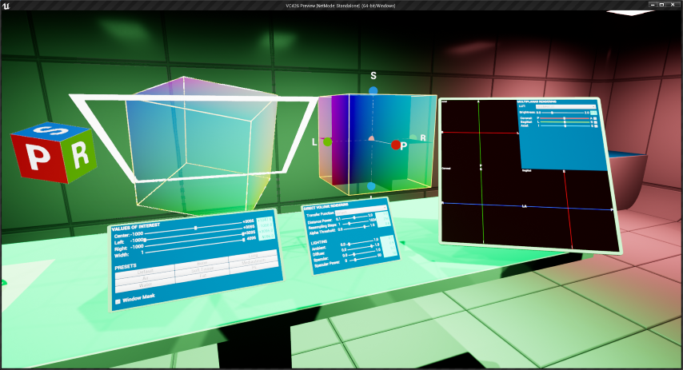

Adds Blueprint Support for Real-time 3D Rendering of Scalar Volumes from Medical Imaging Data.

* Multiplanar Coronal &ndash; Sagittal &ndash; Axial Rendering
* 3D Direct Volume Rendering
* Values of Interest in Hounsfield Units

## Description

Unreal&reg; Engine plugin "Volume Creator" enables real-time multiplanar and direct volume rendering from the Blueprint visual scripting system. The plugin acts as a framework which allows game developers to create VR/AR serious games, e.g., for teaching and training in medical education.

The delivered assets provide importing DICOM&reg; or MetaImage&trade; based medical imaging data, applying values of interest aka DICOM Window and multiplanar or volume rendering colored from transfer functions based on look-up tables or color gradients. A rendered volume may be cropped with a clipping plane and/or a clipping cube. The volume can also be illuminated using Color Rendering Index CRI-R9 compliant operating room light sources.

<!-- UE Marketplace : End 1/2 -->

* Index Terms: Medical Imaging, Multiplanar Rendering, Direct Volume Rendering
* Technology: Unreal Engine, Blueprint Visual Scripting, Code Plugin, C++, HLSL, DICOM

<div style='page-break-after: always'></div>

## Table of Contents

<!-- Start Document Outline -->

* [1. Setup](#1-setup)
  * [1.1. Plugin Installation](#11-plugin-installation)
  * [1.2. Project Configuration](#12-project-configuration)
* [2. Concept](#2-concept)
  * [2.1. Objects](#21-objects)
  * [2.2. Domain Model](#22-domain-model)
* [3. Medical Imaging Data Import](#3-medical-imaging-data-import)
  * [3.1. Import in Editor](#31-import-in-editor)
    * [3.1.1. Import DICOM](#311-import-dicom)
    * [3.2.2. Import MetaImage](#312-import-metaimage)
  * [3.2. Content File Name](#32-content-file-name)
  * [3.3. File Size](#33-file-size)
  * [3.4. Size in Memory](#34-size-in-memory)
  * [3.5. Data Processing](#35-data-processing)
* [4. Rendering](#4-rendering)
  * [4.1. Scalar Volume SV](#41-scalar-volume-sv)
    * [4.1.1. SV Actor](#411-sv-actor)
    * [4.1.2. SV User Widget](#412-sv-user-widget)
    * [4.1.3. SV User Widget Actor](#413-sv-user-widget-actor)
  * [4.2. Values Of Interest VOI](#42-values-of-interest-voi)
    * [4.2.1. VOI Actor](#421-voi-actor)
    * [4.2.2. VOI User Widget](#422-voi-user-widget)
    * [4.2.3. VOI User Widget Actor](#423-voi-user-widget-actor)
  * [4.3. Multiplanar Rendering MPR](#43-multiplanar-rendering-mpr)
    * [4.3.1. MPR Actor](#431-mpr-actor)
    * [4.3.2. MPR User Widget](#432-mpr-user-widget)
    * [4.3.3. MPR User Widget Actor](#433-mpr-user-widget-actor)
  * [4.4. Direct Volume Rendering DVR](#44-direct-volume-rendering-dvr)
    * [4.4.1. DVR Actor](#441-dvr-actor)
    * [4.4.2. DVR User Widget](#442-dvr-user-widget)
    * [4.4.3. DVR User Widget Actor](#443-dvr-user-widget-actor)
    * [4.4.4. Clipping](#444-clipping)
      * [4.4.4.1. Clipping Cube Actor](#4441-clipping-cube-actor)
      * [4.4.4.2. Clipping Cube Handles Actor](#4442-clipping-cube-handles-actor)
      * [4.4.4.3. Clipping Plane Actor](#4443-clipping-plane-actor)
    * [4.4.5. Light Source Actor](#445-light-source-actor)
    * [4.4.6. Orientation Guide Actor](#446-orientation-guide-actor)
* [Appendix](#appendix)
  * [Abbreviations and Acronyms](#abbreviations-and-acronyms)
  * [Glossary](#glossary)
    * [Terms of Location and Coordinate Systems](#terms-of-location-and-coordinate-systems)
    * [Asset Naming Convention](#asset-naming-convention)
  * [A. References](#a-references)
    * [A.1. Medical Imaging](#a1-medical-imaging)
    * [A.2. Unreal Engine](#a2-unreal-engine)
  * [B. Readings](#b-readings)
  * [C. Attribution](#c-attribution)
  * [D. Disclaimer](#d-disclaimer)
  * [E. Citation](#e-citation)

<!-- End Document Outline -->

<div style='page-break-after: always'></div>

## 1. Setup

### 1.1. Plugin Installation

In the Unreal Editor access the Plugin Editor from the menu 'Edit > Plugins'. In the Plugin Editor, under category 'Rendering' find and enable the plugin. Finally restart the Unreal Editor.

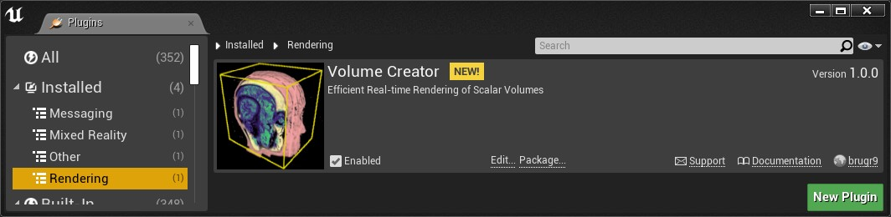
<br>*Fig. 1.1.: Screenshot of Plugin Editor with Plugin "Volume Creator" enabled*

### 1.2. Project Configuration

To allow Volume Texture asset creation follow these steps as from Unreal Engine Documentation article [*Creating Volume Textures*](https://docs.unrealengine.com/4.26/en-US/RenderingAndGraphics/Textures/VolumeTextures/CreatingVolumeTextures/):

> Before you can use Volume Textures in your Unreal Engine 4 (UE4) project, you will need to enable them. In the following How-To, we will take a look at setting up your UE4 project to use Volume Textures.
>
> 1. First, make sure that the Editor is closed, and then locate your project's DefaultEngine.ini file and open it.
> 2. Locate the Script/Engine.RendererSettings section and add the following variable, then save the file when you have added it: ```r.AllowVolumeTextureAssetCreation=1```
> 3. Re-launch the Editor

<div style='page-break-after: always'></div>

## 2. Concept

### 2.1. Objects

The domain specific entities are implemented as Blueprint Actors (see figure 2.1.1.), following the object oriented paradigm:

* Scalar Volume SV Actor
* Values of Interest VOI Actor
* Multiplanar Rendering MPR Actor
* Direct Volume Rendering DVR Actor
  * Clipping Cube Actor
    * Clipping Cube Handles Actor
  * Clipping Plane Actor
  * Light Source Actor
  * Orientation Guide Actor

The plugin provides the rendering of image-stack based volumes, commonly known as scalar volumes. However, the plugin does not support rendering of neither vector nor tensor volumes.

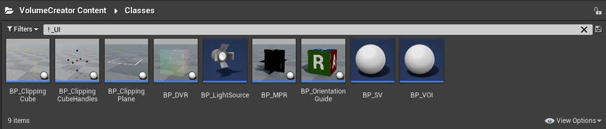<br>*Fig. 2.1.1.: Content Browser, VolumeCreator Content, Folder Classes &ndash; Blueprint Actors*

To access and change parameters of the Blueprint Actors in runtime, the plugin provides with User Widgets (see figure 2.1.2.) as well as with User Widget Actors for the use in augmented and/or virtual reality (see figure 2.1.3.).

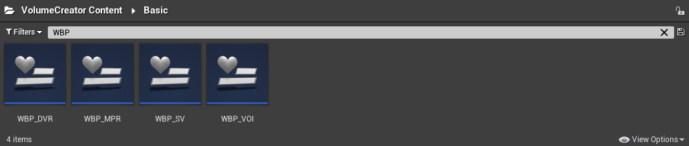<br>*Fig. 2.1.2.: Content Browser, VolumeCreator Content, Folder Basic &ndash; User Widget Blueprints*

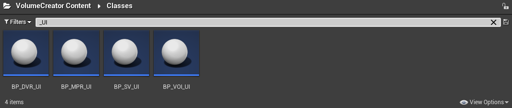<br>*Fig. 2.1.3.: Content Browser, VolumeCreator Content, Folder Classes &ndash; User Widget Actor Blueprints*

<div style='page-break-after: always'></div>

### 2.2. Domain Model

Domain Model Description:

* **Scalar Volume SV**:
  * **Scalar Volume Texture**: A "Scalar Volume Texture" represents a Hounsfield Units encoded Volume Texture.
  * **Scalar Volume Context**: A "Scalar Volume Context" represents a JSON encoded Data asset holding metadata like pixel spacing values.
  * **Scalar Volume Actor**: A "Scalar Volume Actor" holds a reference to a "Scalar Volume Texture" and its related "Scalar Volume Context".
  * **Scalar Volume User Widget and Scalar Volume User Widget Actor**: To access and change parameters of a "Scalar Volume Actor" in runtime, the plugin provides with a "Scalar Volume User Widget" and a "Scalar Volume User Widget Actor".
* **Values Of Interest VOI**
  * **Values Of Interest Actor**: A "Values Of Interest Actor" consumes the volume texture from a "Scalar Volume Actor", manages and applies DICOM Window Attributes 'Center' and 'Width'.
  * **Values Of Interest User Widget and Values Of Interest User Widget Actor**: To access and change parameters of a "Values Of Interest Actor" in runtime, the plugin provides with a "Values Of Interest User Widget" and a "Values Of Interest User Widget Actor".
* **Multiplanar Rendering MPR**
  * **Multiplanar Rendering Actor**: The Values Of Interest may be visualised by multiplanar rendering in a "Multiplanar Rendering Actor", which holds three mutually perpendicular planes, i.e. coronal, sagittal and axial plane as a 3D representation.
  * **Multiplanar Rendering User Widget and Multiplanar Rendering User Widget Actor**: The "Multiplanar Rendering Actor" produces planar rendering, which is also consumed by a "Multiplanar Rendering User Widget" and a "Multiplanar Rendering User Widget Actor", which are 2D representations of MPR. The anatomical planes can be moved in the direction of their corresponding axes interactively in real-time.
* **Volume Rendering**
  * **Direct Volume Rendering DVR**
    * **Direct Volume Rendering Actor**: The Values Of Interest may be visualised by direct volume rendering in a "Direct Volume Rendering Actor". The "Direct Volume Rendering Actor" extent is visualised by a bounding box.
    * **Direct Volume Rendering User Widget and Direct Volume Rendering User Widget Actor**: To access and change parameters of a "Direct Volume Rendering Actor" in runtime, the plugin provides with a "Direct Volume Rendering User Widget" and a "Direct Volume Rendering User Widget Actor".
  * **Clipping**
    * **Clipping Cube Actor**: The "Direct Volume Rendering Actor" can optionally be cropped in real-time using a "Clipping Cube Actor".
    * **Clipping Cube Handles Actor**: A "Clipping Cube Actor" can optionally be modified with a "Clipping Cube Handles Actor" interactively in real-time.
    * **Clipping Plane Actor**: The "Direct Volume Rendering Actor" can optionally be cropped in real-time using a "Clipping Plane Actor".
  * **Light Source Actor**: The "Direct Volume Rendering Actor" can optionally be illuminated with spot light sources from one or more "Light Source Actors".
  * **Orientation Guide Actor**: The "Direct Volume Rendering Actor" can optionally be attached a rotation synchronised "Orientation Guide Actor".

<div style='page-break-after: always'></div>

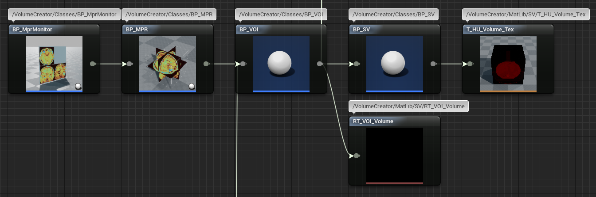<br>*Fig. 2.2.1.: Domain Model Diagram &ndash; Multiplanar Rendering MPR*

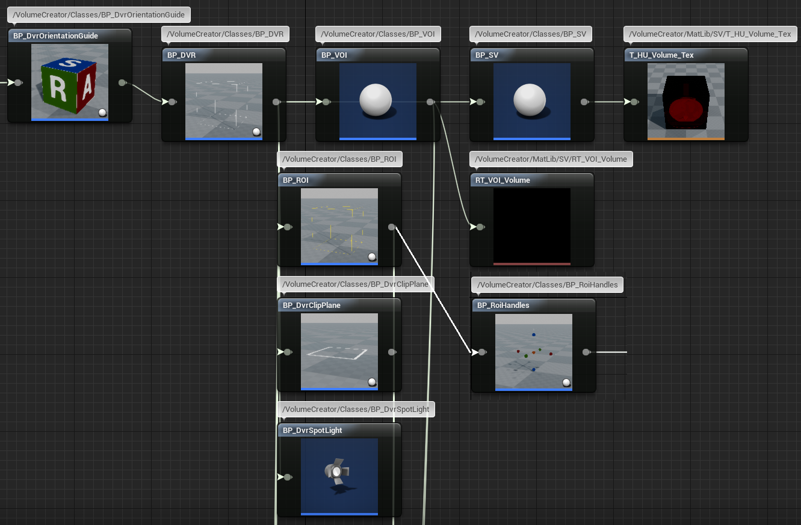<br>*Fig. 2.2.2.: Domain Model Diagram &ndash; Direct Volume Rendering DVR*

<div style='page-break-after: always'></div>

## 3. Medical Imaging Data Import

### 3.1. Import in Editor

Workflow: From DICOM&reg; or MetaImage&trade; files

* Read
  * Read the scalar volume image data and write it to a Houndsfield Units encoded Texture Render Target Volume `RT_SV_Volume`
  * Read the scalar volume image meta data and write it to a JSON encoded Data asset `DA_SV`
* Write
  * Write the Texture Render Target Volume persistently as "Scalar Volume Texture" asset `T_SV_MyDataName_Volume`
  * Write the JSON persistently as "Scalar Volume Context" asset `DA_SV_MyDataName`
* Create a Blueprint asset `BP_MyDataName` (deriving from Scalar Volume Actor `BP_SV`) and
  * Assign the just created "Scalar Volume Texture" asset `T_SV_MyDataName_Volume`
  * Assign the just created "Scalar Volume Context" asset `DA_SV_MyDataName`

See also section "Content File Name" below.

Documentation:

* [UEdoc, How To Import Content] [https://docs.unrealengine.com/4.26/en-US/WorkingWithContent/Importing/HowTo/](https://docs.unrealengine.com/4.26/en-US/WorkingWithContent/Importing/HowTo/)

#### 3.1.1. Import DICOM

* Reads from DICOM files, file name extension `*.dcm`

TODO:

#### 3.1.2. Import MetaImage

* Reads from MetaImage files, file name extension `*.mhds`

TODO:

<div style='page-break-after: always'></div>

### 3.2. Content File Name

The created content file name derives from the imported file name (cf. appendix section [Asset Naming Convention](#asset-naming-convention)) but with rules from the Project Settings (see figure 3.2.1.):

* `AssetTypePrefix`: `T_`
* `AssetName`:
  * The same as the imported file name
  * Underlines (`_`) are replaced with a string as given by the 'Project Settings', which is minus (`-`) by default
  * Maximum length as given by the 'Project Settings', which is `20` by default
* `DescriptorSuffix`: `_Volume`

Example: With importing imaging data from a file named `My_0123456789_ImageFile.dcm` and using the plugin default settings the `AssetName` becomes `My-0123456789-ImageF`. In addition, the `AssetTypePrefix` `T_` and the `DescriptorSuffix` `_Volume` are added, resulting in a content file named `T_My-0123456789-ImageF_Volume`.

When setting the `AssetName Maximum Length`, note that an assets pathname may be limited by the operating system, e.g. to 260 characters.

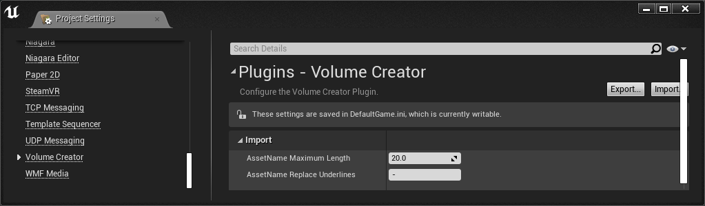<br>*Fig. 3.2.1.: Screenshot of Project Settings > Plugin > Volume Creator*

<div style='page-break-after: always'></div>

### 3.3. File Size

CT image data is expected to come in Hounsfield Units HU, where the use of a range of [-1024, 3071] is documented. These 4096 values can be represented by a twelve-digit binary number (12-bit, 2<sup>12</sup> = 4096). DICOM images therefore are stored as 12-bit data (cf. [Radiopaedia, HU] and [DICOM, FAQ]). Since UE pixel format is of 8-, 16-, or 32-bit, and the UE does not support 12-bit single channels (1 x 4096) nor 10-bit four channels (4 x 1024 = 4096), we use a 16-bit single channel (cf. [UEDoc, EPixelFormat] and [Ivanov 2021]).

Let's assume we have a "Scalar Volume" as follows:

* A Stack of 512 images of size 512 x 512 pixel per image = 512<sup>3</sup> pixel or voxel resp.
* A 16-bit single channel `G16` (Grayscale); 4096 Hounsfield Units [-1024, 3071] shifted to [0, 4095] (unsigned integer)
* *Scalar Volume Texture `T_SV_Volume` = 512<sup>3</sup> px x 1 x 16 bit/voxel = 134,217,728 voxel x 16 bit/voxel = 2,147,483,648 bit = 268,435,456 Byte = 256 MB*

The Volume Texture file size in this example becomes 256 MB.

### 3.4. Size in Memory

The delivered assets make use of Render Targets. The Volume Render Targets size is inherited from the imported data, which is, e.g., Scalar Volume `T_SV_Volume` from above:

* VOI: Texture Render Target `RT_VOI_Volume`, Linear RG8 (2 channels RG, 8-bit); R: VOI [0, 255], G: Window-Mask [0, 1]; Dimension inherited from Texture `T_SV_Volume`
<br>*Example: 512<sup>3</sup> px x 2 x 8-bit/voxel = 134,217,728 voxel x 16-bit/voxel = 2,147,483,648 bit = 268,435,456 Byte = 256 MB*
* DVR: Texture Render Target `RT_Lightmap_Volume`, Linear Color RGBA8 (4 channels RGBA, 8-bit); RGBA: Color [0, 255]; Dimension inherited from Texture Render Target `RT_VOI_Volume` but half Resolution
<br>*Example: 256<sup>3</sup> px x 4 x 8-bit/voxel = 16,777,216 voxel x 32 bit/voxel = 536,870,912 bit = 67,108,864 Byte = 64 MB*
* MPR: Texture Render Targets `RT_VOI_COR` / `RT_VOI_SAG` / `RT_VOI_AXE`: Linear R8 (1 channel R, 8-bit); R: VOI [0, 255]; The MPR Texture Render Targets do not inherit, they are always the same size
<br>*Example: 1024<sup>2</sup> px x 1 x 8-bit/voxel = 1,048,576 voxel x 8-bit/voxel = 8,388,608 bit = 1,048,576 Byte = 1 MB each; Sum: 3 MB*

*Example, size in Memory: <br>`T_SV_Volume` + `RT_VOI_Volume` + `RT_Lightmap_Volume` + `RT_VOI_COR` + `RT_VOI_SAG` + `RT_VOI_AXE` = 256 MB + 256 MB + 64 MB + 1 MB + 1 MB + 1 MB = 579 MB*

### 3.5. Data Processing

For a use case of DVR, the Render Texture Volumes `RT_VOI_Volume` and `RT_Lightmap_Volume` are accessed every tick. Rendering the example from above with, e.g., 90 fps results in an access rate of 241.56 Gigabit/s:

* *2,147,483,648 bit + 536,870,912 bit = 2,684,354,560 bit = 2.684 Gigabit*
* *ProcessedData = 2.684 Gigabit/frame x 90 frames/s = 241.56 Gigabit/s*

<div style='page-break-after: always'></div>

## 4. Rendering

### 4.1. Scalar Volume SV

#### 4.1.1. SV Actor

Plugin "Volume Creator" provides with a "Scalar Volume Actor" or SV Actor (Blueprint Class: `BP_SV`) to handle a Hounsfield Units encoded Volume Texture and its pixel spacing. The SV Actor is an empty Actor and has no mesh.

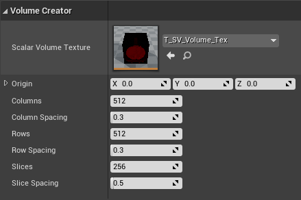<br>*Fig. 4.1.1.1.: Blueprint Actor BP_SV &ndash; Details Panel*

Parameter, Category 'Volume Creator' (see figure 'Details Panel'):

* Scalar Volume Texture
  * Type: `Volume Texture`
  * Default Value: `T_SV_Volume`
  * Description: Scalar Volume, Hounsfield Units encoded Volume Texture
* Origin
  * Type: `Vector`
  * Default Value: `X 0.0, Y 0.0, Z 0.0`
  * Description: Position of the first Voxel in the Anatomical Coordinate System
* Columns
  * Type: `Integer`
  * Default Value: `512`
  * Range: [`1`, `n`]
  * Description: DICOM Columns Attribute: Number of pixel columns in the image; results in Width (UE: Y)
* Columns Spacing
  * Type: `Float`
  * Default Value: `0.3`
  * Range: [`0`, `10`]
  * Description: DICOM Pixel Spacing Attribute: Physical distance in the patient between the center of each pixel - adjacent column spacing (delimiter)
* Rows
  * Type: `Integer`
  * Default Value: `512`
  * Range: [`1`, `n`]
  * Description: DICOM Rows Attribute: Number of pixel rows in the image; results in Height (UE: Z)
* Rows Spacing
  * Type: `Float`
  * Default Value: `0.3`
  * Range: [`0`, `10`]
  * Description: DICOM Pixel Spacing Attribute: Physical distance in the patient between the center of each pixel - adjacent row spacing (delimiter)
* Slices
  * Type: `Integer`
  * Default Value: `256`
  * Range: [`1`, `n`]
  * Description: Number of Slices or Images respectively; results in Depth (UE: X)
* Slices Spacing
  * Type: `Float`
  * Default Value: `0.5`
  * Range: [`0`, `10`]
  * Description: DICOM Spacing Between Slices Attribute: Spacing between slices. The spacing is measured from the center-to-center of each slice

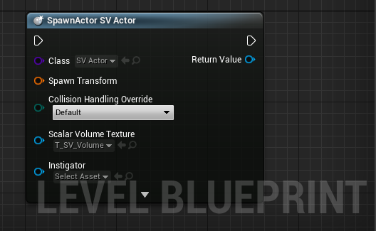<br>*Fig. 4.1.1.2.: Level Blueprint, SpawnActor SV Actor*

Spawn Parameter from Category 'Volume Creator':

* Scalar Volume Texture
  * Type: `Volume Texture`
  * Default Value: `T_SV_Volume`
  * Description: Scalar Volume, Hounsfield Units encoded Volume Texture

<div style='page-break-after: always'></div>

#### 4.1.2. SV User Widget

TODO:

Plugin "Volume Creator" provides with a "Scalar Volume User Widget" or SV User Widget (Blueprint Class: `WBP_SV`).

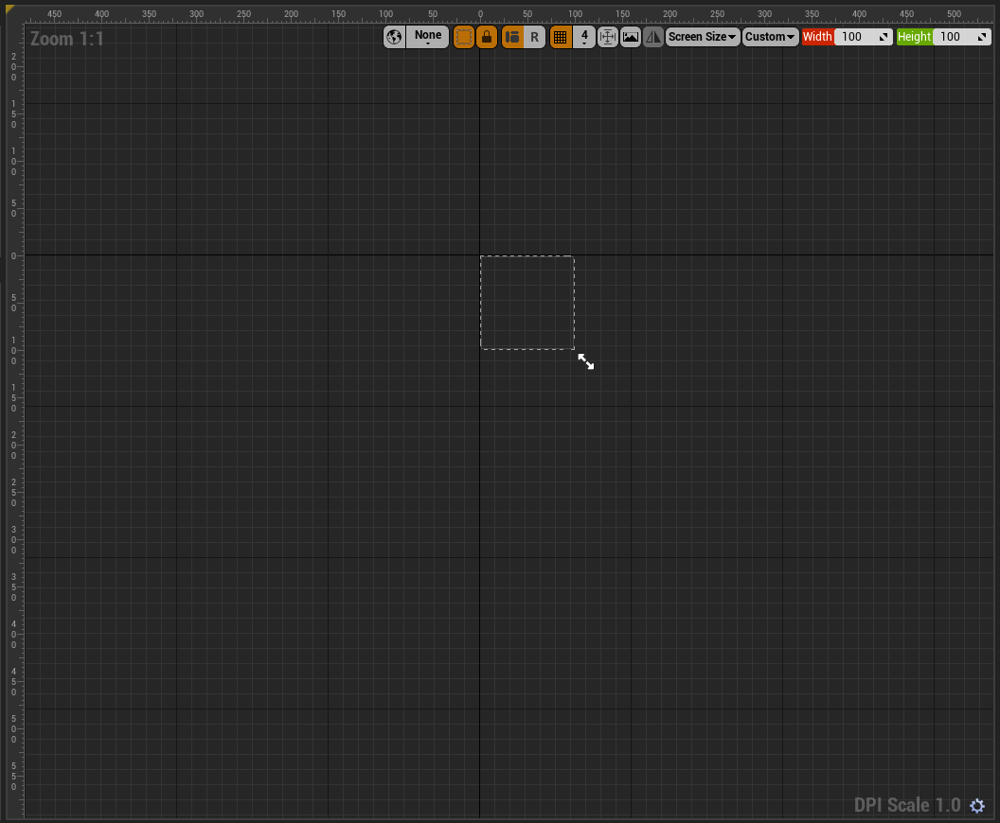<br>*Fig. 4.1.2.1.: User Widget Blueprint WBP_SV*

Widget Input:

* Import... (Dialog)
* Open... (Dialog)
* Save
* Save As... (Dialog)

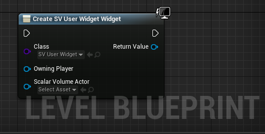<br>*Fig. 4.1.2.2.: Level Blueprint, Create SV User Widget*

Create Parameter:

* Scalar Volume Actor:
  * Type: Scalar Volume Actor `BP_SV` instance as Object Reference
  * Default Value: `none`
  * Description: Mandatory, assign an SV Actor Instance to manage

<div style='page-break-after: always'></div>

#### 4.1.3. SV User Widget Actor

TODO:

Plugin "Volume Creator" provides with a "Scalar Volume User Widget Actor" or SV User Widget Actor (Blueprint Class: `BP_SV_UI`). The Actor holds a User Widget Component with an SV User Widget assigned (see figure 4.1.3.1.).

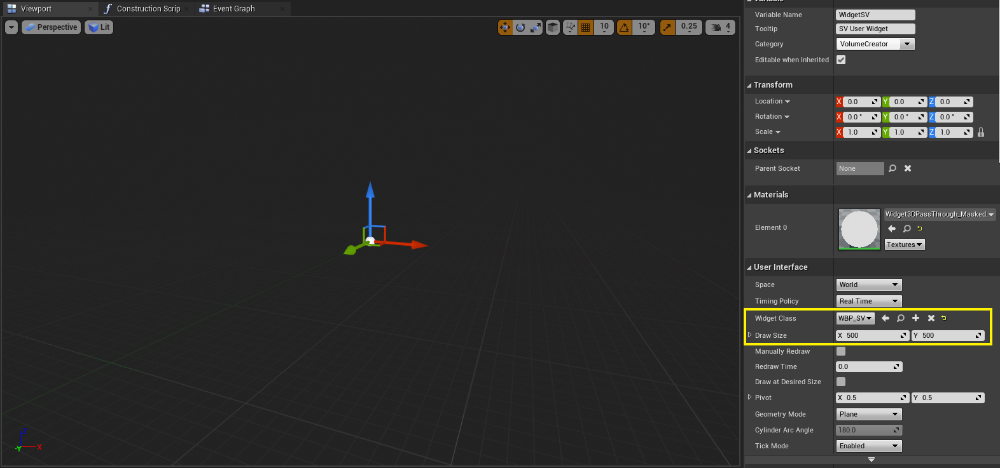<br>*Fig. 4.1.3.1.: Blueprint Actor BP_SV_UI &ndash; Viewport*

The Actor may be added to the world by spawning an instance in a Blueprint, e.g., Level Blueprint (see figure 4.1.3.2) or by picking from the "Place Actors" Tab (see figure 4.1.3.3.).

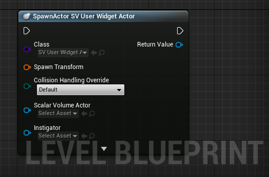<br>*Fig. 4.1.3.2: Level Blueprint, SpawnActor SV User Widget Actor*

Spawn Parameter from Category 'Volume Creator':

* Scalar Volume Actor:
  * Type: Scalar Volume Actor `BP_SV` instance as Object Reference
  * Default Value: `none`
  * Description: Mandatory, assign an SV Actor Instance to manage

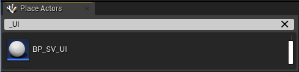<br>*Fig. 4.1.3.3.: Blueprint Actor BP_SV_UI &ndash; Place Actors Tab*

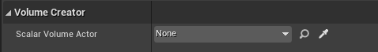<br>*Fig. 4.1.3.4.: Blueprint Actor BP_SV_UI &ndash; Details Panel*

Parameter, Category 'Volume Creator' (see figure 'Details Panel'):

* Scalar Volume Actor:
  * Type: Scalar Volume Actor `BP_SV` instance as Object Reference
  * Default Value: `none`
  * Description: Mandatory, assign an SV Actor Instance to manage

<div style='page-break-after: always'></div>

### 4.2. Values Of Interest VOI

#### 4.2.1. VOI Actor

CT image data is expected to come in Hounsfield Units HU in a range of [-1024, 3071] (cf. section Import) representing 4096 gray levels for different materials where air is defined as -1000 HU and water as 0 HU. Consumer computer screens can only display 256 gray levels, represented by a value range of [0, 255]. Therefore the 4096 Hounsfield Units are mapped to 256 screen gray scale levels. In plugin "Volume Creator" the mapping is done by linear interpolation (Lerp).

If the whole range of 4096 Hounsfield Units is mapped to 256 gray levels, the contrast becomes quite bad. Therefore, the so called Values Of Interest VOI aka 'DICOM Window' was introduced to downsize the range of Hounsfield Units to map. The window is defined by its center and width.

Plugin "Volume Creator" provides with a "Values Of Interest Actor" or VOI Actor (Blueprint Class: `BP_VOI`). The VOI Actor is an empty Actor and has no mesh. It consumes the Hounsfield Units encoded Volume Texture from an SV Actor and applies a DICOM Window.

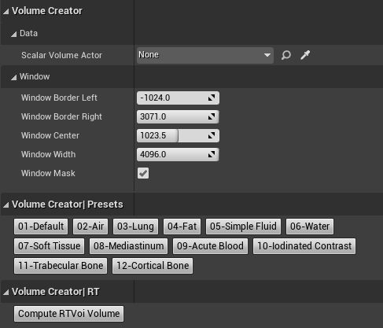<br>*Fig. 4.2.1.1.: Blueprint Actor BP_VOI &ndash; Details Panel*

Parameter, Category 'Volume Creator' (see figure 'Details Panel'):

* Scalar Volume Actor
  * Type: Scalar Volume Actor `BP_SV` instance as Object Reference
  * Default Value: `none`
  * Description: Mandatory, Hounsfield Units data source
* Window Border Left
  * Type: `Float`
  * Default Value: `-1024.0`
  * Range: [`-1024.0`, `3071.0`]
  * Description: Window Left (lower) Border in Hounsfield Units; which is calculated (not editable in the Details Panel)
* Window Border Right
  * Type: `Float`
  * Default Value: `3071.0`
  * Range: [`-1024.0`, `3071.0`]
  * Description: Window Right (upper) Border in Hounsfield Units; which is calculated (not editable in the Details Panel)
* Window Center
  * Type: `Float`
  * Default Value: `1023.5`
  * Range: [`-1024.0`, `3071.0`]
  * Description: Window Center in Hounsfield Units (aka level or brightness)
* Window Width
  * Type: `Float`
  * Default Value: `4096.0`
  * Range: [`1.0`, `4096.0`]
  * Description: Window Width in Hounsfield Units (aka range or contrast)
* Window Mask
  * Type: `Boolean`
  * Default Value: `true`
  * Description: With calculating the "Texture Render Target VOI Volume", values between the window left and right border are linear interpolated (lerped) in a range of [`0`, `255`] by default. Values equal and lesser than the window left border are mapped to `0`, values equal and greater than the window right border are mapped to `255`. To render the lerped values only, a window mask is applied if parameter 'Window Mask' is set to `true`.

If a parameter from above is changed in a VOI Actor instance from the Editor Details Panel, the "Texture Render Target VOI Volume" is not automatically recalculated. Clicking button `Compute RT Voi Volume` will trigger this (see figure 4.2.1.2.).

The VOI range can also be set by clicking one of the VOI range buttons (see figure 4.2.1.2.). The window center and width are calculated from the specified left and right border values (see table 4.2.1.1.). Here the "Texture Render Target VOI Volume" is automatically recalculated.

*Table 4.2.1.1.: VOI Ranges*<br>
| Name                | Left      | Right     | Center    | Width    |
|:--------------------|----------:|----------:|----------:|---------:|
| Default             | `-1024.0` |  `3071.0` |  `1023.5` | `4096.0` |
| Air                 | `-1000.0` | `-1000.0` | `-1000.0` |    `1.0` |
| Lung                |  `-600.0` |  `-400.0` |  `-500.0` |  `201.0` |
| Fat                 |  `-100.0` |   `-60.0` |   `-80.0` |   `41.0` |
| Simple Fluid        |   `-10.0` |    `20.0` |     `5.0` |   `31.0` |
| Water               |     `0.0` |     `0.0` |     `0.0` |    `1.0` |
| Soft Tissue         |    `30.0` |    `45.0` |    `37.5` |   `16.0` |
| Mediastinum         |    `50.0` |   `500.0` |   `275.0` |  `451.0` |
| Acute Blood         |    `60.0` |    `90.0` |    `75.0` |   `31.0` |
| Iodinated Contrast  |   `100.0` |   `500.0` |   `300.0` |  `401.0` |
| Trabecular Bone     |   `300.0` |   `800.0` |   `550.0` |  `501.0` |
| Cortical Bone       |  `1000.0` |  `3000.0` |  `2000.0` | `2001.0` |

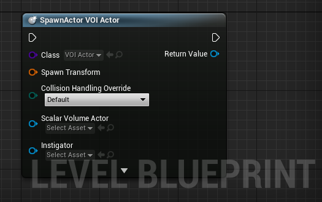<br>*Fig. 4.2.1.2.: Level Blueprint, SpawnActor VOI Actor*

Spawn Parameter from Category 'Volume Creator':

* Scalar Volume Actor
  * Type: Scalar Volume Actor `BP_SV` instance as Object Reference
  * Default Value: `none`
  * Description: Mandatory, Hounsfield Units data source

<div style='page-break-after: always'></div>

#### 4.2.2. VOI User Widget

Plugin "Volume Creator" provides with a "Values Of Interest User Widget" or VOI User Widget (Blueprint Class: `WBP_VOI`).

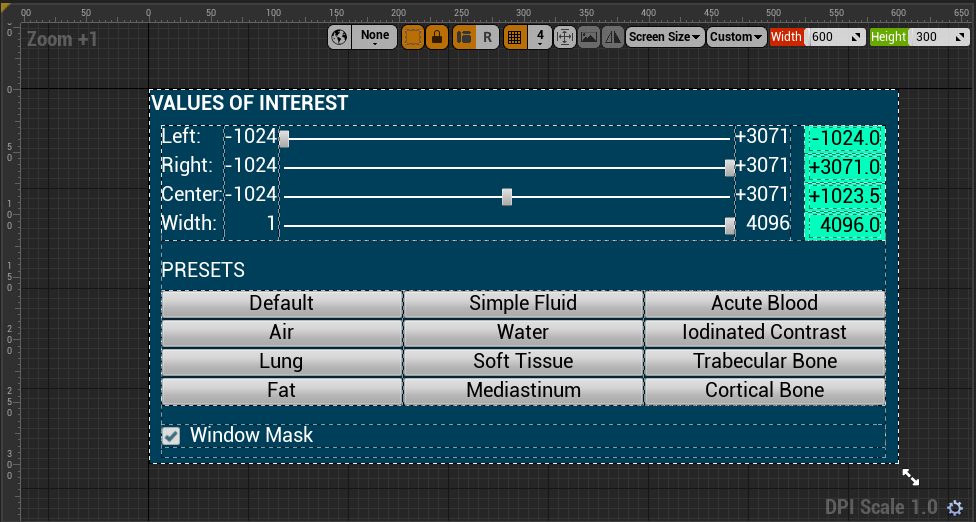<br>*Fig. 4.2.2.1.: User Widget Blueprint WBP_VOI*

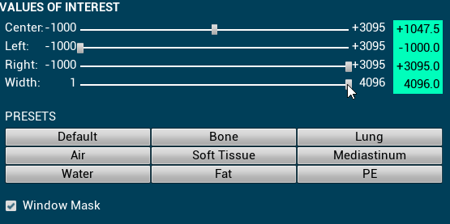<br>*Fig. 4.2.2.2: Screencast of User Widget Blueprint WBP_VOI*

Widget Input (see figures 4.2.2.1. and 4.2.2.2.):

* Left:
  * Type: Slider
  * Description: With moving slider "Left", slider "Right" is static, slider "Center" and "Width" adapt.
* Right:
  * Type: Slider
  * Description: With moving slider "Right", slider "Left" is static, slider "Center" and "Width" adapt.
* Center:
  * Type: Slider
  * Description:  With moving slider "Center"
    * Slider "Width" is static, slider "Left" and "Right" adapt
    * If slider "Left" reaches minimum or slider "Right" reaches maximum: Slider "Width" also adapts.
* Width:
  * Type: Slider
  * Description: With moving slider "Width"
    * Slider "Center" is static, slider "Left" and "Right" adapt
    * If slider "Left" reaches minimum or slider "Right" reaches maximum: Slider "Width" can no longer be increased (TODO: Slider "Center" adapts)
* Presets:
  * Type: Button
  * Description: Set a VOI Range, cf. Table 4.2.1.1.
* Window Mask:
  * Type: Check Box

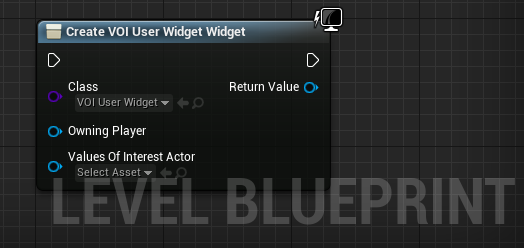<br>*Fig. 4.2.2.3.: Level Blueprint, Create VOI User Widget*

Create Parameter:

* Values Of Interest Actor:
  * Type: Values Of Interest Actor `BP_VOI` instance as Object Reference
  * Default Value: `none`
  * Description: Mandatory, assign a VOI Actor Instance to manage

<div style='page-break-after: always'></div>

#### 4.2.3. VOI User Widget Actor

Plugin "Volume Creator" provides with a "Values Of Interest User Widget Actor" or VOI User Widget Actor (Blueprint Class: `BP_VOI_UI`). The Actor holds a User Widget Component with a VOI User Widget assigned (see figure 4.2.3.1.).

<br>*Fig. 4.2.3.1.: Blueprint Actor BP_VOI_UI &ndash; Viewport*

The Actor may be added to the world by spawning an instance in a Blueprint, e.g., Level Blueprint (see figure 4.2.3.2) or by picking from the "Place Actors" Tab (see figure 4.2.3.3.).

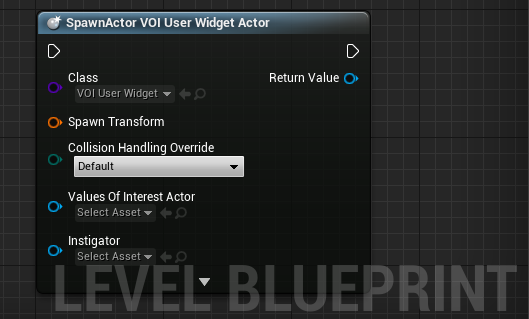<br>*Fig. 4.2.3.2: Level Blueprint, SpawnActor VOI User Widget Actor*

Spawn Parameter from Category 'Volume Creator':

* Values Of Interest Actor:
  * Type: Values Of Interest Actor `BP_VOI` instance as Object Reference
  * Default Value: `none`
  * Description: Mandatory, assign a VOI Actor Instance to manage

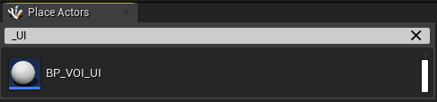<br>*Fig. 4.2.3.3.: Blueprint Actor BP_VOI_UI &ndash; Place Actors Tab*

<br>*Fig. 4.2.3.4.: Blueprint Actor BP_VOI_UI &ndash; Details Panel*

Parameter, Category 'Volume Creator' (see figure 'Details Panel'):

* Values Of Interest Actor:
  * Type: Values Of Interest Actor `BP_VOI` instance as Object Reference
  * Default Value: `none`
  * Description: Mandatory, assign a VOI Actor Instance to manage

<div style='page-break-after: always'></div>

### 4.3. Multiplanar Rendering MPR

#### 4.3.1. MPR Actor

Plugin "Volume Creator" provides with a "Multiplanar Rendering Actor" or MPR Actor (Blueprint Class: `BP_MPR`) to visualise a 3D representation of a scalar volume by Coronal, Sagittal and Axial planes arranged perpendicular to one another.

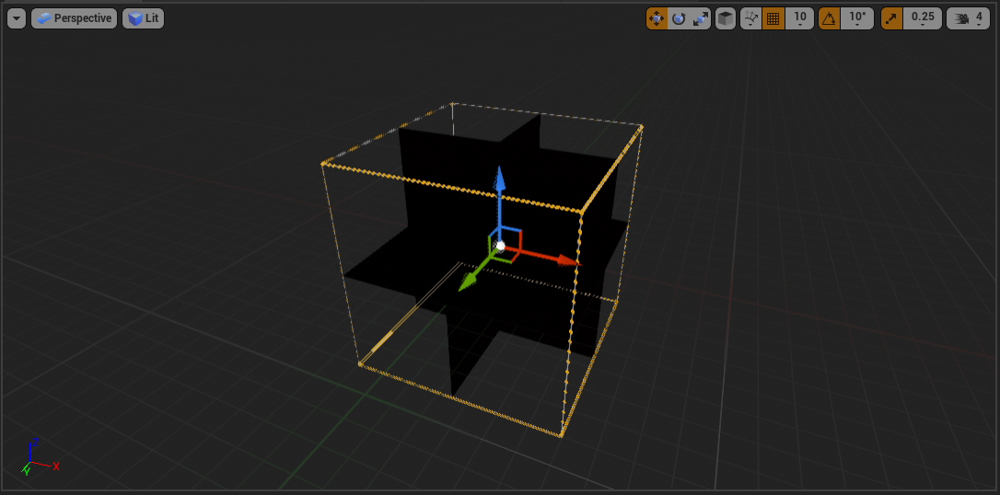<br>*Fig. 4.3.1.1.: Blueprint Actor BP_MPR &ndash; Viewport*

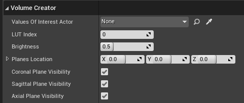<br>*Fig. 4.3.1.2.: Blueprint Actor BP_MPR &ndash; Details Panel*

Parameter, Category 'Volume Creator' (see figure 'Details Panel'):

* Values Of Interest Actor:
  * Type: VOI Actor `BP_VOI` instance as Object Reference
  * Default Value: `none`
  * Description: Mandatory, data to which the transfer function LUT is applied
* LUT Index:
  * Type: `Integer`
  * Default Value: `0`
  * Range: [`0`, `50`]
  * Description: Select Look-Up Table by Index
* Brightness:
  * Type: `Float`
  * Default Value: `0.5`
  * Range: [`0.0`, `2.0`]
  * Description: Emissive Brightness; Values greater than 1 are allowed as HDR lighting is supported.
* Planes Location:
  * Type: `Vector`
  * Default Value: `X 0.0, Y 0.0, Z 0.0`
  * Ranges: [`-50.0`, `50.0`]
  * Description: Anatomical Planes Location (X: Coronal, Y: Sagittal, Z: Axial)<br>Use this Values instead of Component Location Values (Accessed by User Widget, Serialised for Saved Games).
* Coronal Plane Visibility:
  * Type: `bool`
  * Default Value: `true`
  * Description: Use this Value instead of Component Visibility Value (Accessed by User Widget, Serialised for Saved Games).
* Sagittal Plane Visibility:
  * Type: `bool`
  * Default Value: `true`
  * Description: Use this Value instead of Component Visibility Value (Accessed by User Widget, Serialised for Saved Games).
* Axial Plane Visibility:
  * Type: `bool`
  * Default Value: `true`
  * Description: Use this Value instead of Component Visibility Value (Accessed by User Widget, Serialised for Saved Games).

*Table 4.3.1.1.: Look-Up Tables LUT*<br>
| Index | Name | Colors | Index | Name | Colors | Index | Name | Colors |
|------:|:-----|:-------|------:|:-----|:-------|------:|:-----|:-------|
| 0 | dGEMRIC3T |  | 17 | DiscreteOcean |  | 34 | PETHeat |  |
| 1 | dGEMRIC15T |  | 18 | DiscreteRainbow |  | 35 | PETMIP |  |
| 2 | DiscreteBlue |  | 19 | DiscreteRandom |  | 36 | PETRainbow |  |
| 3 | DiscreteCool1 |  | 20 | DiscreteRandomIntegers |  | 37 | ShadeCoolShade1 |  |
| 4 | DiscreteCool2 |  | 21 | DiscreteRed |  | 38 | ShadeCoolShade2 |  |
| 5 | DiscreteCool3 |  | 22 | DiscreteReverseRainbow |  | 39 | ShadeCoolShade3 |  |
| 6 | DiscreteCyan |  | 23 | DiscreteWarm1 |  | 40 | ShadeWarmShade1 |  |
| 7 | DiscreteDesert |  | 24 | DiscreteWarm2 |  | 41 | ShadeWarmShade2 |  |
| 8 | DiscretefMRI |  | 25 | DiscreteWarm3 |  | 42 | ShadeWarmShade3 |  |
| 9 | DiscretefMRIPA |  | 26 | DiscreteYellow |  | 43 | TintCoolTint1 |  |
| 10 | DiscreteFullRainbow |  | 27 | BlueRed |  | 44 | TintCoolTint2 |  |
| 11 | DiscreteGreen |  | 28 | GreenRed |  | 45 | TintCoolTint3 |  |
| 12 | DiscreteGrey |  | 29 | Heat |  | 46 | TintWarmTint1 |  |
| 13 | DiscreteInvertedGrey |  | 30 | RedBlue |  | 47 | TintWarmTint2 |  |
| 14 | DiscreteIron |  | 31 | RedGreen |  | 48 | TintWarmTint3 |  |
| 15 | Discretelabels | 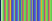 | 32 | LabelsNonSemantic |  |
| 16 | DiscreteMagenta |  | 33 | LabelsPelvis |  |

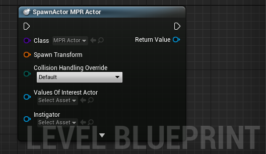<br>*Fig. 4.3.1.3.: Level Blueprint, SpawnActor MPR Actor*

Spawn Parameter from Category 'Volume Creator':

* Values Of Interest Actor:
  * Type: Values Of Interest Actor `BP_VOI` instance as Object Reference
  * Default Value: `none`
  * Description: Mandatory, data to which the transfer function LUT is applied

<div style='page-break-after: always'></div>

#### 4.3.2. MPR User Widget

Plugin "Volume Creator" provides with a "Multiplanar Rendering User Widget" or MPR User Widget (Blueprint Class: `WBP_MPR`) to visualise a 2D representation of the anatomical coronal, sagittal and axial planes which are consumed from an MPR Actor instance and arranged side by side. The perpendicular planes intersections are drawn as color coded orientation lines.

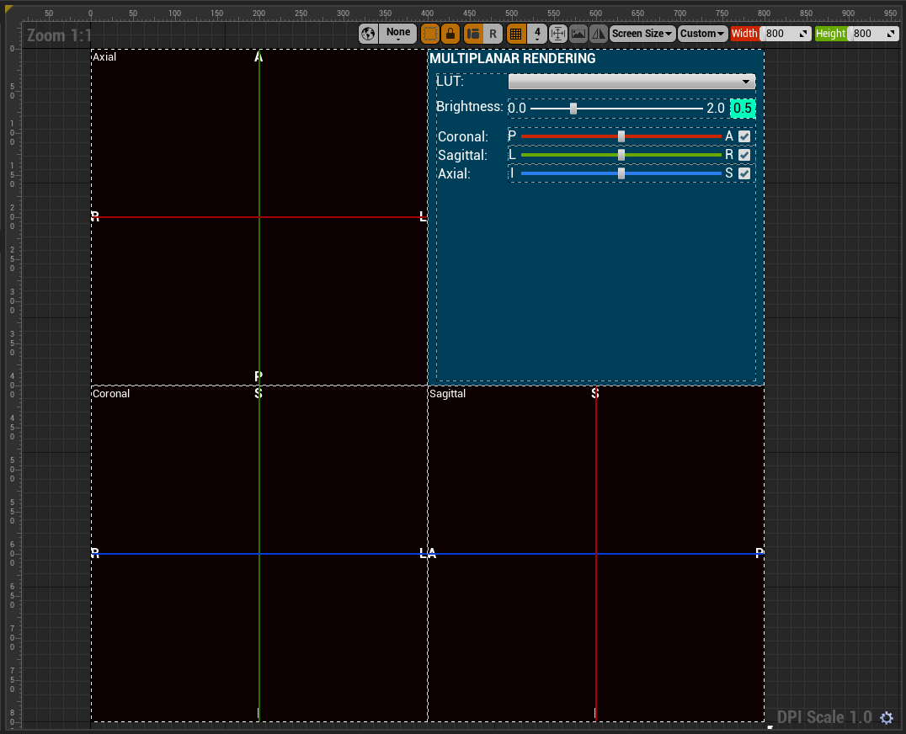<br>*Fig. 4.3.2.1.: User Widget Blueprint WBP_MPR*

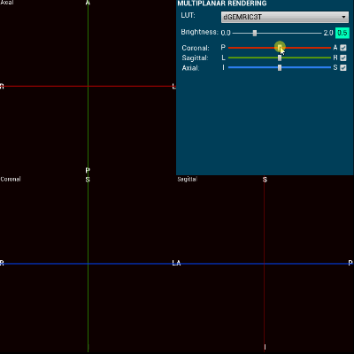<br>*Fig. 4.3.2.2: Screencast of User Widget Blueprint WBP_MPR*

Widget Input (see figures 4.3.2.1. and 4.3.2.2):

* LUT:
  * Type: Select
  * Description: Select a Look-up Table to colorise the content, cf. Table 4.3.1.1.
* Brightness:
  * Type: Slider
  * Description: Emissive Brightness; Values greater than 1 are allowed as HDR lighting is supported.
* Coronal:
  * Type: Slider
  * Description: Coronal Plane Posterior/Anterior  P&ndash;A Location, color code red; With moving the slider the plane changes its P&ndash;A position and content resp., the orientation lines location in the "Sagittal" and "Axial" view is updated.
  * Type: Check Box
  * Description: Orientation line visibility; With a check box checked the corresponding color coded orientation line is visible.
* Sagittal:
  * Type: Slider
  * Description: Sagittal Plane Left/Right L&ndash;R Location, color code green; With moving the slider the plane changes its L&ndash;R position and content resp., the orientation lines location in the "Coronal" and "Axial" view is updated.
  * Type: Check Box
  * Description: Orientation line visibility; With a check box checked the corresponding color coded orientation line is visible.
* Axial:
  * Type: Slider
  * Description: Axial Plane Inferior/Superior I&ndash;S Location, color code blue; With moving the slider the plane changes its I&ndash;S position and content resp., the orientation lines location in the "Coronal" and "Sagittal" view is updated.
  * Type: Check Box
  * Description: Orientation line visibility; With a check box checked the corresponding color coded orientation line is visible.

With changing MPR User Widget parameters, the attached MPR Actor instance planes are also updated.

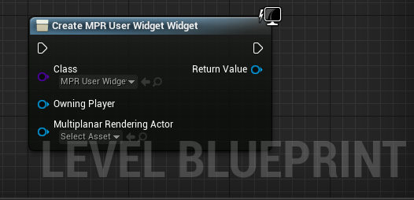<br>*Fig. 4.3.2.3.: Level Blueprint, Create MPR User Widget*

Create Parameter:

* Multiplanar Rendering Actor:
  * Type: Multiplanar Rendering Actor `BP_MPR` instance as Object Reference
  * Default Value: `none`
  * Description: Mandatory, assign an MPR Actor Instance to manage

<div style='page-break-after: always'></div>

#### 4.3.3. MPR User Widget Actor

Plugin "Volume Creator" provides with a "Multiplanar Rendering User Widget Actor" or MPR User Widget Actor (Blueprint Class: `BP_MPR_UI`). The Actor holds a User Widget Component with an MPR User Widget assigned (see figure 4.3.3.1.).

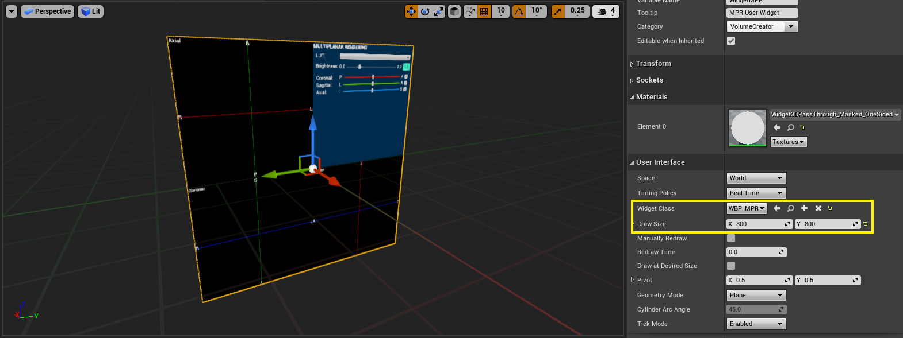<br>*Fig. 4.3.3.1.: Blueprint Actor BP_MPR_UI &ndash; Viewport*

The Actor may be added to the world by spawning an instance in a Blueprint, e.g., Level Blueprint (see figure 4.3.3.2) or by picking from the "Place Actors" Tab (see figure 4.3.3.3.).

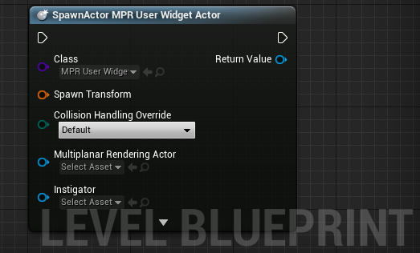<br>*Fig. 4.3.3.2: Level Blueprint, SpawnActor MPR User Widget Actor*

Spawn Parameter from Category 'Volume Creator':

* Multiplanar Rendering Actor:
  * Type: Multiplanar Rendering Actor `BP_MPR` instance as Object Reference
  * Default Value: `none`
  * Description: Mandatory, assign an MPR Actor Instance to manage

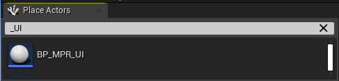<br>*Fig. 4.3.3.3.: Blueprint Actor BP_MPR_UI &ndash; Place Actors Tab*

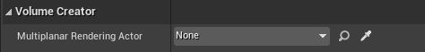<br>*Fig. 4.3.3.4.: Blueprint Actor BP_MPR_UI &ndash; Details Panel*

Parameter, Category 'Volume Creator' (see figure 'Details Panel'):

* Multiplanar Rendering Actor:
  * Type: Multiplanar Rendering Actor `BP_MPR` instance as Object Reference
  * Default Value: `none`
  * Description: Mandatory, assign an MPR Actor Instance to manage

<div style='page-break-after: always'></div>

### 4.4. Direct Volume Rendering DVR

#### 4.4.1. DVR Actor

Plugin "Volume Creator" provides with a "Direct Volume Rendering Actor" or DVR Actor (Blueprint Class: `BP_DVR`) to visualise a 3D representation of a scalar volume. The DVR Actor extent is shown with a bounding box.

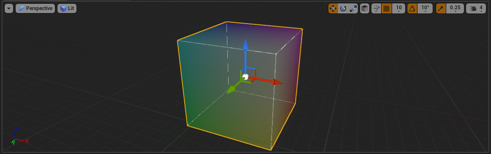<br>*Fig. 4.4.1.1.: Blueprint Actor BP_DVR  &ndash; Viewport*

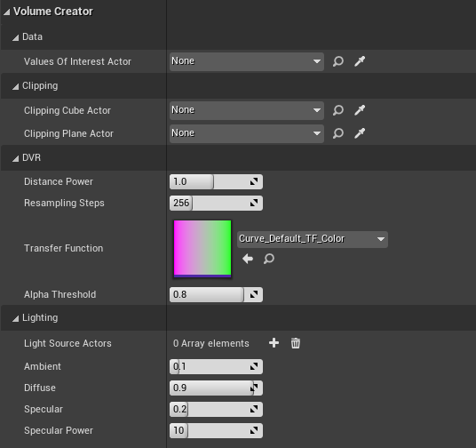<br>*Fig. 4.4.1.2.: Blueprint Actor BP_DVR &ndash; Details Panel*

Parameter, Category 'Volume Creator' (see figure 'Details Panel'):

* Data:
  * Values Of Interest Actor:
    * Type: Values Of Interest Actor `BP_VOI` instance as Object Reference
    * Default Value: `none`
    * Description: Mandatory, data to which the transfer function Curve is applied
* Clipping:
  * Clipping Cube Actor:
    * Type: Clipping Cube Actor `BP_ClippingCube` instance as Object Reference
    * Default Value: `none`
    * Description: Optional, used for geometry subtraction if set
  * Clipping Plane Actor:
    * Type: Clipping Plane Actor `BP_ClippingPlane` instance as Object Reference
    * Default Value: `none`
    * Description: Optional, used for geometry subtraction if set
* DVR:
  * Distance Power
    * Type: `Float`
    * Default Value: `1.0`
    * Range: [`0.1`, `2.0`]
    * Description: Resampling Distance Power &ndash; The shader algorithm calculates the current distance of the image slices with respect to the angle of entry of the resampling ray. With a value of `1.0` (default) the calculated resampling distance is used. This parameter may be seen as an optimisation method (cf. [Luecke 2005], "Fragmented Line Ray-Casting").
      * With values smaller than `1.0` the resampling distance lowers, a so-called oversampling aka supersampling occurs, which may increase visualisation quality (cf. [Meissner et al.], p. 19).
      * With values larger than `1.0` the resampling distance grows, a so-called undersampling occurs, which may accelerate rendering.
  * Resampling Steps:
    * Type: `Integer`
    * Default Value: `256`
    * Range: [`1`, `1024`]
    * Description: Maximum Number of Resampling Steps:
      * A large number means more steps. The resampling ray may advance deeper into the cube. The hereby resulting rendering may increase visualisation quality by the cost of more computing time.
      * A small number may decrease rendering quality but is faster.
  * Transfer Function:
    * Type: `Curve Linear Color`
    * Default Value: `Curve_Default_Color`
    * Description: The transfer functions are based on color gradients from `Curve Linear Color` assets.
  * Alpha Threshold:
    * Type: `Float`
    * Default Value: `0.8`
    * Range: [`0.0`, `1.0`]
    * Description: Maximum Opacity Threshold for Early Ray Termination from iteratively added up Alpha Channel
* Lighting:
  * Light Source:
    * Type: Array of `BP_LightSource` Object References
    * Default Value: `none`
    * Optional, used for static lighting if set
  * Ambient:
    * Type: `Float`
    * Default Value: `0.1`
    * Range: [`0.0`, `1.0`]
    * Description: Phong Shading Parameter
  * Diffuse:
    * Type: `Float`
    * Default Value: `0.9`
    * Range: [`0.0`, `1.0`]
    * Description: Phong Shading Parameter
  * Specular:
    * Type: `Float`
    * Default Value: `0.2`
    * Range: [`0.0`, `1.0`]
    * Description: Phong Shading Parameter
  * Specular Power:
    * Type: `Integer`
    * Default Value: `10`
    * Range: [`1`, `50`]
    * Description: Phong Shading Parameter

TODO: Color Curves Images

*Table 4.4.1.1.: Color Curves*<br>
| Index | Name | Colors | Index | Name | Colors | Index | Name | Colors |
|------:|:-----|:-------|------:|:-----|:-------|------:|:-----|:-------|
| 0 | Default |  | 9 | CT-Chest-Vessels |  | 19 | CT-Pulmonary-Arteries |  |
| 1 | CT-AAA |  | 10 | CT-Coronary-Arteries |  | 20 | CT-Soft-Tissue |  |
| 2 | CT-AAA2 |  | 11 | CT-Coronary-Arteries2 |  | 21 | CT-Air |  |
| 3 | CT-Bone |  | 12 | CT-Coronary-Arteries3 |  | 22 | CT-XRay |  |
| 4 | CT-Bones |  | 13 | CT-Cropped-Volume-Bone |  | 23 | MR-Default |  |
| 5 | CT-Cardiac |  | 14 | CT-Fat |  | 24 | MR-Angio |  |
| 6 | CT-Cardiac2 |  | 15 | CT-Liver-Vasculature |  | 25 | MR-T2-Brain |  |
| 7 | CT-Cardiac3 |  | 16 | CT-Lung |  | 26 | MR-MIP |  |
| 8 | CT-Chest-Contrast-Enhanced |  | 17 | CT-MIP |  | 27 | US-Fetal |  |
| 9 | CT-Chest-Vessels |  | 18 | CT-Muscle |  |

<br>*Fig. 4.4.1.3.: Level Blueprint, SpawnActor DVR Actor*

Spawn Parameter from Category 'Volume Creator':

* Values Of Interest Actor:
  * Type: Values Of Interest Actor `BP_VOI` instance as Object Reference
  * Default Value: `none`
  * Description: Mandatory, data to which the transfer function Curve is applied

<div style='page-break-after: always'></div>

#### 4.4.2. DVR User Widget

Plugin "Volume Creator" provides with a "Direct Volume Rendering User Widget" or DVR User Widget (Blueprint Class: `WBP_DVR`).

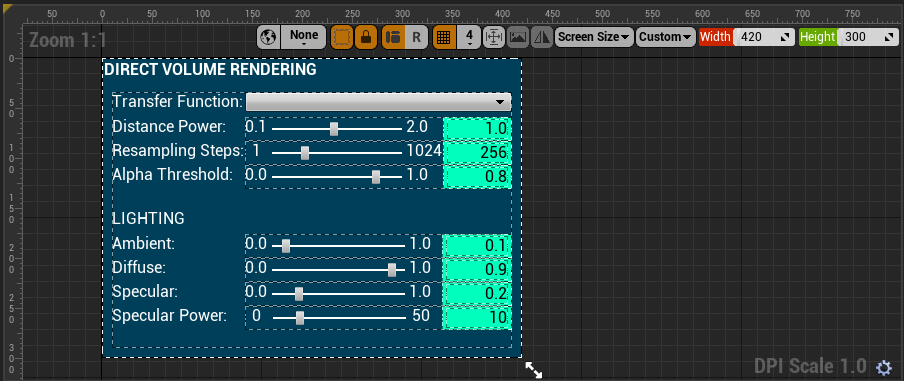<br>*Fig. 4.4.2.1.: User Widget Blueprint WBP_DVR*

Widget Input:

* DVR:
  * Transfer Function (Select)
  * Distance Power (Slider)
  * Resampling Steps (Slider)
  * Alpha Threshold (Slider)
* Lighting:
  * Ambient (Slider)
  * Diffuse (Slider)
  * Specular (Slider)
  * Specular Power (Slider)

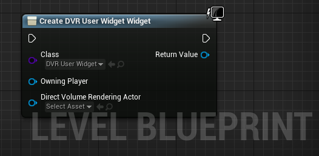<br>*Fig. 4.4.2.2.: Level Blueprint, Create DVR User Widget*

Create Parameter:

* Direct Volume Rendering Actor:
  * Type: Direct Volume Rendering Actor `BP_DVR` instance as Object Reference
  * Default Value: `none`
  * Description: Mandatory, assign a DVR Actor Instance to manage

<div style='page-break-after: always'></div>

#### 4.4.3. DVR User Widget Actor

Plugin "Volume Creator" provides with a "Direct Volume Rendering User Widget Actor" or DVR User Widget Actor (Blueprint Class: `BP_DVR_UI`). The Actor holds a User Widget Component with a DVR User Widget assigned (see figure 4.4.3.1.).

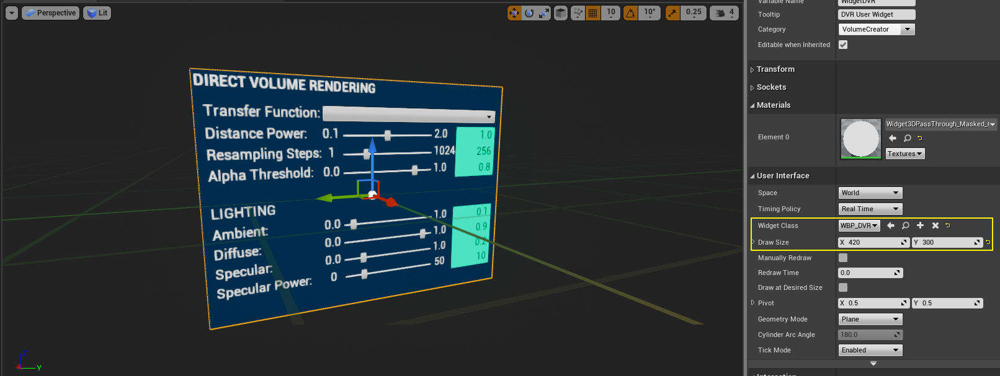<br>*Fig. 4.4.3.1.: Blueprint Actor BP_DVR_UI &ndash; Viewport*

The Actor may be added to the world by spawning an instance in a Blueprint, e.g., Level Blueprint (see figure 4.4.3.2) or by picking from the "Place Actors" Tab (see figure 4.4.3.3.).

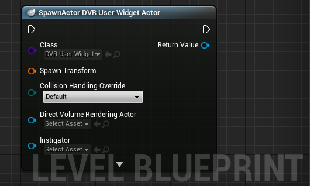<br>*Fig. 4.4.3.2: Level Blueprint, SpawnActor DVR User Widget Actor*

Spawn Parameter from Category 'Volume Creator':

* Direct Volume Rendering Actor:
  * Type: Direct Volume Rendering Actor `BP_DVR` instance as Object Reference
  * Default Value: `none`
  * Description: Mandatory, assign a DVR Actor Instance to manage

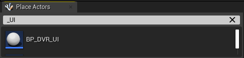<br>*Fig. 4.4.3.3.: Blueprint Actor BP_DVR_UI &ndash; Place Actors Tab*

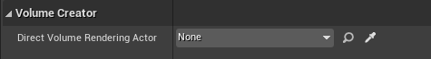<br>*Fig. 4.4.3.4.: Blueprint Actor BP_DVR_UI &ndash; Details Panel*

Parameter, Category 'Volume Creator' (see figure 'Details Panel'):

* Direct Volume Rendering Actor:
  * Type: Direct Volume Rendering Actor `BP_DVR` instance as Object Reference
  * Default Value: `none`
  * Description: Mandatory, assign a DVR Actor Instance to manage

<div style='page-break-after: always'></div>

#### 4.4.4. Clipping

##### 4.4.4.1. Clipping Cube Actor

Plugin "Volume Creator" provides with a "Clipping Cube Actor" (Blueprint Class: `BP_ClippingCube`), with which a volume rendering actor can be cropped in real-time. A Clipping Cube Actor instance can be assigned as to a DVR Actor instance by specifying it there as a parameter. In the Unreal Editor Outline Hierarchy a Clipping Cube Actor is ideally subordinated directly to the corresponding DVR Actor for adaptive scaling.

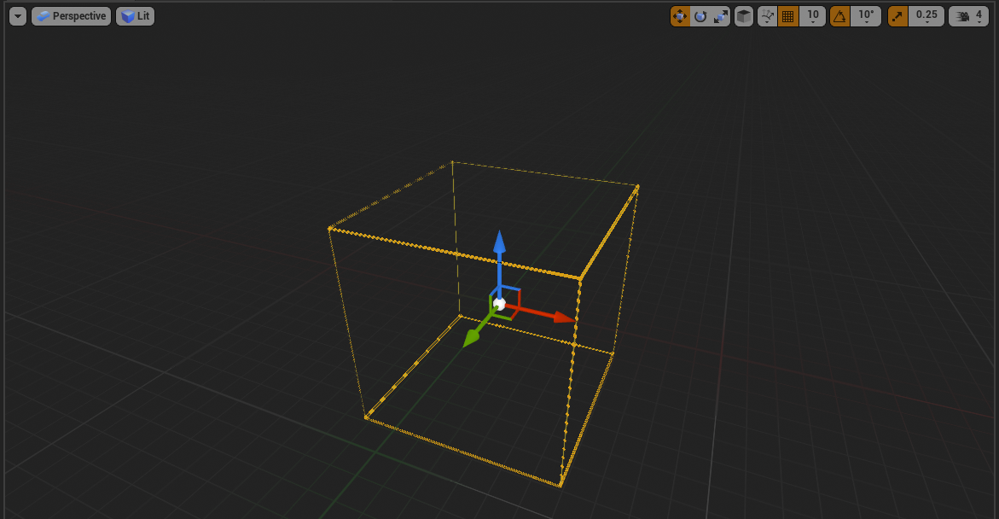<br>*Fig. 4.4.4.1.1.: Blueprint Actor BP_ClippingCube &ndash; Viewport*

Parameter, Category 'Volume Creator':

* none

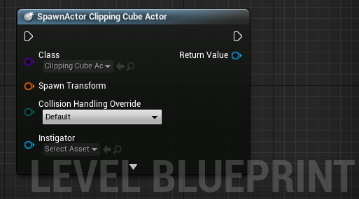<br>*Fig. 4.4.4.1.2.: Level Blueprint, SpawnActor Clipping Cube Actor*

Spawn Parameter from Category 'Volume Creator':

* none

<div style='page-break-after: always'></div>

##### 4.4.4.2. Clipping Cube Handles Actor

Plugin "Volume Creator" provides with a "Clipping Cube Handles Actor" (Blueprint Class: `BP_ClippingCubeHandles`), with which a Clipping Cube Actor can be modified interactively in real-time.

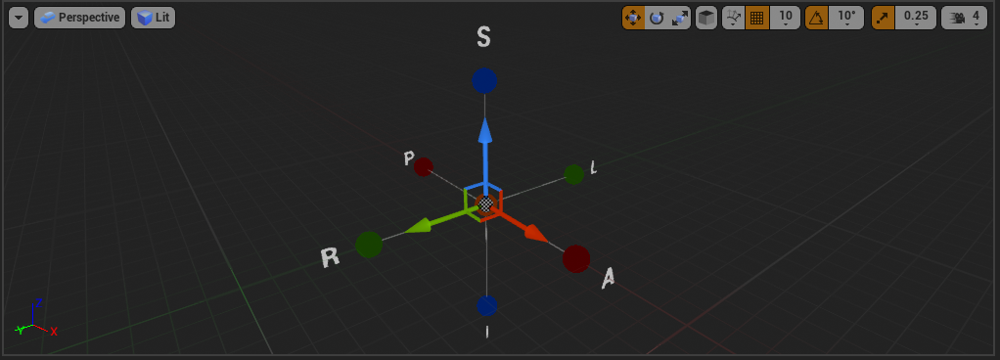<br>*Fig. 4.4.4.2.1.: Blueprint Actor BP_ClippingCubeHandles &ndash; Viewport*

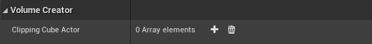<br>*Fig. 4.4.4.2.2.: Blueprint Actor BP_ClippingCubeHandles &ndash; Details Panel*

Parameter, Category 'Volume Creator' (see figure 'Details Panel'):

* Clipping Cube:
  * Type: Array of Clipping Cube Actor `BP_ClippingCube` instances as Object References
  * Default Value: `none`
  * Description: Mandatory, Clipping Cube Actor(s) to manage

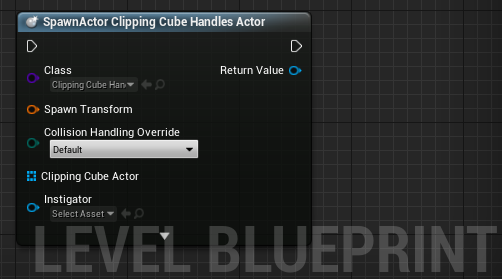<br>*Fig. 4.4.4.2.3.: Level Blueprint, SpawnActor Clipping Cube Handles Actor*

Spawn Parameter from Category 'Volume Creator':

* Clipping Cube:
  * Type: Array of Clipping Cube Actor `BP_ClippingCube` instances as Object References
  * Default Value: `none`
  * Description: Mandatory, Clipping Cube Actor(s) to manage

<div style='page-break-after: always'></div>

##### 4.4.4.3. Clipping Plane Actor

Plugin "Volume Creator" provides with a "Clipping Plane Actor" (Blueprint Class: `BP_ClippingPlane`), with which a volume rendering actor can be cropped in real-time.

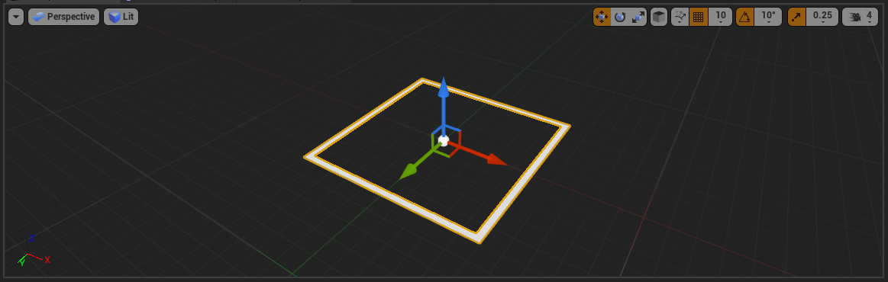<br>*Fig. 4.4.4.3.1.: Blueprint Actor BP_ClippingPlane &ndash; Viewport*

Parameter, Category 'Volume Creator':

* none

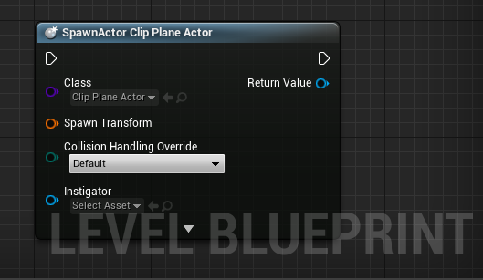<br>*Fig. 4.4.4.3.2.: Level Blueprint, SpawnActor Clipping Plane Actor*

Spawn Parameter from Category 'Volume Creator':

* none

<div style='page-break-after: always'></div>

#### 4.4.5. Light Source Actor

Plugin "Volume Creator" provides with a "Light Source Actor" (Blueprint Class: `BP_LightSource`), which can optionally be attached to a DVR Actor and act as a lighting source to illuminate the volume rendering.

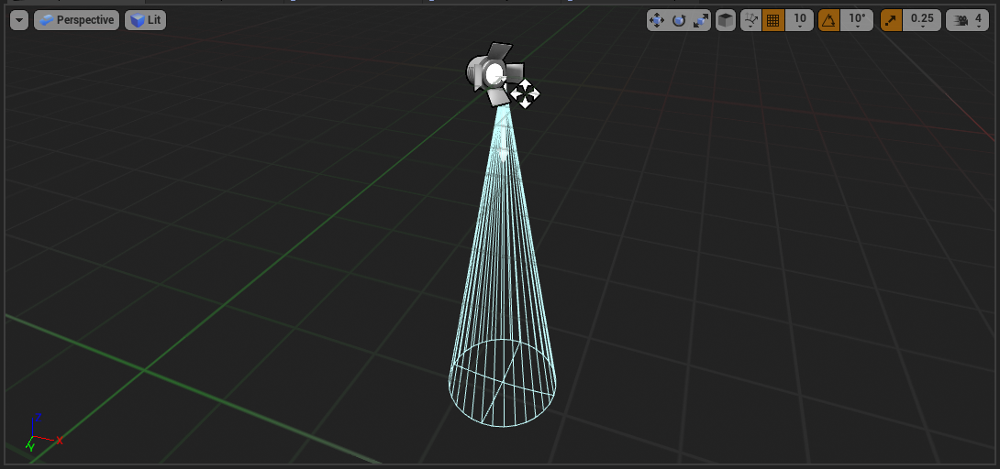<br>*Fig. 4.4.5.1.: Blueprint Actor BP_LightSource &ndash; Viewport*

The "Light Source Actor"s `SpotLightComponent` is simulating an operating room LED light source. By default its parameters are set as follows (see figure 4.4.5.2.).

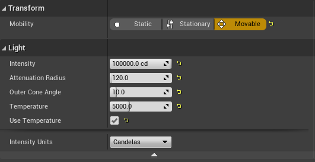<br>*Fig. 4.4.5.2.: Blueprint Actor BP_LightSource &ndash; Details Panel*

Parameter (see figure 'Details Panel'):

* Category 'Transform':
  * Mobility: `Movable`
* Category 'Light':
  * Use Temperature: `true`
  * Temperature: `5000.0`
    * Description: To provide a good color rendering index  CRI-R9 for red tones in surgical procedures (cf. [WaveformLighting]), parameter "Temperature" in Kelvin [K] is used (Use Temperature: `true`) to achieve an adjustable warm or cold white. "*Warmer colors (yellows and reds) appear at lower temperatures, while cooler colors (white and blue) appear at temperatures above 5,000 Kelvin.*" (cf. [USAMedicalSurgical]). Therefore initially a temperature of `5,000.0` K is set (see also [VivoSurgical]). It is up to the game developer to adjust the value accordingly.
  * Intensity Units: `Candelas`
  * Intensity: `100000.0 cd`
    * Description: We like to achieve a depth of illumination with a full spot of 100,000 lux at a distance of 1 meter (cf. [USAMedicalSurgical]). [UEDoc, Physical Lighting Units] mentiones that *"Candela (cd) is a measure of luminous intensity emitted uniformly across a solid angle of 1 steradian (sr). For example, a light set to 1000 cd would measure 1000 lux at 1 meter."* Therefore parameter "Intensity" is set to `100,000.0 cd` (Intensity Units: `Candelas`). Also *"Note that when the intensity of a light is defined in Candelas, it is unaffected by its cone angle"* (ibid.).
  * Attenuation Radius: `120.0`
    * Description: To bound the visible influence of the light and save rendering resources, we set parameter "Attenuation Radius" to a value slightly above 1m or 100.0 UE resp., i.e. `120.0` (*"Light Attenuation Radius can have a serious impact on performance, so use larger radius values sparingly"*, cf. [UEDoc, Lighting Basics]).
* Category 'Volume Creator':
  * none

The "Light Source Actor" implements Blueprint interface `BPI_LightSource`. A DVR Actor consumes values of a "Light Source Actor" by calling these interface functions:

* GetWorldLocation (returns: `Vector`)
* GetWorldRotation (returns: `Rotator`)
* GetIntensity (returns: `Float`)
* GetColor (returns: `Linear Color Structure`, from Temperature if used or LightColor otherwise)

Notes: By default, the "Light Source Actor"s spot light component is set to affect the world (Affects World: `true`) and also casts ray tracing shadows, reflections and global illumination. It is up to the game developer to manage these parameters. The same applies to source radius and length which define specular highlights on surfaces.

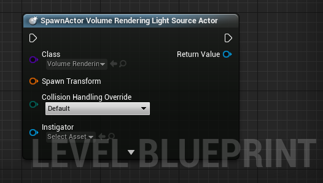<br>*Fig. 4.4.5.3.: Level Blueprint, SpawnActor Light Source Actor*

Spawn Parameter from Category 'Volume Creator':

* none

<div style='page-break-after: always'></div>

#### 4.4.6. Orientation Guide Actor

Plugin "Volume Creator" provides with an "Orientation Guide Actor" (Blueprint Class: `BP_OrientationGuide`), which can be attached to a volume rendering actor and serves as rotation synchronised orientation guide.

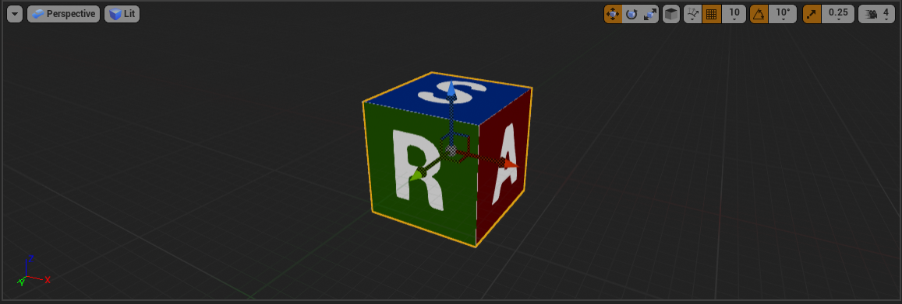<br>*Fig. 4.4.6.1.: Blueprint Actor BP_OrientationGuide &ndash; Viewport*

<br>*Fig. 4.4.6.2.: Blueprint Actor BP_OrientationGuide &ndash; Details Panel*

Parameter, Category 'Volume Creator' (see figure 'Details Panel'):

* Volume Rendering Actor:
  * Type: Direct Volume Rendering Actor `BP_DVR` instance as Object Reference
  * Default Value: `none`
  * Description: Mandatory, DVR Actor Instance to synchronise rotation from

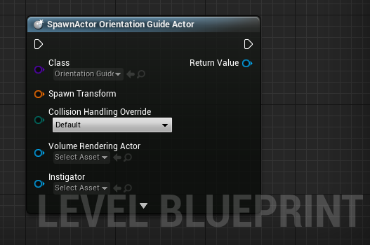<br>*Fig. 4.4.6.3.: Level Blueprint, SpawnActor Orientation Guide Actor*

Spawn Parameter from Category 'Volume Creator':

* Volume Rendering Actor:
  * Type: Direct Volume Rendering Actor `BP_DVR` instance as Object Reference
  * Default Value: `none`
  * Description: Mandatory, DVR Actor Instance to synchronise rotation from

<div style='page-break-after: always'></div>

## Appendix

### Abbreviations and Acronyms

* A &mdash; Anterior
* A&ndash;R&ndash;S &mdash; Anterior&ndash;Right&ndash;Superior
* AXE &mdash; Axial
* BB &mdash; Bounding Box
* cd &mdash; Candela; luminous intensity emitted by a source
* COR &mdash; Coronal
* CRI &mdash; Color Rendering Index
* CS &mdash; Compute Shader
* CT &mdash; Computed Tomography (X-ray)
* DICOM &mdash; Digital Imaging and Communications in Medicine
* DVR &mdash; Direct Volume Rendering
* fps &mdash; Frames per Second
* FPV &mdash; First Person View
* HU &mdash; Hounsfield Units
* I &mdash; Inferior
* L &mdash; Left
* LED &mdash; Light-emitting Diode
* LhS &mdash; Left-handed System
* L&ndash;A&ndash;S &mdash; Left&ndash;Anterior&ndash;Superior
* L&ndash;P&ndash;S &mdash; Left&ndash;Posterior&ndash;Superior
* lm &mdash; Lumen; luminous intensity emitted by a source
* LUT &mdash; Look-Up Table
* lux &mdash; lux; illumination on a surface
* MinIP &mdash; Minimum Intensity Projection
* MIP &mdash; Maximum Intensity Projection
* MPR &mdash; Multiplanar Rendering or Reconstruction resp.
* MR &mdash; Magnetic Resonance
* P &mdash; Posterior
* PE &mdash; Positron Emission
* PIE &mdash; Play in Editor
* PS &mdash; Pixel Shader
* R &mdash; Right
* R&ndash;A&ndash;S &mdash; Right&ndash;Anterior&ndash;Superior
* RhS &mdash; Right-handed System
* RT &mdash; Render Target Texture
* S &mdash; Superior
* SAG &mdash; Sagittal
* SV &mdash; Scalar Volume
* TCS &mdash; Test Color Samples
* TF &mdash; Transfer Function
* UE &mdash; Unreal Engine
* UI &mdash; User Interface
* US &mdash; Ultrasound Imaging (sonography)
* VOI &mdash; Values of Interest

<!--
* AAA &mdash; Abdominal Aortic Aneurysm
* CRS &mdash; Coordinate Reference System
* CTA &mdash; Computed Tomography Angiography
* dGEMRIC &mdash; delayed Gadolinium-Enhanced MRI of Cartilage
* IES &mdash; Illuminating Engineering Society, Lighting Profile File Extension
* MRI &mdash; Magnetic Resonance Imaging
* MRT &mdash; Magnetic Resonance Tomography
* MRT &mdash; Multiple Render Targets (rendering technique)
* PET &mdash; Positron Emission Tomography
* ROI &mdash; Region Of Interest
* SV &mdash; Scalar Volume (not to be confused with the HLSL abbreviation for System Value; cf. Online: *[HLSL Semantics](https://learn.microsoft.com/en-gb/windows/win32/direct3dhlsl/dx-graphics-hlsl-semantics)*).
* WCS &mdash; World Coordinate System
-->

<div style='page-break-after: always'></div>

### Glossary

#### Terms of Location and Coordinate Systems

Patient Coordinate System: Anatomical planes and terms of location on a person standing upright (cf. [mbbs]):

* **Coronal Plane**: Frontal plane, separates in **Posterior (P)** towards back and **Anterior (A)** towards front.
* **Sagittal Plane**: The median plane is a longitudinal plane, which separates the body into its **Left (L)** and **Right (R)** halves. A sagittal plane is any plane perpendicular to the median plane.
* **Axial Plane**: Horizontal plane, separates in **Inferior (I)** towards feet and **Superior (S)** towards head.

##### *DICOM Images*

DICOM images are using a **Left&ndash;Posterior&ndash;Superior L&ndash;P&ndash;S** system (cf. [Sharma 2022] and [Adaloglouon 2020], *Anatomical coordinate system*). DICOM images are stored as a matrix of pixels with index coordinates in rows `i`, columns `j`, and slices `k` using a **Right-handed System RhS** (cf. [Adaloglouon 2020, Medical Image coordinate system (Voxel space)]):

* The image stack Origin is located in the first slice, first column, first row
* i: Image width in columns, increases to anatomical **Left L**
* j: Image height in rows, increases to anatomical **Posterior P**
* k: Image stack depth in slices, increases anatomical **Superior S**

##### *Unreal Engine*

Unreal Engine is using a **Left-handed System LhS** based First Person View FPV (cf. [Mower, Coordinate System]) with terms of location 'Back', 'Front', 'Left', 'Right', 'Bottom' and 'Top'. In plugin "Volume Creator"&mdash;with the use of UE's LhS and terms of location&mdash; the anatomical coordinate system results in an **Anterior&ndash;Right&ndash;Superior A&ndash;R&ndash;S** system (see figure G.1.):

<br>*Fig. G.1.: Orientation Guide Actor with UE Left handed Location-Gizmo Arrows*

* X: Increases from Back to Front, color code **Red**; anatomical from Posterior P to **Anterior A**
* Y: Increases from Left to Right, color code **Green**; anatomical from Left L to **Right R**
* Z: Increases upwards from Bottom to Top, color code **Blue**; anatomical from Inferior I to **Superior S**

Anatomical Planes and Terms of Location in plugin "Volume Creator" (see figure G.2.):

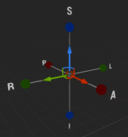<br>*Fig. G.2.: Clipping Cube Handles Actor with UE Left handed Location-Gizmo Arrows*

* **Coronal COR**: Frontal **YZ-Plane** (green/blue arrows) with **Up-Vector X+** (red arrow) from **Posterior P** to **Anterior A**
* **Sagittal SAG**: Longitudinal **XZ-Plane** (red/blue arrows) with **Up-Vector Y+** (green arrow) from **Left L** to **Right R**
* **Axial AXE**: Horizontal **XY-Plane** (red/green arrows) with **Up-Vector Z+** (blue arrow) from **Inferior I** to **Superior S**

<div style='page-break-after: always'></div>

#### Luminous Intensity and Illumination

The lumen (lm) is used to measure the luminous intensity emitted by a source. Another unit of measurement, the lux, takes account of the illumination on a given surface. This varies according to the distance from the light source and the width of the beam. The further away you are from the light source, the less effective the lighting will be. 1 Lux is equivalent to the uniform illumination of a flux of 1 lumen over a surface area of 1 m². ([Illuminance])

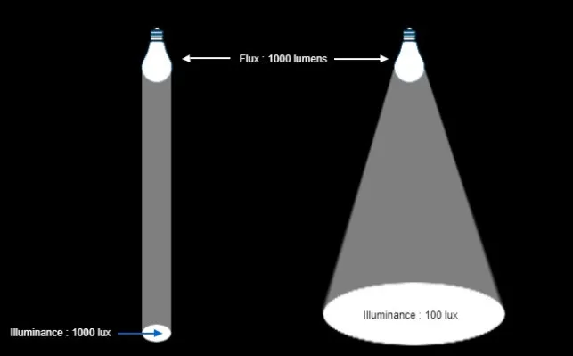<br>*Fig. G.3.: Illustration of the Distinction between Lux and Lumen*

<div style='page-break-after: always'></div>

#### Asset Naming Convention

The plugins assets naming convention is based on a scheme from [UEDoc, Recommended Asset Naming Conventions] (see also [Allar 2022] and [Amos 2021]):
> *`[AssetTypePrefix]_[AssetName]_[DescriptorSuffix]_[OptionalVariantLetterOrNumber]`*
>
>* *`AssetTypePrefix` identifies the type of Asset [...].*
>* *`AssetName` is the Asset's name.*
>* *`DescriptorSuffix` provides additional context for the Asset, to help identify how it is used. For example, whether a texture is a normal map or an opacity map.*
>* *`OptionalVariantLetterOrNumber` is optionally used to differentiate between multiple versions or variations of an asset.*

* `[AssetTypePrefix]`:
  * Blueprint: `BP`
  * Blueprint Interface: `BPI`
  * Curve: `Curve`
  * Data Asset: `DA`
  * Enum(eration): `E`
  * Material: `M`
  * Material Instance: `MI`
  * Material Instance Dynamic: `MID`
  * Struct(ure): `F`
  * Static Mesh: `SM`
  * Texture: `T`
  * Texture Render Target: `RT`
  * Widget Blueprint: `WBP`
* `[AssetName]` (Domain Specific):
  * Bounding Box: `BB`
  * Data Type:
    * Scalar Volume: `SV`
    * Values Of Interest: `VOI`
    * Transfer Function: `TF`
    * Look-Up Table: `LUT`
  * Acquisition Type:
    * Computer Tomography: `CT`
    * Magnetic Resonance: `MR`
    * Ultrasound: `US`
  * Rendering Type:
    * Multiplanar Rendering: `MPR`
      * Plane: `COR`, `SAG`, `AXE`
      * Location: `P`, `A`, `L`, `R`, `I`, `S`
    * Direct Volume Rendering: `DVR`
* `[DescriptorSuffix]`:
  * Texture Array: `Array`
  * Curve Linear Color: `Color`
  * Color Atlas: `ColorAtlas`
  * Main Material: `Main`
  * User Widget Actor: `UI`
  * Volume Texture: `Volume`

<div style='page-break-after: always'></div>

### A. References

#### A.1. Medical Imaging

* Anatomical Terms:
  * [mbbs] mbbsbooks: **Anatomical Terms**. In: mbbsbooks Medical - Category Anatomy. Feb 14, 2023. Online: [https://mbbsbooks.com/anatomical-terms/](https://mbbsbooks.com/anatomical-terms/)
* DICOM:
  * [DICOM] **The DICOM Standard**. Online: [https://www.dicomstandard.org/current](https://www.dicomstandard.org/current)
  * [DICOM, FAQ] **DICOM Standard FAQ**. Online: [https://www.dicomstandard.org/faq](https://www.dicomstandard.org/faq)
  * [DICOM-Browser] Innolitics: **DICOM Standard Browser**. Online: [https://dicom.innolitics.com/ciods/ct-image](https://dicom.innolitics.com/ciods/ct-image)
  * [Radiopaedia, HU] Greenway K, Murphy A, Gaillard F, et al.: **Hounsfield unit**. Reference article, Radiopaedia.org (Accessed on 25 Sep 2023), DOI: [10.53347/rID-38181](https://doi.org/10.53347/rID-38181)
  * [Sharma 2021] Shivam Sharma: **Introduction to DICOM for Computer Vision Engineers**. In: *RedBrick AI*. Dec 15, 2021. Online: [https://medium.com/redbrick-ai/introduction-to-dicom-for-computer-vision-engineers-78f346bbc1fd](https://medium.com/redbrick-ai/introduction-to-dicom-for-computer-vision-engineers-78f346bbc1fd)
  * [Sharma 2022] Shivam Sharma: **DICOM Coordinate Systems &ndash; 3D DICOM for Computer Vision Engineers**. In: *RedBrick AI*. Dec 22, 2022. Online: [https://medium.com/redbrick-ai/dicom-coordinate-systems-3d-dicom-for-computer-vision-engineers-pt-1-61341d87485f](https://medium.com/redbrick-ai/dicom-coordinate-systems-3d-dicom-for-computer-vision-engineers-pt-1-61341d87485f)
  * [Adaloglouon 2020] Nikolas Adaloglouon: **Understanding Coordinate Systems and DICOM for Deep Learning Medical Image Analysis**. In: *The AI Summer*. July 16, 2020. Online: [https://theaisummer.com/medical-image-coordinates/](https://theaisummer.com/medical-image-coordinates/)
  * [Zaharia 2013] Roni Zaharia: **Chapter 14 - Image Orientation: Getting Oriented using the Image Plane Module**. In: *DICOM Tutorial, DICOM is Easy &ndash; Software Programming for Medical Applications*. June 6, 2013. Online: [http://dicomiseasy.blogspot.com/2013/06/getting-oriented-using-image-plane.html](http://dicomiseasy.blogspot.com/2013/06/getting-oriented-using-image-plane.html)
* Volume Rendering:
  * [Luecke 2005] Peter Luecke: **Volume Rendering Techniques for Medical Imaging**. Diplomarbeit. Technische Universität München, Fakultät für Informatik. April 15, 2005. In collaboration with Siemens Corporate Research Inc., Princeton, USA. Online: [https://campar.in.tum.de/twiki/pub/Students/DaLuecke/Diplomarbeit.pdf](https://campar.in.tum.de/twiki/pub/Students/DaLuecke/Diplomarbeit.pdf)
  <!--* [Piper et al.] Piper S., Finet J., Yarmarkovich A., Aucoin N.: **3D Slicer Module "Volumes"**. License: slicer4. The work is part of the National Alliance for Medical Image Computing (NAMIC), funded by the National Institutes of Health through the NIH Roadmap for Medical Research, Grant U54 EB005149. Online Documentation: [https://slicer.readthedocs.io/en/latest/user_guide/modules/volumes.html](https://slicer.readthedocs.io/en/latest/user_guide/modules/volumes.html)-->
  <!--* [Finet et al.] Finet J., Yarmarkovich A., Liu Y., Freudling A., Kikinis R.: **3D Slicer Module "Volume Rendering"**. License: slicer4. The work is part of the National Alliance for Medical Image Computing (NAMIC), funded by the National Institutes of Health through the NIH Roadmap for Medical Research, Grant U54 EB005149. Online Documentation: [https://slicer.readthedocs.io/en/latest/developer_guide/modules/volumerendering.html](https://slicer.readthedocs.io/en/latest/developer_guide/modules/volumerendering.html); Transfer Function Presets on GitHub: [https://github.com/Slicer/Slicer/blob/main/Modules/Loadable/VolumeRendering/Resources/presets.xml](https://github.com/Slicer/Slicer/blob/main/Modules/Loadable/VolumeRendering/Resources/presets.xml)-->
  * [Sunden 2015] Sunden E., Ropinski, T.: **Efficient volume illumination with multiple light sources through selective light updates**. 2015 IEEE Pacific Visualization Symposium (PacificVis), Hangzhou, China, 2015, pp. 231-238, DOI: [10.1109/PACIFICVIS.2015.7156382](https://doi.org/10.1109/PACIFICVIS.2015.7156382).
* Surgical Lighting:
  * [VivoSurgical] **Why Colour Matters in Surgical Lighting**. In: Website of Vivo Surgical. Jul 27, 2021. Online: *[https://www.vivo-surgical.com/post/why-colour-matters-the-importance-of-colour-temperature](https://www.vivo-surgical.com/post/why-colour-matters-the-importance-of-colour-temperature)*
  <!--* [22] **The Different Colors Of Operating Theatre Lights**. In: Website "Forum Theatre". September 15, 2022. Online: *[https://forum-theatre.com/the-different-colors-of-operating-theatre-lights/](https://forum-theatre.com/the-different-colors-of-operating-theatre-lights/)*-->
  * [WaveformLighting] **What is CRI R9 and Why is it Important?** In: Waveform Lighting Blog, Tech & Color Science. Waveform Lighting, LLC. Online: [https://www.waveformlighting.com/tech/what-is-cri-r9-and-why-is-it-important](https://www.waveformlighting.com/tech/what-is-cri-r9-and-why-is-it-important)
  * [Wikipedia, Surgical lighting] Article **Surgical lighting**. In: Wikipedia. URL: [https://en.wikipedia.org/w/index.php?oldid=1143957583](https://en.wikipedia.org/w/index.php?oldid=1143957583)
  * [USAMedicalSurgical] **Surgical Lights Buyer's Guide For Medical Professionals, Surgery Centers, Medical Offices and Hospitals**. In: USA Medical and Surgical Supplies. Posted on 07/24/2018. Online: [https://www.usamedicalsurgical.com/blog/surgical-lights-buyers-guide/](https://www.usamedicalsurgical.com/blog/surgical-lights-buyers-guide/)

#### A.2. Unreal Engine

* [UEDoc] Epic Games: **Unreal Engine Documentation**. Online: *[https://docs.unrealengine.com](https://docs.unrealengine.com)*
* Coordinate System:
  * [Mower, Scale] Nick Mower: **Scale and Measurement Inside Unreal Engine 4**. In: TechArt-Hub. Online: [https://www.techarthub.com/scale-and-measurement-inside-unreal-engine-4/](https://www.techarthub.com/scale-and-measurement-inside-unreal-engine-4/)
  * [Mower, Coordinate System] Nick Mower: **A Practical Guide to Unreal Engine 4’s Coordinate System**. In: TechArt-Hub. Online: [https://www.techarthub.com/a-practical-guide-to-unreal-engine-4s-coordinate-system/](https://www.techarthub.com/a-practical-guide-to-unreal-engine-4s-coordinate-system/)
* Naming Convention:
  * [UEDoc, Recommended Asset Naming Conventions] Epic Games: **Recommended Asset Naming Conventions**. In: Unreal Engine Documentation. Online: [https://docs.unrealengine.com/5.2/en-US/recommended-asset-naming-conventions-in-unreal-engine-projects/](https://docs.unrealengine.com/5.2/en-US/recommended-asset-naming-conventions-in-unreal-engine-projects/)
  * [Allar 2022] Michael Allar: **Gamemakin UE Style Guide**. March 7, 2022. Online: [https://github.com/Allar/ue5-style-guide](https://github.com/Allar/ue5-style-guide)
  * [Amos 2021] Dylan "Tezenari" Amos: **Asset Naming Conventions**. In: Unreal Directive. October 12, 2021. Online: [https://www.unrealdirective.com/resource/asset-naming-conventions](https://www.unrealdirective.com/resource/asset-naming-conventions)
* Textures:
  * [UEDoc, EPixelFormat] Epic Games: Unreal Engine API Reference > Runtime > Core > **EPixelFormat**. In: Unreal Engine Documentation. Online: [https://docs.unrealengine.com/4.26/en-US/API/Runtime/Core/EPixelFormat/](https://docs.unrealengine.com/4.26/en-US/API/Runtime/Core/EPixelFormat/)
  * [Ivanov 2021] Michael Ivanov: **Unreal Engine and Custom Data Textures**. June 19, 2021. Online: [https://sasmaster.medium.com/unreal-engine-and-custom-data-textures-40857f8b6b81](https://sasmaster.medium.com/unreal-engine-and-custom-data-textures-40857f8b6b81)
  * [UEDoc, Guidelines for Optimizing Rendering for Real-Time] Epic Games: **Guidelines for Optimizing Rendering for Real-Time**. In: Unreal Engine Documentation. Online: [https://docs.unrealengine.com/5.2/en-US/guidelines-for-optimizing-rendering-for-real-time-in-unreal-engine/](https://docs.unrealengine.com/5.2/en-US/guidelines-for-optimizing-rendering-for-real-time-in-unreal-engine/)
  * [Mower, Compression] Nick Mower: **Your Guide to Texture Compression in Unreal Engine**. In: TechArt-Hub. Online: [https://www.techarthub.com/your-guide-to-texture-compression-in-unreal-engine/](https://www.techarthub.com/your-guide-to-texture-compression-in-unreal-engine/)
* Lighting:
  * [UEDoc, Physical Lighting Units] **Physical Lighting Units**. In: Unreal Engine Documentation. Online: [https://docs.unrealengine.com/4.27/en-US/BuildingWorlds/LightingAndShadows/PhysicalLightUnits/](https://docs.unrealengine.com/4.27/en-US/BuildingWorlds/LightingAndShadows/PhysicalLightUnits/)
  * [Illuminance ] **Lux et Lumens, comment s’y retrouver? - Différence entre les deux unités de mesure**. Online: [https://www.lecyclo.com/fr-ch/blogs/conseils/difference-lux-lumens-luminosite-feu-velo](https://www.lecyclo.com/fr-ch/blogs/conseils/difference-lux-lumens-luminosite-feu-velo)

### B. Readings

* Meissner M., Pfister H., Westermann R., and Wittenbrink C. (2000): **Volume Visualization and Volume Rendering Techniques**. Eurographics tutorial. Online: [https://vcg.seas.harvard.edu/publications/volume-visualization-and-volume-rendering-techniques](https://vcg.seas.harvard.edu/publications/volume-visualization-and-volume-rendering-techniques)
* Engel K., Hadwiger M., Kniss J., Rezk Salama C., Weiskopf D. (2006): **Real-Time Volume Graphics**. doi: [10.1145/1103900.1103929](http://dx.doi.org/10.1145/1103900.1103929). Online: [http://www.real-time-volume-graphics.org/](http://www.real-time-volume-graphics.org/)
* Ikits M., Kniss J., Lefohn A., Hansen C. (2007): **Volume Rendering Techniques**. In: GPU Gems: Programming Techniques, Tips, and Tricks for Real-Time Graphics &ndash; Part VI: Beyond Triangles, Chapter 39. 5th Printing September 2007, Pearson Education, Inc. Online: [https://developer.nvidia.com/gpugems/gpugems/part-vi-beyond-triangles/chapter-39-volume-rendering-techniques](https://developer.nvidia.com/gpugems/gpugems/part-vi-beyond-triangles/chapter-39-volume-rendering-techniques)
* Beyer J, Hadwiger M, and Pfister H.: **State-of-the-Art in GPU-Based Large-Scale Volume Visualization**. Wiley Online Library: Computer Graphics Forum, 2015. DOI: [10.1111/cgf.12605](https://doi.org/10.1111/cgf.12605) Online: [https://vcg.seas.harvard.edu/publications/stateof-the-art-in-gpu-based-large-scale-volume-visualization](https://vcg.seas.harvard.edu/publications/stateof-the-art-in-gpu-based-large-scale-volume-visualization)

<!--
* Fedorov A., Beichel R., Kalpathy-Cramer J., Finet J., Fillion-Robin J-C., Pujol S., Bauer C., Jennings D., Fennessy F.M., Sonka M., Buatti J., Aylward S.R., Miller J.V., Pieper S., Kikinis R: **3D Slicer as an Image Computing Platform for the Quantitative Imaging Network**. Online: [https://www.ncbi.nlm.nih.gov/pmc/articles/PMC3466397/pdf/nihms383480.pdf](https://www.ncbi.nlm.nih.gov/pmc/articles/PMC3466397/pdf/nihms383480.pdf). Magnetic Resonance Imaging. 2012 Nov;30(9):1323-41. PMID: 22770690. PMCID: PMC3466397.
* Microsoft Learn: **Volume Rendering Overview**. In: Learn > Windows > Mixed Reality > App quality and testing. 06/01/2022. Online: [https://learn.microsoft.com/en-us/windows/mixed-reality/develop/advanced-concepts/volume-rendering-overview](https://learn.microsoft.com/en-us/windows/mixed-reality/develop/advanced-concepts/volume-rendering-overview)
-->

<div style='page-break-after: always'></div>

### C. Attribution

* The word mark *Unreal* and its logo are Epic Games, Inc. trademarks or registered trademarks in the US and elsewhere (cf. Branding Guidelines and Trademark Usage, Online: [https://www.unrealengine.com/en-US/branding](https://www.unrealengine.com/en-US/branding))
* The word mark *DICOM&mdash;Digital Imaging and Communication in Medicine* and its logo are trademarks or registered trademarks of the National Electrical Manufacturers Association (NEMA), managed by the Medical Imaging Technology Association (MITA), a division of NEMA
* The word mark *MetaImage* is a trademark or registered trademark of Kitware, Inc.
<!-- * The word mark *ITK&mdash;Insight Toolkit* is a trademark or registered trademark of Kitware, Inc. -->
<!-- * The word mark *3D Slicer* and its logo are trademarks of Brigham and Women’s Hospital (BWH), used with permission -->

### D. Disclaimer

This documentation has **not been reviewed or approved** by the Food and Drug Administration FDA or by any other agency. It is the users responsibility to ensure compliance with applicable rules and regulations&mdash;be it in the US or elsewhere.

### E. Citation

**Software**: To acknowledge *"Unreal&reg; Engine Plugin: Volume Creator"* software, please cite

> Bruggmann, Roland (2023). *Unreal&reg; Engine Plugin: Volume Creator*, Version [v#.#.#], UE [4.## or 5.#]. Unreal&reg; Marketplace. URL: [https://www.unrealengine.com/marketplace/en-US/product/volume-creator](https://www.unrealengine.com/marketplace/en-US/product/volume-creator). Copyright 2023 Roland Bruggmann aka brugr9. All Rights Reserved.

**Documentation**: To acknowledge this documentation&mdash;be it, e.g., the Readme or the Changelog&mdash;please cite

> Bruggmann, Roland (2023). *Volume Creator: Unreal&reg; Engine Plugin for Medical Data Rendering &mdash; Documentation*, \[Readme, Changelog\]. GitHub; accessed [Year Month Day]. URL: [https://github.com/brugr9/UEPluginVolumeCreator](https://github.com/brugr9/UEPluginVolumeCreator). Licensed under [Creative Commons Attribution-ShareAlike 4.0 International](http://creativecommons.org/licenses/by-sa/4.0/)

---
<!-- Footer -->

[](https://creativecommons.org/licenses/by-sa/4.0/)

*"Volume Creator: Unreal&reg; Engine Plugin for Medical Data Rendering &mdash; Documentation"*. URL: [https://github.com/brugr9/UEPluginVolumeCreator](https://github.com/brugr9/UEPluginVolumeCreator). &copy; 2023 by Roland Bruggmann, Documentation licensed under Creative Commons Attribution-ShareAlike 4.0 International.
