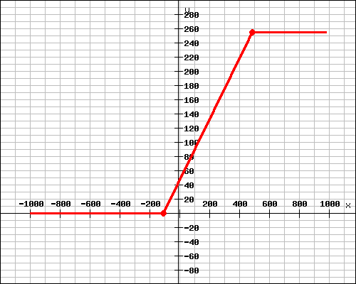
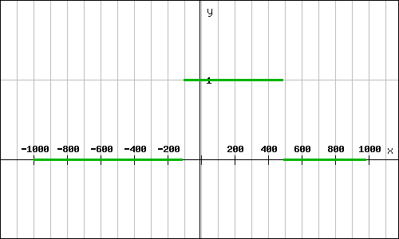

# Volume Creator: An Unreal&reg; Engine Plugin for Medical Data Rendering &ndash; Readme

This document is part of *"Volume Creator: An Unreal&reg; Engine Plugin for Medical Data Rendering &mdash; Documentation"*

* Author: Copyright 2023 Roland Bruggmann aka brugr9
* Profile on UE Marketplace: [https://www.unrealengine.com/marketplace/profile/brugr9](https://www.unrealengine.com/marketplace/profile/brugr9)
* Profile on Epic Developer Community: [https://dev.epicgames.com/community/profile/PQBq/brugr9](https://dev.epicgames.com/community/profile/PQBq/brugr9)

---

<!-- UE Marketplace : Begin 1/2 -->


Real-time Volume Rendering from Medical Imaging Data

## Description

This plugin provides a user-friendly workflow for creating image-based and efficiently rendered 3D volumes from medical imaging data using the Blueprint Visual Scripting System.

The delivered assets provide the rendering from medical imaging data (CT/MRI) using shader software with transfer-functions from color curve gradients. To speed up rendering, optimization techniques such as empty space skipping and early ray termination are used. The delivered assets also support importing image stacks and creating texture volumes, e.g., from DICOM&reg; files.

<!-- UE Marketplace : End 1/2 -->
---

<div style='page-break-after: always'></div>

## Table of Contents

<!-- Start Document Outline -->

* [1. Setup](#1-setup)
  * [1.1. Installation](#11-installation)
  * [1.2. Project Configuration](#12-project-configuration)
* [2. Usage](#2-usage)
  * [2.1. Concept](#21-concept)
  * [2.2. Scalar Volumes](#22-scalar-volumes)
    * [2.2.1. Import](#221-import)
    * [2.2.2. Data Background](#222-data-background)
  * [2.3. DICOM Window](#23-dicom-window)
    * [2.3.1. DICOM Window Function](#231-dicom-window-function)
    * [2.3.2. DICOM Window Mask](#232-dicom-window-mask)
  * [2.3. Transfer Function](#23-transfer-function)
  * [2.4. Volume Rendering](#24-volume-rendering)
  * [2.5. Shading](#25-shading)
* [3. Demo](#3-demo)
  * [3.1. Desktop](#31-desktop)
  * [3.2. VR](#32-vr)
    * [3.2.1. Configure Input Bindings](#321-configure-input-bindings)
* [4. Unsupported](#4-unsupported)
* [Appendix](#appendix)
  * [Acronyms](#acronyms)
  * [Glossary](#glossary)
  * [A. References](#a-references)
    * [A.1. Unreal Engine](#a1-unreal-engine)
    * [A.2. Medical Image Processing](#a2-medical-image-processing)
  * [B. Readings](#b-readings)
  * [C. Acknowledgements](#c-acknowledgements)
  * [D. Attribution](#d-attribution)
  * [E. Disclaimer](#e-disclaimer)
  * [F. Citation](#f-citation)

<!-- End Document Outline -->

<div style='page-break-after: always'></div>

## 1. Setup

### 1.1. Installation

In the Unreal Editor access the Plugin Editor from the menu 'Edit > Plugins'. In the Plugin Editor, under category 'Rendering' find and enable the plugin. Finally restart the Unreal Editor.


<br>*Fig. 1.1.: Screenshot of Plugin Editor with Plugin "Volume Creator" enabled*

### 1.2. Project Configuration

To allow Volume Texture asset creation follow these steps as from Unreal Engine Documentation article [*Creating Volume Textures*](https://docs.unrealengine.com/4.26/en-US/RenderingAndGraphics/Textures/VolumeTextures/CreatingVolumeTextures/):

> Before you can use Volume Textures in your Unreal Engine 4 (UE4) project, you will need to enable them. In the following How-To, we will take a look at setting up your UE4 project to use Volume Textures.
>
> 1. First, make sure that the Editor is closed, and then locate your project's DefaultEngine.ini file and open it.
> 2. Locate the Script/Engine.RendererSettings section and add the following variable, then save the file when you have added it:
>
> ```r.AllowVolumeTextureAssetCreation=1```
>
> 3. Re-launch the Editor

<div style='page-break-after: always'></div>

## 2. Usage

### 2.1. Concept

The following workflow is discussed as a basic concept. We use an actor with an actor component Static Mesh 'Cube'. The cube is assiged a volume rendering material with parameters as follows:

* **Scalar Volume**: Voxels from Image-Stack represented as `Volume Texture` asset
* **DICOM Window**: Hounsfield Scale filter
* **Transfer Function**: Color Gradients represented as `Curve Linear Color` assets packed in a `Curve Atlas`
* **Volume Rendering**: Direct Volume Rendering DVR by Raymarching represented by Raymarching `Material` assets
* **Shading**: unlit or with static lighting

TODO:

* **Actor Component**: Actor Component `ScalarVolume` which is a Mesh Cube with Material `Raymarching` by default

<div style='page-break-after: always'></div>

### 2.2. Scalar Volumes

An image-stack based volume&mdash;commonly known as scalar volume&mdash;is kept as Volume Texture asset in Unreal Engine.

Plugin features:

* Creates Volume Texture and Data Asset (meta data) from imported scalar data
* Window center and window width support
* Saving is limited to `G8` or `G16`. The plugin does not support persistent 32bit grayscale textures to be saved.

Naming convention:

* Texture Prefix: `T_`
* Underlines in file names (`_`) are replaced by minus in asset names (`-`)
* Volume Texture Suffix: `_Volume`
* Data Asset Suffix: `_Data`

Example:

* Volume Texture: `T_LUNA16-subset0-5112_Volume`
* Data Asset: `T_LUNA16-subset0-5112_Data`

#### 2.2.1. Import

CT image data is expected to come in Hounsfield Units $HU$ as values in a range of $[-1024,3071]$ which are $4096$ gray levels for different materials. These $4096$ gray levels can be optimally represented with a twelve-digit binary number ($2^{12} = 4096$).

##### 2.2.1.1. Import DICOM

DICOM&reg; *.dcm

The results are stored in a Volume Render Texture named `RT_Scalar_Volume`, R-channel.

##### 2.2.1.2. Import MetaImage

MetaImage&trade; *.mhd

<div style='page-break-after: always'></div>

#### 2.2.2. Data Background

##### 2.2.2.1. Memory

Scalar volume size $V_1$ (cp. [FAQ]):

* A Stack of 256 images of size 256 x 256 pixel per image = 256<sup>3</sup> pixel or voxel resp.
* 4 channels RGBA
* With 8 bit per channel ($2^{8} = 256$, range from 0 to 255)

$ V_1 = 256^3 \times 4 \times 8\ {}bit = 536’870’912\ {}bit = 0.537\ {}Gigabit = 67\ {}MB $

If the images are double the size (stack of 512 images with 512 x 512 pixel per image), the size $V_2$ increases to 0.5 GB:

$ V_2 = 512^3 \times 4 \times 8\ {}bit = 4’294’967’296\ {}bit = 4.295\ {}Gigabit = 537\ {}MB $

If the images are double the size (stack of 1024 images with 1024 x 1024 pixel per image), the size $V_3$ increases to 4 GB:

$ V_3 = 1024^3 \times 4 \times 8\ {}bit = 34’359’738’368\ {}bit = 34.359\ {}Gigabit = 4295\ {}MB $

##### 2.2.2.2. Processing

With processing, e.g., $30 \text{ fps}$:

$
Processed\ {}Data_1 = \frac{0.537\ {}Gigabit}{frame} \times \frac{30\ {}frames}{s} = 16.1\ {} Gigabit\ {}per\ {}second
$

$
Processed\ {}Data_2 = \frac{4.295\ {}Gigabit}{frame} \times \frac{30\ {}frames}{s} = 128.8\ {} Gigabit\ {}per\ {}second
$

$
Processed\ {}Data_3 = \frac{34.359\ {}Gigabit}{frame} \times \frac{30\ {}frames}{s} = 1030.8\ {} Gigabit\ {}per\ {}second
$

<!-- 
https://www.quora.com/How-can-a-processor-handle-10-Gigabit-per-second-or-more-data-rate
-->

<div style='page-break-after: always'></div>

### 2.3. DICOM Window

CT image data is expected to come in Hounsfield Units $HU$ in a range of $[-1024,3071]$ representing $4096$ gray levels for different materials where air is defined as $-1000 HU$ and water as $0 HU$. But computer screens only can visualize $256$ gray levels, represented by a value range of $[0, 255]$. Therefore the $4096$ Hounsfield Units have to be mapped to the $256$ screen gray scale levels. This is done by linear interpolation (Lerp).

If the whole range of $4096$ Hounsfield data is mapped to $256$ gray levels, the contrast becomes quite bad. Therefore, the so called DICOM Window was introduced to downsize the range of Hounsfield data to map.

#### 2.3.1. DICOM Window Function

A DICOM Window is defined in $HU$ by its center $W_c$&mdash;aka level, and width $W_w$&mdash;aka contrast. The DICOM window center $W_c$ and width $W_w$ define the window right border $W_r$ and left border $W_l$:

* $W_r = W_c + \frac{W_w}{2}$
* $W_l = W_c - \frac{W_w}{2}$
* $W_l <= W_r$

The DICOM Window function $w$ is applied to the volume's Hounsfiled data $v$ as a linear mapping $w(v)$ into the range of $[0,255]$ as follows:

$
w(v) := \begin{cases}
255 & \text{if } v > W_r\\
0 & \text{if } v < W_l\\
0 + \frac{(v-w_l)(255-0)}{w_r-w_l} =
\frac{(v-w_l) \times 255}{w_r-w_l}
& \text{else}
\end{cases}
$

by means of a gray level becomes:

* $255$ if $v$ is greater than the window right border $W_r$
* $0$ if $v$ is lesser than the window left border $W_l$
* linear Interpolated (lerp) in the range of $[0,255]$ else

Example:

With, e.g., a DICOM Window center $W_c = 1023 HU$ and width $W_w = 4096 HU$ the whole range of $[-1024,3071] HU$ is taken to account for mapping. With a DICOM Window center $W_c = 200 HU$ and width $W_w = 600 HU$ only the range of $[-100,500] HU$ is mapped (see figure 2.1. and see figure 2.3.).

<br>*Fig. 2.1.: Graph of DICOM Window function with $W_c = 200$ and $W_w = 600$ ($W_r = 500$ and $W_l = -100$)*

For Blueprint Actor `BP_ScalarVolume` Detail Panel, DICOM Window, see figure 2.2. The result is stored in a Volume-Render-Texture instance named `RT_Scalar_Volume` (8-bit R-channel).

<br>*Fig. 2.2.: BP_ScalarVolume Detail Panel, DICOM Window*


<br>*Fig. 2.3.: DICOM Window Rendering Result Comparison*

<div style='page-break-after: always'></div>

#### 2.3.2. DICOM Window Mask

To allow to render the lerped values only, a mask $m$ is applied to the volume's Hounsfiled data $v$. Values $v$ greater than the window right border $W_r$ and lesser than the window left border $W_l$ are mapped as follows:

$
m(v) := \begin{cases}
0 & \text{if } v > W_r \text{ or } v < W_l\\
1 & \text{else}
\end{cases}
$

by means of the mask becomes:

* $false$ or $0$ if $v$ is greater than the right window border $W_r$
* $false$ or $0$ if $v$ is lesser than the left window border $W_l$
* $true$ or $1$ else

<br>*Fig. 2.4.: Graph of mask for DICOM Window with $W_c = 200$ and $W_w = 600$ ($W_r = 500$ and $W_l = -100$)*

For Blueprint Actor `BP_ScalarVolume` Detail Panel, DICOM Window, Checkbox Mask see figure 2.5. The result is stored in the Volume-Render-Texture instance `RT_Scalar_Volume` (8-bit G-channel).

<br>*Fig. 2.5.: BP_ScalarVolume Detail Panel, DICOM Window, Checkbox Mask*


<br>*Fig. 2.3.: DICOM Window Mask Rendering Result Comparison*

<div style='page-break-after: always'></div>

### 2.3. Transfer Function

The Transfer Functions are based on Gradients from `Curve Linear Color` assets, bundled in a `Curve Atlas` asset as Look-Up Table:

* Curve Linear Color assets named `Curve_TF-[*]_Color`
* Curve Atlas asset named `T_TF_CurveAtlas`

The gradients show values as found in 3D Slicer, Module "Volume Rendering" [Presets on GitHub](https://github.com/Slicer/Slicer/blob/main/Modules/Loadable/VolumeRendering/Resources/presets.xml).

<div style='page-break-after: always'></div>

### 2.4. Volume Rendering

Direct Volume Rendering DVR with Materials from Raymarching Shaders, unlit or with (precomputed) static lighting.

<div style='page-break-after: always'></div>

### 2.5. Shading

TODO:

<div style='page-break-after: always'></div>

## 3. Demo

The plugin folder 'Demo' provides with two Blueprints ... `BP_Demo-DVR-TF-Gradient` as well as with two maps `Map_Demo-VolumeCreator`.

Screenshot of Content Browser with VolumeCreator Content, Folder 'Demo':


### 3.1. Desktop

With the level Map_Demo-DVR openned, from the Level Editor, click the Play button to Play-in-Editor PIE:


### 3.2. VR

HMD VR

#### 3.2.1. Configure Input Bindings

Under `Project Settings > Engine > Input` push button `Import` and select file `VolumeCreator/Config/Input.ini`.


<br>*Fig. 3.1.: Screenshot of Project Setting, Input Bindings*

With these input settings configured, from VolumeCreator Content/Showcase/VR open Blueprint `BP_VRPawn`, find its Details Panel and edit entry 'VRPawn > Per Platform Controllers':

* Left Controller Class: `BP_LeftMotionController` (from dropdown)
* Right Controller Class: `BP_RightMotionController` (from dropdown)


<br>*Fig. 3.2.: Screenshot of BP_VRPawn, Per Platform Controllers*

<div style='page-break-after: always'></div>

## 4. Unsupported

* **Labelmap Volume** &ndash; where the voxels store a discrete value, such as an index or a label; e.g., used for segmentation (cp. [3DSlicer-01]).
* **Vector Volume** &ndash; where the voxels store multiple scalar values, e.g., three coordinates R-A-S as components of a displacement field (cp. [3DSlicer-01]).
* **Tensor Volume** &ndash; where the voxels store a tensor, e.g., used for MRI diffusion tensor imaging DTI (cp. [3DSlicer-01]).

<div style='page-break-after: always'></div>

## Appendix

### Acronyms

<!--> * BMD &mdash; Bone Mineral Density <-->
* CT &mdash; Computed Tomography (X-ray)
<!-- * CTA &mdash; Computed Tomography Angiography -->
* DVR &mdash; Direct Volume Rendering
<!-- * DXA &mdash; Dual-energy X-ray Absorptiometry -->
<!-- * FOV &mdash; Field of View -->
* HU &mdash; Hounsfield Unit
<!-- * IVR &mdash; Indirect Volume Rendering --
* LhS &mdash; Left-handed System
<!-- * LUT &mdash; Look-Up Table -->
<!-- * MIP &mdash; Maximum Intensity Projection -->
<!-- * MR &mdash; Magnetic Resonance -->
* MRI &mdash; Magnetic Resonance Imaging
<!-- * MRT &mdash; Magnetic Resonance Tomography -->
* PET &mdash; Positron Emission Tomography
<!-- * QCT &mdash; Quantitative Computed Tomography -->
* RhS &mdash; Right-handed System
<!-- * ROI &mdash; Region of Interest -->
<!-- * SNR &mdash; Signal-to-Noise Ratio -->
* TF &mdash; Transfer Function

### Glossary

* Anatomical Planes and Terms of Location:
  * **Saggital**: Longitudinal (median) plane, divides in Left and Right (R);<br>positive R-Axis from Left to Right, color code red
  * **Coronal**: Frontal plane, divides in Posterior and Anterior (A);<br>positive A-Axis from Posterior to Anterior, color code blue
  * **Axial**: Horizontal plane, divides in Inferior and Superior (S);<br>positive S-Axis from Inferior to Superior, color code green
* Handedness, world Cartesian coordinate system:
  * Unreal Engine is using a Left-handed System (LhS): X-Front, Y-Right, Z-Up
  * DICOM is using a Right-handed System (RhS): X-Right, Y-Down, Z-Front

<div style='page-break-after: always'></div>

### A. References

#### A.1. Unreal Engine

* Coordinate System:
  * [Mower] Nick Mower: **A Practical Guide to Unreal Engine 4’s Coordinate System**. Online: [https://www.techarthub.com/a-practical-guide-to-unreal-engine-4s-coordinate-system/](https://www.techarthub.com/a-practical-guide-to-unreal-engine-4s-coordinate-system/)
* Textures:
  * [UEDoc] Epic Games: **Guidelines for Optimizing Rendering for Real-Time**. URL: [https://docs.unrealengine.com/5.1/en-US/guidelines-for-optimizing-rendering-for-real-time-in-unreal-engine/](https://docs.unrealengine.com/5.1/en-US/guidelines-for-optimizing-rendering-for-real-time-in-unreal-engine/)
  * [Mower] Nick Mower: **Your Guide to Texture Compression in Unreal Engine**. URL: [https://www.techarthub.com/your-guide-to-texture-compression-in-unreal-engine/](https://www.techarthub.com/your-guide-to-texture-compression-in-unreal-engine/)
  * [Ivanov] Michael Ivanov: **Unreal Engine and Custom Data Textures**. Jun 19, 2021 URL: [https://sasmaster.medium.com/unreal-engine-and-custom-data-textures-40857f8b6b81](https://sasmaster.medium.com/unreal-engine-and-custom-data-textures-40857f8b6b81)

#### A.2. Medical Image Processing

* DICOM:
  * [FAQ] **DICOM Standard FAQ**. Online: [https://www.dicomstandard.org/faq](https://www.dicomstandard.org/faq)
  * [Zaharia] Roni Zaharia: **Getting Oriented using the Image Plane Module**. In: *DICOM Tutorial, DICOM is Easy &ndash; Software Programming for Medical Applications*. Online: [http://dicomiseasy.blogspot.com/2013/06/getting-oriented-using-image-plane.html](http://dicomiseasy.blogspot.com/2013/06/getting-oriented-using-image-plane.html)
* Volume Rendering:
  * [Engel06] Klaus Engel, Markus Hadwiger, Joe Kniss, Christof Rezk Salama, Daniel Weiskopf (2006): **Real-Time Volume Graphics**. doi: [10.1145/1103900.1103929](http://dx.doi.org/10.1145/1103900.1103929). Online: [http://www.real-time-volume-graphics.org/](http://www.real-time-volume-graphics.org/)
  * [Hadwiger18] Markus Hadwiger, Ali K. Al-Awami, Johanna Beyer, Marcos Agos, Hanspeter Pfister (2018): **SparseLeap: Efficient Empty Space Skipping for Large-Scale Volume Rendering**. In: *IEEE Transactions on Visualization and Computer Graphics*. Online: [https://vcg.seas.harvard.edu/publications/sparseleap-efficient-empty-space-skipping-for-large-scale-volume-rendering](https://vcg.seas.harvard.edu/publications/sparseleap-efficient-empty-space-skipping-for-large-scale-volume-rendering)
  * [3DSlicer-01] Steve Piper (Isomics), Julien Finet (Kitware), Alex Yarmarkovich (Isomics), Nicole Aucoin (SPL, BWH): **3D Slicer Module "Volumes"**. License: slicer4. The work is part of the National Alliance for Medical Image Computing (NAMIC), funded by the National Institutes of Health through the NIH Roadmap for Medical Research, Grant U54 EB005149. Online Documentation: [https://slicer.readthedocs.io/en/latest/user_guide/modules/volumes.html](https://slicer.readthedocs.io/en/latest/user_guide/modules/volumes.html)
* Transfer Function:
  * [3DSlicer-02] Julien Finet (Kitware), Alex Yarmarkovich (Isomics), Yanling Liu (SAIC-Frederick, NCI-Frederick), Andreas Freudling (SPL, BWH), Ron Kikinis (SPL, BWH): **3D Slicer Module "Volume Rendering"**. License: slicer4. The work is part of the National Alliance for Medical Image Computing (NAMIC), funded by the National Institutes of Health through the NIH Roadmap for Medical Research, Grant U54 EB005149. Online Documentation: [https://slicer.readthedocs.io/en/latest/developer_guide/modules/volumerendering.html](https://slicer.readthedocs.io/en/latest/developer_guide/modules/volumerendering.html)

### B. Readings

* Milan Ikits, Joe Kniss, Aaron Lefohn, Charles Hansen: **Volume Rendering Techniques**. In: *GPU Gems: Programming Techniques, Tips, and Tricks for Real-Time Graphics &ndash; Part VI: Beyond Triangles, Chapter 39*. 5th Printing September 2007, Pearson Education, Inc. Online: [https://developer.nvidia.com/gpugems/gpugems/part-vi-beyond-triangles/chapter-39-volume-rendering-techniques](https://developer.nvidia.com/gpugems/gpugems/part-vi-beyond-triangles/chapter-39-volume-rendering-techniques)
* **Volume Rendering Algorithm &ndash; An Overview**. In: ScienceDirect Topics. Online: [https://www.sciencedirect.com/topics/computer-science/volume-rendering-algorithm](https://www.sciencedirect.com/topics/computer-science/volume-rendering-algorithm)
* Fedorov A., Beichel R., Kalpathy-Cramer J., Finet J., Fillion-Robin J-C., Pujol S., Bauer C., Jennings D., Fennessy F.M., Sonka M., Buatti J., Aylward S.R., Miller J.V., Pieper S., Kikinis R: **3D Slicer as an Image Computing Platform for the Quantitative Imaging Network**. Online: [https://www.ncbi.nlm.nih.gov/pmc/articles/PMC3466397/pdf/nihms383480.pdf](https://www.ncbi.nlm.nih.gov/pmc/articles/PMC3466397/pdf/nihms383480.pdf). Magnetic Resonance Imaging. 2012 Nov;30(9):1323-41. PMID: 22770690. PMCID: PMC3466397.

### C. Acknowledgements

* **Software:** Bruggmann, Roland (2023): **Volume Creator**, Version v1.0.0, UE 5.1. Unreal&reg; Marketplace. URL: [https://www.unrealengine.com/marketplace/en-US/product/volume-creator](https://www.unrealengine.com/marketplace/en-US/product/volume-creator). Copyright 2023 Roland Bruggmann aka brugr9. All Rights Reserved.
* **Data:** van Ginneken, Bram, & Jacobs, Colin. (2019): **LUNA16 Part 1/2 subset0**. Zenodo. [https://doi.org/10.5281/zenodo.3723295](https://doi.org/10.5281/zenodo.3723295), licensed under Creative Commons Attribution 4.0 International ([CC BY 4.0](https://creativecommons.org/licenses/by/4.0/))

<div style='page-break-after: always'></div>

### D. Attribution

* The word mark *Unreal* and its logo are Epic Games, Inc. trademarks or registered trademarks in the US and elsewhere (cp. Branding Guidelines and Trademark Usage, URL: [https://www.unrealengine.com/en-US/branding](https://www.unrealengine.com/en-US/branding))
* The word mark *DICOM&mdash;Digital Imaging and Communication in Medicine* and its logo are trademarks or registered trademarks of the National Electrical Manufacturers Association (NEMA), managed by the Medical Imaging Technology Association (MITA), a division of NEMA
* The word mark *MetaImage* is a trademark or registered trademark of Kitware, Inc.
* The word mark *3D Slicer* and the logo are trademarks of Brigham and Women’s Hospital (BWH), used with permission.

### E. Disclaimer

This documentation has **not been reviewed or approved** by the Food and Drug Administration FDA or by any other agency. It is the users responsibility to ensure compliance with applicable rules and regulations&mdash;be it in the US or elsewhere.

Read also:

* *"Documentation Disclaimer"* (file DISCLAIMER.md), Online: [https://github.com/brugr9/UEPluginVolumeCreator/blob/main/DISCLAIMER.md](https://github.com/brugr9/UEPluginVolumeCreator/blob/main/DISCLAIMER.md)
* *"Software Disclaimer"* from Plugin folder Docs/DISCLAIMER.pdf

### F. Citation

**Software**: To acknowledge *"Unreal&reg; Engine Plugin: Volume Creator"* software, please cite

> Bruggmann, Roland (2023). *Unreal&reg; Engine Plugin: Volume Creator*, Version [v#.#.#], UE [4.## or 5.#]. Unreal&reg; Marketplace. URL: [https://www.unrealengine.com/marketplace/en-US/product/volume-creator](https://www.unrealengine.com/marketplace/en-US/product/volume-creator). Copyright 2023 Roland Bruggmann aka brugr9. All Rights Reserved.

**Documentation**: To acknowledge this documentation&mdash;be it, e.g., the Readme or the Changelog&mdash;please cite

> Bruggmann, Roland (2023). *Volume Creator: An Unreal&reg; Engine Plugin for Medical Data Rendering &mdash; Documentation*, \[Readme, Changelog\]. GitHub; accessed [Year Month Day]. URL: [https://github.com/brugr9/UEPluginVolumeCreator](https://github.com/brugr9/UEPluginVolumeCreator). Licensed under [Creative Commons Attribution-ShareAlike 4.0 International](http://creativecommons.org/licenses/by-sa/4.0/)

---
<!-- Footer -->

[](https://creativecommons.org/licenses/by-sa/4.0/)

*"Volume Creator: An Unreal&reg; Engine Plugin for Medical Data Rendering &mdash; Documentation"*. URL: [https://github.com/brugr9/UEPluginVolumeCreator](https://github.com/brugr9/UEPluginVolumeCreator). &copy; 2023 by [Roland Bruggmann](https://about.me/rbruggmann), licensed under [Creative Commons Attribution-ShareAlike 4.0 International](http://creativecommons.org/licenses/by-sa/4.0/)
