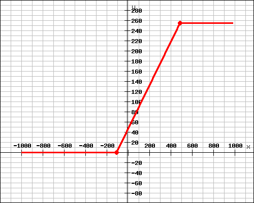
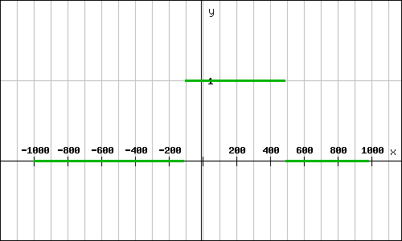

# Unreal&reg; Engine Plugin: Volume Creator &ndash; Readme

This document is part of *"Unreal&reg; Engine Plugin: Volume Creator &mdash; Documentation"*

* Author: Copyright 2022 Roland Bruggmann aka brugr9
* Profile on UE Marketplace: [https://www.unrealengine.com/marketplace/profile/brugr9](https://www.unrealengine.com/marketplace/profile/brugr9)
* Profile on Epic Developer Community: [https://dev.epicgames.com/community/profile/PQBq/brugr9](https://dev.epicgames.com/community/profile/PQBq/brugr9)

---

<!-- UE Marketplace : Begin 1/2 -->


Efficient Real-time Rendering of Scalar Volumes

## Description

This plugin enables efficient image-based volume rendering from the Blueprint visual scripting system. The delivered assets provide rendering of CT and MRI data using shader software with transfer-functions from color curve gradients. To speed up rendering, optimization techniques such as empty space skipping or early ray termination are used. The delivered assets also enable importing image stacks and creating texture volumes from the Blueprint visual scripting system.

<!-- UE Marketplace : End 1/2 -->
---

<div style='page-break-after: always'></div>

## Table of Contents

<!-- Start Document Outline -->

* [1. Setup](#1-setup)
  * [1.1. Installation](#11-installation)
  * [1.2. Project Configuration](#12-project-configuration)
* [2. Usage](#2-usage)
  * [2.1. Concept](#21-concept)
  * [2.2. Volumes](#22-volumes)
    * [2.2.1. Data Background](#221-data-background)
    * [2.2.2. Import](#222-import)
    * [2.2.3. DICOM Window](#223-dicom-window)
  * [2.3. Transfer Function](#23-transfer-function)
  * [2.4. Volume Rendering](#24-volume-rendering)
    * [2.4.1. Direct Volume Rendering](#241-direct-volume-rendering)
    * [2.4.2. Indirect Volume Rendering](#242-indirect-volume-rendering)
  * [2.5. Shading](#25-shading)
* [3. Demo](#3-demo)
  * [3.1. Desktop](#31-desktop)
  * [3.2. VR](#32-vr)
    * [3.2.1. Configure Input Bindings](#321-configure-input-bindings)
* [4. Unsupported](#4-unsupported)
* [Appendix](#appendix)
  * [Acronyms](#acronyms)
  * [Glossary](#glossary)
  * [A. Attribution](#a-attribution)
  * [B. Acknowledgements](#b-acknowledgements)
  * [C. Citation](#c-citation)
  * [D. Disclaimer](#d-disclaimer)

<!-- End Document Outline -->

<div style='page-break-after: always'></div>

## 1. Setup

### 1.1. Installation

In the Unreal Editor access the Plugin Editor from the menu 'Edit > Plugins'. In the Plugin Editor, under category 'Rendering' find and enable the plugin. Finally restart the Unreal Editor.


<br>*Fig. 1.1.: Screenshot of Plugin Editor with Plugin "Volume Creator" enabled*

### 1.2. Project Configuration

To allow Volume Texture asset creation follow these steps as from Unreal Engine Documentation article [*Creating Volume Textures*](https://docs.unrealengine.com/4.26/en-US/RenderingAndGraphics/Textures/VolumeTextures/CreatingVolumeTextures/):

> Before you can use Volume Textures in your Unreal Engine 4 (UE4) project, you will need to enable them. In the following How-To, we will take a look at setting up your UE4 project to use Volume Textures.
>
> 1. First, make sure that the Editor is closed, and then locate your project's DefaultEngine.ini file and open it.
> 2. Locate the Script/Engine.RendererSettings section and add the following variable, then save the file when you have added it:
>
> ```r.AllowVolumeTextureAssetCreation=1```
>
> 3. Re-launch the Editor

<div style='page-break-after: always'></div>

## 2. Usage

### 2.1. Concept

The following workflow is discussed as a basic concept. We use an actor with an actor component Static Mesh 'Cube'. The cube is assiged a volume rendering material with parameters as follows:

* **Volume**: Scalar Volume (Voxels) from Image-Stack represented as `Volume Texture` asset
* **Transfer Function**: Color Gradients represented as `Curve Linear Color` assets packed in a `Curve Atlas`
* **Actor Component**: Actor Component `ScalarVolume` which is a Mesh Cube with Material `Raymarching` by default
* **Rendering**: Direct Volume Rendering DVR by Raymarching (unlit or static lighting) represented by Raymarching `Material` assets

<div style='page-break-after: always'></div>

### 2.2. Volumes

An image-stack based volume&mdash;commonly known as scalar volume&mdash;is kept as Volume Texture asset in Unreal Engine.

Plugin features:

* Creates Volume Texture and Data Asset (meta data) from imported scalar data
* Window center and window width support
* Saving is limited to `G8` or `G16`. The plugin does not support persistent 32bit grayscale textures to be saved.

Naming convention:

* Texture Prefix: `T_`
* Underlines in file names (`_`) are replaced by minus in asset names (`-`)
* Volume Texture Suffix: `_Volume`
* Data Asset Suffix: `_Data`

Example:

* Volume Texture: `T_LUNA16-subset0-5112_Volume`
* Data Asset: `T_LUNA16-subset0-5112_Data`

#### 2.2.1. Data Background

##### 2.2.1.1. Memory

Size of scalar volume:

* A Stack of 256 images of size 256 x 256 pixel per image = 256<sup>3</sup> pixel or voxel resp.
* Pixel depth: 4 channels (RGBA)
* With using 8 bit unsigned integer (`G8`, Range: From 0 to 255) this is 8 bit per channel
<!-- * The range per voxel is 4 x 2<sup>8</sup> = 1024 -->

```math
V_1 = 256^3 \times 4 \times 8\ {}bit = 536’870’912\ {}bit = 0.537\ {}Gigabit = 67\ {}MB
```

If the images are double the size (stack of 512 images with 512 x 512 pixel per image), the size increases to 0.5 GB:

```math
V_2 = 512^3 \times 4 \times 8\ {}bit = 4’294’967’296\ {}bit = 4.295\ {}Gigabit = 537\ {}MB
```

If the images are double the size (stack of 1024 images with 1024 x 1024 pixel per image), the size increases to 4 GB:

```math
V_3 = 1024^3 \times 4 \times 8\ {}bit = 34’359’738’368\ {}bit = 34.359\ {}Gigabit = 4295\ {}MB
```

##### 2.2.1.2. Processing

With processing of, e.g., 30 fps:

```math
Processed\ {}Data_1 = \frac{0.537\ {}Gigabit}{frame} \times \frac{30\ {}frames}{s} = 16.1\ {} Gigabit\ {}per\ {}second
```

```math
Processed\ {}Data_2 = \frac{4.295\ {}Gigabit}{frame} \times \frac{30\ {}frames}{s} = 128.8\ {} Gigabit\ {}per\ {}second
```

```math
Processed\ {}Data_3 = \frac{34.359\ {}Gigabit}{frame} \times \frac{30\ {}frames}{s} = 1030.8\ {} Gigabit\ {}per\ {}second
```

<!-- 
https://www.quora.com/How-can-a-processor-handle-10-Gigabit-per-second-or-more-data-rate
-->

#### 2.2.2. Import

##### 2.2.2.1. Import DICOM

DICOM CT image data comes in Hounsfield Units $HU$ as values in a range of $[-1024,3071]$ which are $4096$ gray levels for different materials. These $4096$ gray levels can be represented with a twelve-digit binary number ($2^{12} = 4096$).

DICOM&reg; *.dcm

The results are stored in a Volume Render Texture named `RT_Scalar_Volume`, R-channel.

##### 2.2.2.2. Import MetaImage

MetaImage&trade; *.mhd

#### 2.2.3. DICOM Window

DICOM CT image data comes in Hounsfield Units $HU$ in a range of $[-1024,3071]$ representing $4096$ gray levels for different materials where air is defined as $-1000 HU$ and water as $0 HU$. But computer screens only can visualize $256$ gray levels, represented by a value range of $[0, 255]$. Therefore the $4096$ Hounsfield Units have to be mapped to the $256$ screen gray scale levels. This is done by linear interpolation (Lerp).

If all of the $4096 HU$ are mapped to $256$ gray levels, the contrast becomes quite bad. Therefore, the so called DICOM Window was introduced to downsize the range of $HU$ to map. A DICOM Window is defined in $HU$ by its center $W_c$&mdash;aka level, and width $W_w$&mdash;aka contrast.

* E.g., with a DICOM Window center $W_c = 1023 HU$ and width $W_w = 4096 HU$ the whole range of $[-1024,3071] HU$ is mapped.
* E.g., with a DICOM Window center $W_c = 0 HU$ and width $W_w = 1000 HU$ only the range of $[-500,500] HU$ is mapped.

##### 2.2.3.1. Apply DICOM Window

The DICOM window center $W_c$ and width $W_w$ define the window right border $W_r$ and its left border $W_l$:

* $W_r = W_c + \frac{W_w}{2}$
* $W_l = W_c - \frac{W_w}{2}$
* $W_l <= W_r$

The DICOM Window $w$ is applied to the volume's Hounsfiled data $v$ as a linear mapping $w(v)$ into the range of $[0,255]$ as follows:

$
w(v) := \begin{cases}
255 & \text{if } v > W_r\\
0 & \text{if } v < W_l\\
0 + \frac{(v-w_l)(255-0)}{w_r-w_l} =
\frac{(v-w_l) \times 255}{w_r-w_l}
& \text{else}
\end{cases}
$

by means of the gray level becomes:

* $255$ if $v$ is greater than the window right border $W_r$
* $0$ if $v$ is lesser than the window left border $W_l$
* linear Interpolated (lerp) in the range of $[0,255]$ else

<br>*Fig. 2.1.: First example graph of applied DICOM Window with $W_c = 200$ and $W_w = 600$ ($W_r = 500$ and $W_l = -100$)*

<br>*Fig. 2.2.: Second example graph of applied DICOM Window with $W_c = 50$ and $W_w = 800$ ($W_r = 450$ and $W_l = -350$)*

`BP_ScalarVolume` Detail Panel, DICOM Window (see fig. 2.3.). The result is stored in a Volume-Render-Texture named `RT_Scalar_Volume` (R-channel).

<br>*Fig. 2.3.: BP_ScalarVolume Detail Panel, DICOM Window*

##### 2.2.3.2. Mask DICOM Window

To allow to render the lerped values only we mask $m$ the values $v$ greater than the window right border $W_r$ and lesser than the window left border $W_l$ by applying the following mapping $m(v)$ as follows:

$
m(v) := \begin{cases}
0 & \text{if } v > W_r \text{ or } v < W_l\\
1 & \text{else}
\end{cases}
$

by means of the mask value becomes:

* False or $0$ if $v$ is greater than the right window border $W_r$
* False or $0$ if $v$ is lesser than the left window border $W_l$
* True or $1$ else

<br>*Fig. 2.4.: First example graph of mask for DICOM Window with $W_c = 200$ and $W_w = 600$ ($W_r = 500$ and $W_l = -100$)*

<br>*Fig. 2.5.: Second example graph of mask for DICOM Window with $W_c = 50$ and $W_w = 800$ ($W_r = 450$ and $W_l = -350$)*

`BP_ScalarVolume` Detail Panel, DICOM Window (see fig. 2.6.). The result is stored in the Volume-Render-Texture `RT_Scalar_Volume` G-channel.

<br>*Fig. 2.6.: BP_ScalarVolume Detail Panel, DICOM Window, Mask*

<!-->
#### 2.2.5. Empty Space Skipping

SparseLeap: Efficient Empty Space Skipping for Large-Scale Volume Rendering
https://vcg.seas.harvard.edu/publications/sparseleap-efficient-empty-space-skipping-for-large-scale-volume-rendering

<!-->

<div style='page-break-after: always'></div>

### 2.3. Transfer Function

The Transfer Functions are based on Gradients from `Curve Linear Color` assets, bundled in a Curve Atlas asset as Look-Up Table LUT

* Curve Linear Color assets named `Curve_TF-[*]_Color`
* Curve Atlas asset named `T_TF_CurveAtlas`

The gradients show values as found in 3D Slicer, Module "Volume Rendering" [Presets on GitHub](https://github.com/Slicer/Slicer/blob/main/Modules/Loadable/VolumeRendering/Resources/presets.xml).

<div style='page-break-after: always'></div>

### 2.4. Volume Rendering

#### 2.4.1. Direct Volume Rendering

Direct Volume Rendering DVR with Materials from Raymarching Shaders, unlit or with (precomputed) static lighting.

#### 2.4.2. Indirect Volume Rendering

Indirect Volume Rendering IVR with Materials from Raymarching Shaders, unlit or with (precomputed) static lighting.

### 2.5. Shading

<div style='page-break-after: always'></div>

## 3. Demo

The plugin folder 'Demo' provides with two Blueprints ... `BP_Demo-DVR-TF-Gradient` as well as with two maps `Map_Demo-VolumeCreator`.

Screenshot of Content Browser with VolumeCreator Content, Folder 'Demo':


### 3.1. Desktop

With the level Map_Demo-DVR openned, from the Level Editor, click the Play button to Play-in-Editor PIE:


### 3.2. VR

HMD VR

#### 3.2.1. Configure Input Bindings

Under `Project Settings > Engine > Input` push button `Import` and select file `VolumeCreator/Config/Input.ini`.


<br>*Fig. 3.1.: Screenshot of Project Setting, Input Bindings*

With these input settings configured, from VolumeCreator Content/Showcase/VR open Blueprint `BP_VRPawn`, find its Details Panel and edit entry 'VRPawn > Per Platform Controllers':

* Left Controller Class: `BP_LeftMotionController` (from dropdown)
* Right Controller Class: `BP_RightMotionController` (from dropdown)


<br>*Fig. 3.2.: Screenshot of BP_VRPawn, Per Platform Controllers*

<div style='page-break-after: always'></div>

## 4. Unsupported

* **Labelmap Volume** &ndash; where the voxels store a discrete value, such as an index or a label; e.g., used for segmentation.
* **Vector Volume** &ndash; where the voxels store multiple scalar values, e.g., three coordinates RAS as components of a displacement field.
* **Tensor Volume** &ndash; where the voxels store a tensor, e.g., used for MRI diffusion tensor imaging DTI.

## Appendix

### Acronyms

* BMD &mdash; Bone Mineral Density
* CT &mdash; Computed Tomography (X-ray)
* CTA &mdash; Computed Tomography Angiography
* DVR &mdash; Direct Volume Rendering
* DXA &mdash; Dual-energy X-ray Absorptiometry
* FOV &mdash; Field of View
* HU &mdash; Hounsfield Unit
* IVR &mdash; Indirect Volume Rendering
* LhS &mdash; Left-handed System
* LUT &mdash; Look-Up Table
* MIP &mdash; Maximum Intensity Projection
* MR &mdash; Magnetic Resonance
* MRI &mdash; Magnetic Resonance Imaging
* MRT &mdash; Magnetic Resonance Tomography
* PET &mdash; Positron Emission Tomography
* QCT &mdash; Quantitative Computed Tomography
* RhS &mdash; Right-handed System
* ROI &mdash; Region of Interest
* SNR &mdash; Signal-to-Noise Ratio
* TF &mdash; Transfer Function

### Glossary

* Anatomical Planes and Terms of Location:
  * *Saggital*: Longitudinal (median) plane, divides in Left and Right (R); <br>positive R-Axis from Left to Right, color code red
  * *Coronal*: Frontal plane, divides in Posterior and Anterior (A); <br>positive A-Axis from Posterior to Anterior, color code blue
  * *Axial*: Horizontal plane, divides in Inferior and Superior (S); <br>positive S-Axis from Inferior to Superior, color code green
* Handedness:
  * Unreal Engine uses a left-handed world Cartesian coordinate system (LhS): positive X-Axis to Front, positive Y-Axis to Right, positive Z-Axis to Up

### A. Attribution

* The word mark *Unreal&reg;* and its logo are Epic Games, Inc. trademarks or registered trademarks in the US and elsewhere (cp. Branding Guidelines and Trademark Usage, URL: [https://www.unrealengine.com/en-US/branding](https://www.unrealengine.com/en-US/branding))
* The word mark *DICOM&reg; &mdash;"Digital Imaging and Communication in Medicine"* and its logo are trademarks or registered trademarks of the National Electrical Manufacturers Association (NEMA), managed by the Medical Imaging Technology Association (MITA), a division of NEMA
* The word mark *MetaImage&trade;* is a trademark or registered trademark of Kitware, Inc.
* The word mark *3D Slicer* and the logo are trademarks of Brigham and Women’s Hospital (BWH) and may not be used without permission.

### B. Acknowledgements

* Bruggmann, Roland (2022). *Volume Creator*. Unreal&reg; Marketplace. URL: [https://www.unrealengine.com/marketplace/en-US/product/volume-creator](https://www.unrealengine.com/marketplace/en-US/product/volume-creator). Copyright 2022 Roland Bruggmann aka brugr9. All Rights Reserved.
* van Ginneken, Bram, & Jacobs, Colin. (2019). LUNA16 Part 1/2 subset0. Zenodo. [https://doi.org/10.5281/zenodo.3723295](https://doi.org/10.5281/zenodo.3723295), licensed under Creative Commons Attribution 4.0 International ([CC BY 4.0](https://creativecommons.org/licenses/by/4.0/))
* Fedorov A., Beichel R., Kalpathy-Cramer J., Finet J., Fillion-Robin J-C., Pujol S., Bauer C., Jennings D., Fennessy F.M., Sonka M., Buatti J., Aylward S.R., Miller J.V., Pieper S., Kikinis R. [3D Slicer as an Image Computing Platform for the Quantitative Imaging Network](https://www.ncbi.nlm.nih.gov/pmc/articles/PMC3466397/pdf/nihms383480.pdf). Magnetic Resonance Imaging. 2012 Nov;30(9):1323-41. PMID: 22770690. PMCID: PMC3466397.
* 3D Slicer Module "Volume Rendering": Julien Finet (Kitware), Alex Yarmarkovich (Isomics), Yanling Liu (SAIC-Frederick, NCI-Frederick), Andreas Freudling (SPL, BWH), Ron Kikinis (SPL, BWH). License: slicer4. The work is part of the National Alliance for Medical Image Computing (NAMIC), funded by the National Institutes of Health through the NIH Roadmap for Medical Research, Grant U54 EB005149. Some of the transfer functions were contributed by Kitware Inc. (VolView)

### C. Citation

**Software**

To acknowledge *"Unreal&reg; Engine Plugin: Volume Creator"* software, please cite

> Bruggmann, Roland (2022). *Unreal&reg; Engine Plugin: Volume Creator*, Version [#.#.#], UE [4.## or 5.#]. Unreal&reg; Marketplace. URL: [https://www.unrealengine.com/marketplace/en-US/product/volume-creator](https://www.unrealengine.com/marketplace/en-US/product/volume-creator). Copyright 2022 Roland Bruggmann aka brugr9. All Rights Reserved.

**Documentation**

To acknowledge *"Unreal&reg; Engine Plugin: Volume Creator &mdash; Documentation"* (be it , e.g., the Readme or the Changelog), please cite

> Bruggmann, Roland (2022). *Unreal&reg; Engine Plugin: Volume Creator &mdash; Documentation*, \[Readme, Changelog\]. GitHub; accessed [Year Month Day]. URL: [https://github.com/brugr9/UEPluginVolumeCreator](https://github.com/brugr9/UEPluginVolumeCreator). Licensed under [Creative Commons Attribution-ShareAlike 4.0 International](http://creativecommons.org/licenses/by-sa/4.0/)

### D. Disclaimer

*This documentation has **not been reviewed or approved** by the Food and Drug Administration FDA or by any other agency. It is the users responsibility to ensure compliance with applicable rules and regulations&mdash;be it in the US or elsewhere.*

Read also *"Unreal&reg; Engine Plugin: Volume Creator &mdash; Documentation Disclaimer"* (file DocumentationDISCLAIMER.md), URL: [https://github.com/brugr9/UEPluginVolumeCreator/blob/main/DocumentationDISCLAIMER.md](https://github.com/brugr9/UEPluginVolumeCreator/blob/main/DocumentationDISCLAIMER.md).

---
<!-- Footer -->

[](https://creativecommons.org/licenses/by-sa/4.0/)

*"Unreal&reg; Engine Plugin: Volume Creator &mdash; Documentation"*. URL: [https://github.com/brugr9/UEPluginVolumeCreator](https://github.com/brugr9/UEPluginVolumeCreator). &copy; 2022 by [Roland Bruggmann](https://about.me/rbruggmann), licensed under [Creative Commons Attribution-ShareAlike 4.0 International](http://creativecommons.org/licenses/by-sa/4.0/)
