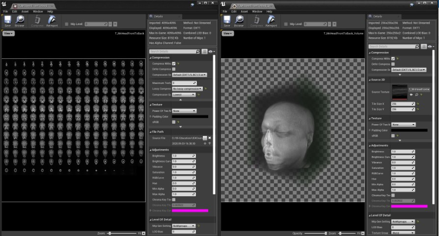
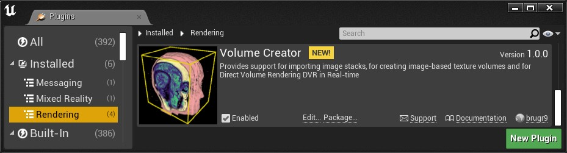
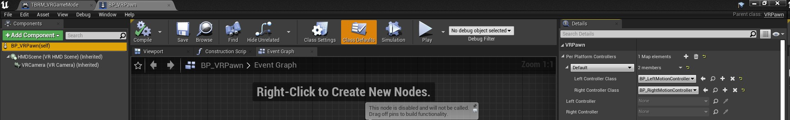

# Volume Creator: An Unreal&reg; Engine Plugin for Rendering of Medical Data &ndash; Readme

This document is part of *"Volume Creator: An Unreal&reg; Engine Plugin for Rendering of Medical Data &mdash; Documentation"*

* Author: Copyright 2022 Roland Bruggmann aka brugr9
* Profile on UE Marketplace: [https://www.unrealengine.com/marketplace/profile/brugr9](https://www.unrealengine.com/marketplace/profile/brugr9)
* Profile on Epic Developer Community: [https://dev.epicgames.com/community/profile/PQBq/brugr9](https://dev.epicgames.com/community/profile/PQBq/brugr9)

---
<!-- UE Marketplace : Begin 1/2 -->



Provides support for importing image stacks, for creating image-based texture volumes and for Direct Volume Rendering DVR in Real-time

## Description

This plugin enables image-based volume rendering from the Blueprint visual scripting system. The delivered assets provide rendering of CT and MRI data using shader software with transfer-functions from look-up tables or gradients. To speed up rendering, optimization techniques such as empty space skipping or early ray termination are used. The delivered assets also enable importing image stacks from the Blueprint visual scripting system.

<!-- UE Marketplace : End 1/2 -->
---

<div style='page-break-after: always'></div>

## Table of Contents

<!-- Start Document Outline -->

* [1. Setup](#1-setup)
  * [1.1. Installation](#11-installation)
  * [1.2. Project Configuration](#12-project-configuration)
* [2. Usage](#2-usage)
  * [2.1. Concept](#21-concept)
  * [2.2. Volumes](#22-volumes)
    * [2.2.1. Default Volume](#221-default-volume)
    * [2.2.2. Import dcm](#222-import-dcm)
    * [2.2.3. Import mhd](#223-import-mhd)
  * [2.3. Transfer Functions](#23-transfer-functions)
    * [2.3.1. TF LUTs](#231-tf-luts)
    * [2.3.2. TF Gradients](#232-tf-gradients)
  * [2.4. Direct Volume Rendering](#24-direct-volume-rendering)
    * [2.4.1 Raymarching Materials](#241-raymarching-materials)
* [3. Showcase](#3-showcase)
  * [3.1. Desktop](#31-desktop)
  * [3.2. HMD VR](#32-hmd-vr)
    * [3.2.1. Configure Input Bindings](#321-configure-input-bindings)
* [A. Attribution](#a-attribution)
* [B. References](#b-references)
* [C. Acknowledgments](#c-acknowledgments)
  * [Software](#software)
  * [Documentation](#documentation)
* [D. Disclaimer](#d-disclaimer)

<!-- End Document Outline -->

<div style='page-break-after: always'></div>

## 1. Setup

### 1.1. Installation

In the Unreal Editor access the Plugin Editor from the menu 'Edit > Plugins'. In the Plugin Editor, under category 'Rendering' find and enable the plugin. Finally restart the Unreal Editor.


<br>*Fig. 1.1.: Screenshot of Plugin Editor with Plugin "Volume Creator" enabled*

### 1.2. Project Configuration

To allow Volume Texture asset creation follow these steps as from Unreal Engine Documentation article [*Creating Volume Textures*](https://docs.unrealengine.com/4.26/en-US/RenderingAndGraphics/Textures/VolumeTextures/CreatingVolumeTextures/):

> Before you can use Volume Textures in your Unreal Engine 4 (UE4) project, you will need to enable them. In the following How-To, we will take a look at setting up your UE4 project to use Volume Textures.
>
> 1. First, make sure that the Editor is closed, and then locate your project's DefaultEngine.ini file and open it.
> 2. Locate the Script/Engine.RendererSettings section and add the following variable, then save the file when you have added it:
>
> ```r.AllowVolumeTextureAssetCreation=1```
>
> 3. Re-launch the Editor

<div style='page-break-after: always'></div>

## 2. Usage

### 2.1. Concept

The following workflow is discussed as a basic concept. We use an actor with an actor component Static Mesh 'Cube'. The cube is assiged a volume rendering material with parameters as follows:

* **Volume**: TextureVolume from Image-Stack
* **Transfer Function**: Look-Up Table LUT (Texture2D) or Gradient (CurveLinearColor)
* **Shader**: Direct Volume Rendering DVR by Raycasting (unlit) or Raymarching (static lighting)

Depending on which parameters have been selected, additional parameters can be displayed.

<div style='page-break-after: always'></div>

### 2.2. Volumes

* Volumes from Image-Stack as Texture2D and TextureVolume
* Raymarching with precomputed static lighting
* Limitations: Saving is limited to `G8` or `G16`. The plugin does not support persistent 32bit grayscale textures to be saved.

#### 2.2.1. Default Volume

Default Volume, size of image-stack based volume:

* A Stack of 256 images of size 256 x 256 pixel per image = 256<sup>3</sup> pixel or voxel resp.
* Pixel depth: 4 channels (RGBA)
* With using 8 bit unsigned integer (`G8`, Range: From 0 to 255) this is 8 bit per channel
<!-- * The range per voxel is 4 x 2<sup>8</sup> = 1024 -->

```math
V = 256^3 \times 4 \times 8 bit = 64 MB
```

Please consider: If the images are double the size (stack of 512 images with 512 x 512 pixel per image), the size already increases to 0.5 GB:

```math
V = 512^3 \times 4 \times 8 bit = 512 MB
```

The volume has to be loaded to RAM and has to be processed every frame of, e.g., 30 fps, which is a huge amount of work to be done &ndash; even for nowadays graphics hardware. That's why we provide with a 256<sup>3</sup> voxel volume.

#### 2.2.2. Import dcm

DICOM dcm

#### 2.2.3. Import mhd

MetaImage mhd

<div style='page-break-after: always'></div>

### 2.3. Transfer Functions

Transfer Functions TF from Look-Up Tables LUT (Texture2D assets) or Gradients (CurveLinearColor assets)

#### 2.3.1. TF LUTs

Texture2D named `T_TF-LUT-[*]`

#### 2.3.2. TF Gradients

CurveLinearColor named `Curve_TF-[*]_Color`

<div style='page-break-after: always'></div>

### 2.4. Direct Volume Rendering

Direct Volume Rendering DVR Materials with Raycasting Shader or Raymarching Shader

#### 2.4.1 Raymarching Materials

DVR Material with Raymarching Shader

<div style='page-break-after: always'></div>

## 3. Showcase

The plugin folder 'Showcase' provides with two Blueprints `BP_Demo-DVR-TF-LUT` and `BP_Demo-DVR-TF-Gradient` as well as with two maps `Map_Demo-VolumeCreator`.

Screenshot of Content Browser with VolumeCreator Content, Folder 'Demo':


### 3.1. Desktop

With the level Map_Demo-DVR openned, from the Level Editor, click the Play button to Play-in-Editor PIE:


### 3.2. HMD VR

#### 3.2.1. Configure Input Bindings

Under `Project Settings > Engine > Input` push button `Import` and select file `VolumeCreator/Config/Input.ini`.


<br>*Fig. 3.1.: Screenshot of Project Setting, Input Bindings*

With these input settings configured, from VolumeCreator Content/Showcase/VR open Blueprint `BP_VRPawn`, find its Details Panel and edit entry 'VRPawn > Per Platform Controllers':

* Left Controller Class: `BP_LeftMotionController` (from dropdown)
* Right Controller Class: `BP_RightMotionController` (from dropdown)


<br>*Fig. 3.2.: Screenshot of BP_VRPawn, Per Platform Controllers*

<div style='page-break-after: always'></div>

## A. Attribution

* The word mark *Unreal&reg;* and its logo are Epic Games, Inc. trademarks or registered trademarks in the US and elsewhere (cp. Branding Guidelines and Trademark Usage, URL: [https://www.unrealengine.com/en-US/branding](https://www.unrealengine.com/en-US/branding))
* The word mark *DICOM&reg; &mdash;"Digital Imaging and Communication in Medicine"* and its logo are trademarks or registered trademarks of the National Electrical Manufacturers Association (NEMA), managed by the Medical Imaging Technology Association (MITA), a division of NEMA
* The word mark *DICOMParser&trade;* is a trademark or registered trademark of Brad King and/or Matt Turek
* The word mark *MetaImage&trade;* and its logo are trademarks or registered trademarks of TODO: ???

## B. References

* Bruggmann, Roland (2022). *Volume Creator: An Unreal&reg; Engine Plugin for Rendering of Medical Data*. Unreal&reg; Marketplace. URL: [https://www.unrealengine.com/marketplace/en-US/product/volume-creator](https://www.unrealengine.com/marketplace/en-US/product/volume-creator). Copyright 2022 Roland Bruggmann aka brugr9. All Rights Reserved.
* Medical imaging data set: van Ginneken, Bram, & Jacobs, Colin. (2019). LUNA16 Part 1/2 subset0. Zenodo. [https://doi.org/10.5281/zenodo.3723295](https://doi.org/10.5281/zenodo.3723295), licensed under [Creative Commons Attribution 4.0 International (CC BY 4.0)](https://creativecommons.org/licenses/by/4.0/)
* Larobina, M., & Murino, L. (2014). Medical image file formats. *Journal of digital imaging*, 27(2), 200–206. [https://doi.org/10.1007/s10278-013-9657-9](https://doi.org/10.1007/s10278-013-9657-9). In: *The National Center for Biotechnology Information NCBI*, accessed 2022/05/06. URL: [https://www.ncbi.nlm.nih.gov/pmc/articles/PMC3948928/](https://www.ncbi.nlm.nih.gov/pmc/articles/PMC3948928/)

## C. Acknowledgments

### Software

To acknowledge *"Volume Creator: An Unreal&reg; Engine Plugin for Rendering of Medical Data"* software in an academic paper, please cite

> Bruggmann, Roland (2022). *Volume Creator: An Unreal&reg; Engine Plugin for Rendering of Medical Data*, Version [#.#.#], UE [4.## or 5.#]. Unreal&reg; Marketplace. URL: [https://www.unrealengine.com/marketplace/en-US/product/volume-creator](https://www.unrealengine.com/marketplace/en-US/product/volume-creator). Copyright 2022 Roland Bruggmann aka brugr9. All Rights Reserved.

### Documentation

To acknowledge *"Volume Creator: An Unreal&reg; Engine Plugin for Rendering of Medical Data &mdash; Documentation"* (be it , e.g., the Readme or the Changelog) in an academic paper, please cite

> Bruggmann, Roland (2022). *Volume Creator: An Unreal&reg; Engine Plugin for Rendering of Medical Data &mdash; Documentation*, \[Readme, Changelog\]. GitHub; accessed [Year Month Day]. URL: [https://github.com/brugr9/UEPluginVolumeCreator](https://github.com/brugr9/UEPluginVolumeCreator). Licensed under [Creative Commons Attribution-ShareAlike 4.0 International](http://creativecommons.org/licenses/by-sa/4.0/)

## D. Disclaimer

*This documentation has **not been reviewed or approved** by the Food and Drug Administration FDA or by any other agency. It is the users responsibility to ensure compliance with applicable rules and regulations.*

See also DISCLAIMER.md *"Volume Creator: An Unreal&reg; Engine Plugin for Rendering of Medical Data &mdash; Documentation Disclaimer"*, URL: [https://github.com/brugr9/UEPluginVolumeCreator/blob/main/DISCLAIMER.md](https://github.com/brugr9/UEPluginVolumeCreator/blob/main/DISCLAIMER.md).

---
<!-- Footer -->

[](https://creativecommons.org/licenses/by-sa/4.0/)

*"Volume Creator: An Unreal&reg; Engine Plugin for Rendering of Medical Data &mdash; Documentation"*. URL: [https://github.com/brugr9/UEPluginVolumeCreator](https://github.com/brugr9/UEPluginVolumeCreator). &copy; 2022 by [Roland Bruggmann](https://about.me/rbruggmann), licensed under [Creative Commons Attribution-ShareAlike 4.0 International](http://creativecommons.org/licenses/by-sa/4.0/)
