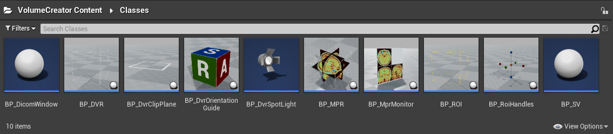
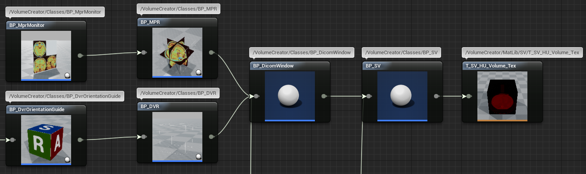

# Volume Creator: An Unreal&reg; Engine Plugin for Medical Data Rendering &ndash; Readme

This document is part of *"Volume Creator: An Unreal&reg; Engine Plugin for Medical Data Rendering &mdash; Documentation"*

* Author: Copyright 2023 Roland Bruggmann aka brugr9
* Profile on UE Marketplace: [https://www.unrealengine.com/marketplace/profile/brugr9](https://www.unrealengine.com/marketplace/profile/brugr9)
* Profile on Epic Developer Community: [https://dev.epicgames.com/community/profile/PQBq/brugr9](https://dev.epicgames.com/community/profile/PQBq/brugr9)

---

<!-- UE Marketplace : Begin 1/2 -->


Adds Blueprint Support for Real-time Rendering from DICOM&reg; based Medical Imaging Data.

## Description

Unreal&reg; Engine plugin "Volume Creator" enables real-time multiplanar and direct volume rendering from the Blueprint Visual Scripting system.

The delivered assets provide importing DICOM&reg; based medical imaging data, applying DICOM Window and rendering by coloring from look-up tables and color-gradient based transferfunctions. With a clipping plane and/or with a region of interest the user may shrink the rendered volume interactively. The plugin allows to create solutions that can be used in VR/AR serious games, e.g., for teaching and training in medical education.

<!-- UE Marketplace : End 1/2 -->

* Index Terms:
  * Medical Imaging, Computer Tomography, Magnetic Resonance
  * Multiplanar Rendering, Direct Volume Rendering
  * Virtual Reality, Augmented Reality, Serious Games for Teaching and Training
* Technology: DICOM, Unreal Engine C++ Code Plugin, HLSL Compute Shader

* Tags: DICOM, CT, MR, MPR, DVR, VR, AR, UE, CS

---

<div style='page-break-after: always'></div>

## Table of Contents

<!-- Start Document Outline -->

* [1. Setup](#1-setup)
  * [1.1. Installation](#11-installation)
  * [1.2. Project Configuration](#12-project-configuration)
* [2. Concept](#2-concept)
* [3. Import](#3-import)
  * [3.1. Import DICOM](#31-import-dicom)
  * [3.2. Import MetaImage](#32-import-metaimage)
  * [3.3. Data Background](#33-data-background)
* [4. Actors](#4-actors)
  * [4.1. Scalar Volume Actor](#41-scalar-volume-actor)
  * [4.2. Dicom Window Actor](#42-dicom-window-actor)
  * [4.3. Multiplanar Rendering](#43-multiplanar-rendering)
    * [4.3.1. MPR Actor](#431-mpr-actor)
    * [4.3.2. MPR Monitor Actor](#432-mpr-monitor-actor)
  * [4.4. Direct Volume Rendering](#44-direct-volume-rendering)
    * [4.4.1. DVR Actor](#441-dvr-actor)
    * [4.4.2. Orientation Guide Actor](#442-orientation-guide-actor)
    * [4.4.3. ROI Actor](#443-roi-actor)
    * [4.4.4. ROI Handles Actor](#444-roi-handles-actor)
    * [4.4.5. Clip Plane Actor](#445-clip-plane-actor)
    * [4.4.6. Spot Light Actor](#446-spot-light-actor)
* [5. Widgets](#5-widgets)
* [6. Outlook](#6-outlook)
* [Appendix](#appendix)
  * [Abbreviations and Acronyms](#abbreviations-and-acronyms)
  * [Glossary](#glossary)
    * [Terms of Location and Coordinate Systems](#terms-of-location-and-coordinate-systems)
    * [Asset Naming Convention](#asset-naming-convention)
  * [A. References](#a-references)
    * [A.1. Medical Imaging](#a1-medical-imaging)
    * [A.2. Unreal Engine](#a2-unreal-engine)
  * [B. Readings](#b-readings)
  * [C. Acknowledgements](#c-acknowledgements)
  * [D. Attribution](#d-attribution)
  * [E. Disclaimer](#e-disclaimer)
  * [F. Citation](#f-citation)

<!-- End Document Outline -->

<div style='page-break-after: always'></div>

## 1. Setup

### 1.1. Installation

In the Unreal Editor access the Plugin Editor from the menu 'Edit > Plugins'. In the Plugin Editor, under category 'Rendering' find and enable the plugin. Finally restart the Unreal Editor.


<br>*Fig. 1.1.: Screenshot of Plugin Editor with Plugin "Volume Creator" enabled*

### 1.2. Project Configuration

To allow Volume Texture asset creation follow these steps as from Unreal Engine Documentation article [*Creating Volume Textures*](https://docs.unrealengine.com/4.26/en-US/RenderingAndGraphics/Textures/VolumeTextures/CreatingVolumeTextures/):

> Before you can use Volume Textures in your Unreal Engine 4 (UE4) project, you will need to enable them. In the following How-To, we will take a look at setting up your UE4 project to use Volume Textures.
>
> 1. First, make sure that the Editor is closed, and then locate your project's DefaultEngine.ini file and open it.
> 2. Locate the Script/Engine.RendererSettings section and add the following variable, then save the file when you have added it:
>
> ```r.AllowVolumeTextureAssetCreation=1```
>
> 3. Re-launch the Editor

<div style='page-break-after: always'></div>

## 2. Concept

The plugin provides rendering of image-stack based volumes, commonly known as scalar volumes. The plugin however does not support the rendering of other type of volumes, like vector volumes or tensor volumes. Following the Object Oriented Paradigm OOP entities are implemented as an object or Actor resp.:

<br>*Fig. 2.1.: Plugin Blueprint Actor Classes*

* **Scalar Volume Actor**: Medical images are imported, e.g., from DICOM files and stored as Hounsfield Units encoded Volume Texture. A Scalar Volume Actor holds a reference to the latter and stores also DICOM pixel spacing attribute values.
* **Dicom Window Actor**: A Dicom Window Actor consumes the Volume Texture from a Scalar Volume Actor and applies DICOM Window Attributes 'Center' and 'Width'.
* **MPR Actor**: The DICOM windowed scalar volume may be visualized by multiplanar rendering in a MPR Actor. The MPR Actor as a 3D representation of MPR holds three perpendicular planes, i.e. coronal, sagittal and axial plane. Its dimensions derive from the scalar volume pixel spacing. The planes can be moved in the direction of their corresponding axes interactively in real-time.
  * **MPR Monitor Actor**: The MPR produces planar rendering, which is also consumed by the MPR Monitor, a 2D representation of MPR.
* **DVR Actor**: The DICOM windowed scalar volume may be visualized by direct volume rendering in a DVR Actor. The DVR Actor extent is shown with a bounding box. Its dimension derives from the scalar volume pixel spacing.
  * **Orientation Guide Actor**: The DVR Actor can be optionally attached a rotation synchronized orientation guide.
  * **ROI Actor**: The DVR geometry can be optionally shrinked with a region of interest from a ROI Actor in real-time.
    * **ROI Handles Actor**: A ROI geometry can be optionally modified with a ROI Handles Actor interactively in real-time.
  * **Clip Plane Actor**: The DVR geometry can be optionally shrinked with a clip plane interactively in real-time.
  * **Spot Light Actor**: The DVR can be optionally illuminated with static spot-lights.

<br>*Fig. 4.2.: Domain Model Diagram &mdash; Blueprint Actor Classes in Reference Viewer with Focus on BP_SV*

<br>*Fig. 4.3.: Domain Model Diagram &mdash; Blueprint Actor Classes in Reference Viewer with Focus on BP_DVR*

## 3. Import

* Asset names derive from the file name which is imported:
  * Underlines (`_`) from a file name are replaced by minus (`-`) in asset names.
  * Maximum asset name length is 20 signs.
* CT image data is expected to come in Hounsfield Units HU. The data is clamped to 4096 values in a range of [-1000, 3095].

### 3.1. Import DICOM

Workflow:

* Reads from DICOM&reg; files, file name extension `*.dcm`
* Writes image data temporarely to a Houndsfield Units encoded Volume Texture Render Target `RT_SV_HU_Volume`
* Saves image data to a new Houndsfield Units encoded Volume Texture asset `T_MyDataName_HU_Volume`
* Saves meta data&mdash;e.g., DICOM Pixel Spacing&mdash;to a new Blueprint asset `BP_MyDataName_SV` based on Scalar Volume Actor `BP_SV` and assigns the just saved Volume Texture asset.

### 3.2. Import MetaImage

Workflow:

* Reads from MetaImage&trade;, file name extension `*.mhds`

### 3.3. Data Background

DICOM image data is stored as 12 bit data, sometimes you also meet 16 bit. A twelve-digit binary number can represent 4096 values or Hounsfield Units resp. (12 bit, 2<sup>12</sup> = 4096). Let's assume we have a scalar volume as follows (cp. [DICOM, FAQ]):

* A Stack of 256 images of size 256 x 256 pixel per image = 256<sup>3</sup> pixel or voxel resp.
* 4 channels RGBA with 8 bit per channel (2<sup>8</sup> = 256, range from 0 to 255)

The size of Volume<sub>1</sub> becomes 67 MB. If the images are double the size (stack of 512 images with 512 x 512 pixel per image), the size of Volume<sub>2</sub> increases to 0.5 GB. If the images are even double the size (stack of 1024 images with 1024 x 1024 pixel per image), the size of Volume<sub>3</sub> increases to 4 GB.

* *Volume<sub>1</sub> = 256<sup>3</sup> x 4 x 8 bit = 536’870’912 bit = 0.537 Gigabit = 67 MB*
* *Volume<sub>2</sub> = 512<sup>3</sup> x 4 x 8 bit = 4’294’967’296 bit = 4.295 Gigabit = 537 MB*
* *Volume<sub>3</sub> = 1024<sup>3</sup> x 4 x 8 bit = 34’359’738’368 bit = 34.359 Gigabit = 4295 MB*

With processing, e.g., 30 fps (cp. [Lindberg]):

* *ProcessedData<sub>1</sub> = 0.537 Gigabit/frame x 30 frames/s = 16.1 Gigabit/s*
* *ProcessedData<sub>2</sub> = 4.295 Gigabit/frame x 30 frames/s = 128.8 Gigabit/s*
* *ProcessedData<sub>3</sub> = 34.359 Gigabit/frame x 30 frames/s = 1030.8 Gigabit/s*

<div style='page-break-after: always'></div>

## 4. Actors

### 4.1. Scalar Volume Actor

Plugin Content:

* Blueprint Class: `BP_SV`

### 4.2. Dicom Window Actor

CT image data is expected to come in Hounsfield Units HU in a range of [-1000, 3095] (cp. section Import) representing 4096 gray levels for different materials where air is defined as -1000 HU and water as 0 HU.

Consumer computer screens only can visualize 256 gray levels, represented by a value range of [0, 255]. Therefore the 4096 Hounsfield Units are mapped to the 256 screen gray scale levels. This is done by linear interpolation (Lerp).

If the whole range of 4096 Hounsfield data is mapped to 256 gray levels, the contrast becomes quite bad. Therefore, the so called DICOM Window was introduced to downsize the range of Hounsfield data to map.

* Values lesser than the window left border are mapped to 0, greater than the window right border are mapped to 255.
* To render only the lerped values, a mask may be applied.

Plugin Content:

* Blueprint Class: `BP_DicomWindow`

### 4.3. Multiplanar Rendering

TODO: Reference Viewer as Domain Model Diagram

#### 4.3.1. MPR Actor

Plugin Content:

* Blueprint Class: `BP_MPR`

#### 4.3.2. MPR Monitor Actor

Plugin Content:

* Blueprint Class: `BP_MprMonitor`

### 4.4. Direct Volume Rendering

TODO: Reference Viewer as Domain Model Diagram

#### 4.4.1. DVR Actor

Direct Volume Rendering DVR with Materials from Raymarching Shaders with static lighting support.

Plugin Content:

* Blueprint Class: `BP_DVR`

Parameter:

##### 4.4.1.1. ROI Actor

* Type: ROI Actor `BP_ROI` instance as Object Reference
* Default Value: `none`
* Optional, used for geometry subtraction if set

##### 4.4.1.2. Clip Plane Actor

* Type: Clip Plane Actor `BP_DvrClipPlane` instance as Object Reference
* Default Value: `none`
* Optional, used for geometry subtraction if set

##### 4.4.1.3. Distance Power

* Type: `float`
* Default Value: `1.0`
* Range: [`0.1`, `2.0`]

Resampling Distance Power:

* The shader algorithm calculates the current distance of the image slices with respect to the angle of entry of the resampling ray. With a value of `1.0` (default) the calculated resampling distance is used.
* With values smaller than `1.0` the resampling distance lowers, a so-called oversampling occurs, which may increase visualisation quality.
* With values larger than `1.0` the resampling distance grows, a so-called undersampling occurs, which may accelerate rendering.

This parameter may be seen as an optimisation method, cp. [Luecke 2005], *Fragmented Line Ray-Casting*:
> *To lower the number of operations necessary for computing a single frame, [...] the distance between two successive resampling locations, i.e the sampling distance, could be increased, thereby decreasing the number of actual locations used for volume reconstruction.*
> *However, it is worth mentioning, that incorporating any of these optimization approaches usually tends to result in generated images of less quality compared to an unoptimized ray-casting volume renderer.*

##### 4.4.1.4. Resampling Steps

* Type: `Integer`
* Default Value: `256`
* Range: [`1`, `1024`]

Maximum Number of Resampling Steps:

* A large number means more steps. The resampling ray may advance deeper into the cube. The hereby resulting rendering may increase visualisation quality by the cost of more computing time.
* A small number may decrease rendering quality but is faster.

##### 4.4.1.5. Transfer Function

* Type: `Curve Linear Color`
* Default Value: `Curve_Default_TF_Color`

The transfer functions are based on color gradients from `Curve Linear Color` assets. The gradients represent values as found in 3D-Slicer&trade; Module "Volume Rendering" (cp. [Finet et al.]).

##### 4.4.1.6. Alpha Max

* Type: `float`
* Default Value: `0.8`
* Range: [`0.0`, `1.0`]

Maximum Opacity Threshold for Early Ray Termination from iteratively added up Alpha Channel

##### 4.4.1.7. Phong Shading

https://help.maxon.net/r3d/katana/en-us/Content/html/IES+Light.html#CommonRedshiftLightParameters-DiffuseScale

* Ambient: Default Value: `0.1`, Range: [`0.0`, `1.0`]
* Diffuse: Default Value: `0.9`, Range: [`0.0`, `1.0`]
* Specular: Default Value: `0.2`, Range: [`0.0`, `1.0`]
* Specular Power: Default Value: `10`, Range: [`1`, `50`]

##### 4.4.1.8. Lighting

* Type: Array of `BP_DvrSpotLight` Object References
* Default Value: `none`
* Optional, used for static lighting if set

#### 4.4.2. Orientation Guide Actor

Plugin Content:

* Blueprint Class: `BP_DvrOrientationGuide`

#### 4.4.3. ROI Actor

Region of Interest Actor, in Outline Hierarchy (Scene Graph) ideally subordinated to the DVR Actor for adaptive scaling.

Plugin Content:

* Blueprint Class: `BP_ROI`

#### 4.4.4. ROI Handles Actor

Plugin Content:

* Blueprint Class: `BP_RoiHandles`

#### 4.4.5. Clip Plane Actor

The plugin provides with a Blueprint Actor named `BP_DvrClipPlane` with a `StaticMeshComponent` of type `Plane`. The material instance `MI_Edges_ClipPlane` is assigned to the mesh (see figure 4.4.3.).

Plugin Content:

* Blueprint Class: `BP_DvrClipPlane`
* Material Instance: `MI_Edges_ClipPlane`

<br>*Fig. 4.4.3.: Blueprint Actor BP_DvrClipPlane*

#### 4.4.6. Spot Light Actor

The plugin provides with a Blueprint SpotLight named `BP_DvrSpotLight` whose transform mobility is set to *static* (see figure 2.4.). Its `SpotLightComponent` *Light* parameters are simulating an operating theatre light:

* Intensity (Brightness): 1700 Lumen (see [UEDoc, Physical Lighting Units])
* Temperature: 5100 K (cp. [21])

Plugin Content:

* Blueprint Class: `BP_DvrSpotLight`

<br>*Fig. 2.4.: Blueprint SpotLight BP_DvrSpotLight*

## 5. Widgets

TODO: Reference Viewer as Domain Model Diagram

<div style='page-break-after: always'></div>

## 6. Outlook

Not yet implmeneted features:

* MPR Monitor:
  * Region of Interest visualization
  * Plane Interaction
* Rendering Type:
  * Indirect Volume Rendering
  * Vector Volume Rendering &ndash; where the voxels store multiple scalar values&mdash;e.g., L-P-S or R-A-S coordinates&mdash;as components of a displacement field (cp. [Piper et al., Overview]).
  * Tensor Volume Rendering &ndash; where the voxels store a tensor, e.g., used for MRI diffusion tensor imaging DTI (cp. [Piper et al., Overview]).
  <!--* Labelmap Volume Rendering &ndash; where the voxels store a discrete value, such as an index or a label; e.g., used for segmentation.-->

<div style='page-break-after: always'></div>

## Appendix

### Abbreviations and Acronyms

* A &mdash; Anterior
* A-R-S &mdash; Anterior&ndash;Right&ndash;Superior
* AXE &mdash; Axial
* BB &mdash; Bounding Box
* COR &mdash; Coronal
* CS &mdash; Compute Shader
* CT &mdash; Computed Tomography (X-ray)
* DICOM &mdash; Digital Imaging and Communications in Medicine
* DVR &mdash; Direct Volume Rendering
* fps &mdash; Frames per Second
* FPV &mdash; First Person View
* HU &mdash; Hounsfield Units
* I &mdash; Inferior
* L &mdash; Left
* LhS &mdash; Left-handed System
* L-A-S &mdash; Left&ndash;Anterior&ndash;Superior
* L-P-S &mdash; Left&ndash;Posterior&ndash;Superior
* LUT &mdash; Look-Up Table
* MIP &mdash; Maximum Intensity Projection
* MPR &mdash; Multiplanar Reconstruction
* MR &mdash; Magnetic Resonance
* OG &mdash; Orientation Guide
* P &mdash; Posterior
* R &mdash; Right
* R-A-S &mdash; Right&ndash;Anterior&ndash;Superior
* RhS &mdash; Right-handed System
* ROI &mdash; Region of Interest
* RT &mdash; Render Target Texture
* S &mdash; Superior
* SAG &mdash; Sagittal
* SV &mdash; Scalar Volume
* TF &mdash; Transfer Function
* UI &mdash; User Interface
* US &mdash; Ultrasound Imaging (sonography)
* VOI &mdash; Volume of Interest

<!--
* AAA &mdash; Abdominal Aortic Aneurysm
* CRI &mdash; Colour Rendering Index
* CTA &mdash; Computed Tomography Angiography
* MRI &mdash; Magnetic Resonance Imaging
* MRT &mdash; Magnetic Resonance Tomography
* PET &mdash; Positron Emission Tomography
* CRS &mdash; Coordinate Reference System
* WCS &mdash; World Coordinate System
-->

<div style='page-break-after: always'></div>

### Glossary

#### Terms of Location and Coordinate Systems

Patient Coordinate System: Anatomical planes and terms of location on a person standing upright (cp. [mbbs]):

* **Axial Plane**: Horizontal (transverse) plane, separates in **Inferior (I)** towards feet (bottom) and **Superior (S)** towards head (top).
* **Sagittal Plane**: The median plane is a longitudinal plane, which separates the body into its **Left (L)** and **Right (R)** halves. A sagittal plane is any plane perpendicular to the median plane.
* **Coronal Plane**: Frontal plane, separates in **Posterior (P)** towards back and **Anterior (A)** towards front.

##### DICOM

DICOM images are using a **Left&ndash;Posterior&ndash;Superior L-P-S** system (cp. [Sharma 2022] and [Adaloglouon 2020], *Anatomical coordinate system*):*"LPS is used by DICOM images and by the ITK toolkit, while 3D Slicer and other medical software use RAS"*. DICOM images are stored as a matrix of pixels with index coordinates in rows `i`, columns `j`, and slices `k` using a **Right-handed System RhS** (cp. [Adaloglouon 2020, Medical Image coordinate system (Voxel space)]):

* The image stack Origin is located in the first slice, first column, first row
* i: Image width in columns, increases to anatomical **Left L**
* j: Image height in rows, increases to anatomical **Posterior P**
* k: Image stack depth in slices, increases anatomical **Superior S**

##### Unreal Engine

Unreal Engine is using a **Left-handed System LhS** based First Person View FPV (cp. [Mower, Coordinate System]). The anatomical coordinate system in plugin "Volume Creator"&mdash;with UE's use of a LhS&mdash;results in an **Anterior&ndash;Right&ndash;Superior A-R-S** anatomical coordinate system (cp. figure G.1.):

* X: Increases from Back to Front, color code red; anatomical from Posterior P to **Anterior A**
* Y: Increases from Left to Right, color code green; anatomical from Left L to **Right R**
* Z: Increases upwards from Bottom to Top, color code blue; anatomical from Inferior I to **Superior S**

<br>*Fig. G.1.: DVR Orientation Guide Actor with Left Handed UE-Location-Gizmo Arrows*

Anatomical Planes and Terms of Location in plugin "Volume Creator" (cp. figure G.2.):

* **Coronal COR**: Frontal **YZ-Plane** (green/blue arrows) with **Up-Vector X+** (red arrow) from **Posterior P** to **Anterior A**
* **Sagittal SAG**: Longitudinal **XZ-Plane** (red/blue arrows) with **Up-Vector Y+** (green arrow) from **Left L** to **Right R**
* **Axial AXE**: Horizontal **XY-Plane** (red/green arrows) with **Up-Vector Z+** (blue arrow) from **Inferior I** to **Superior S**

<br>*Fig. G.2.: ROI-Handles Actor with Left Handed UE-Location-Gizmo Arrows*

<div style='page-break-after: always'></div>

#### Asset Naming Convention

The plugins assets naming convention is based on a scheme from [UEDoc, Recommended Asset Naming Conventions] (see also [Allar 2022] and [Amos 2021]):
> *`[AssetTypePrefix]_[AssetName]_[DescriptorSuffix]_[OptionalVariantLetterOrNumber]`*
>
>* *`AssetTypePrefix` identifies the type of Asset [...].*
>* *`AssetName` is the Asset's name.*
>* *`DescriptorSuffix` provides additional context for the Asset, to help identify how it is used. For example, whether a texture is a normal map or an opacity map.*
>* *`OptionalVariantLetterOrNumber` is optionally used to differentiate between multiple versions or variations of an asset.*

* `[AssetTypePrefix]` (UEDoc):
  * Blueprint: `BP`
  * Blueprint Interface: `BPI`
  * Curve: `Curve`
  * Enum(eration): `E`
  * Material: `M`
  * Material Instance: `MI`
  * Material Instance Dynamic: `MID`
  * Struct(ure): `F`
  * Static Mesh: `SM`
  * Texture: `T`
  * Texture Render Target: `RT`
  * Widget Blueprint: `WBP`
  <!--* VR-Editor Blueprint: `VR`-->
* `[AssetName]` (Domain Specific):
  * Scalar Volume: `SV`
  * Acquisition Type:
    * Computer Tomography: `CT`
    * Magnetic Resonance: `MR`
    * Ultrasound: `US`
  * Data Type:
    * Hounsfield Units: `HU`
    * DICOM Window: `W`
    * Lighting: `L`
  * Rendering Type:
    * Multiplanar Rendering: `MPR`
      * Plane: `COR`, `SAG`, `AXE`
      * Location: `P`, `A`, `L`, `R`, `I`, `S`
      * Look-Up Table: `LUT`
    * Direct Volume Rendering: `DVR`
      * Bounding Box: `BB`
      * Orientation Guide: `OG`
      * Region of Interest: `ROI`
      * Transfer Function: `TF`
* `[DescriptorSuffix]` (UEDoc):
  * Texture Array: `Array`
  * Curve Linear Color: `Color`
  * Color Atlas: `ColorAtlas`
  * Compute Shader: `CS`
  * Main Material: `Main`
  * Volume Texture: `Volume`
  * Texture Drawn from 'Material to Texture Render Target': `Tex`
  * User Widget Blueprint: `U`
  * Editor Utility Widget Blueprint: `E`
  <!--* VR-Editor Dockable Window Blueprint: `DW`-->

<div style='page-break-after: always'></div>

### A. References

#### A.1. Medical Imaging

* Anatomical Terms:
  * [mbbs] mbbsbooks: **Anatomical Terms**. In: mbbsbooks Medical - Category Anatomy. Feb 14, 2023. Online: [https://mbbsbooks.com/anatomical-terms/](https://mbbsbooks.com/anatomical-terms/)
* DICOM:
  * [DICOM] **The DICOM Standard**. Online: [https://www.dicomstandard.org/current](https://www.dicomstandard.org/current)
  * [DICOM, FAQ] **DICOM Standard FAQ**. Online: [https://www.dicomstandard.org/faq](https://www.dicomstandard.org/faq)
  * [DICOM-Browser] Innolitics: **DICOM Standard Browser**. Online: [https://dicom.innolitics.com/ciods/ct-image](https://dicom.innolitics.com/ciods/ct-image)
  * [Sharma 2021] Shivam Sharma: **Introduction to DICOM for Computer Vision Engineers**. In: *RedBrick AI*. Dec 15, 2021. Online: [https://medium.com/redbrick-ai/introduction-to-dicom-for-computer-vision-engineers-78f346bbc1fd](https://medium.com/redbrick-ai/introduction-to-dicom-for-computer-vision-engineers-78f346bbc1fd)
  * [Sharma 2022] Shivam Sharma: **DICOM Coordinate Systems &ndash; 3D DICOM for Computer Vision Engineers**. In: *RedBrick AI*. Dec 22, 2022. Online: [https://medium.com/redbrick-ai/dicom-coordinate-systems-3d-dicom-for-computer-vision-engineers-pt-1-61341d87485f](https://medium.com/redbrick-ai/dicom-coordinate-systems-3d-dicom-for-computer-vision-engineers-pt-1-61341d87485f)
  * [Adaloglouon 2020] Nikolas Adaloglouon: **Understanding Coordinate Systems and DICOM for Deep Learning Medical Image Analysis**. In: *The AI Summer*. July 16, 2020. Online: [https://theaisummer.com/medical-image-coordinates/](https://theaisummer.com/medical-image-coordinates/)
  * [Zaharia 2013] Roni Zaharia: **Chapter 14 - Image Orientation: Getting Oriented using the Image Plane Module**. In: *DICOM Tutorial, DICOM is Easy &ndash; Software Programming for Medical Applications*. June 6, 2013. Online: [http://dicomiseasy.blogspot.com/2013/06/getting-oriented-using-image-plane.html](http://dicomiseasy.blogspot.com/2013/06/getting-oriented-using-image-plane.html)
* Volume Rendering:
  * [Luecke 2005] Peter Lücke: **Volume Rendering Techniques for Medical Imaging**. Diplomarbeit. Technische Universität München, Fakultät für Informatik. April 15, 2005. In collaboration with Siemens Corporate Research Inc., Princeton, USA. Online: [https://campar.in.tum.de/twiki/pub/Students/DaLuecke/Diplomarbeit.pdf](https://campar.in.tum.de/twiki/pub/Students/DaLuecke/Diplomarbeit.pdf)
  * [Piper et al.] Piper S., Finet J., Yarmarkovich A., Aucoin N.: **3D Slicer Module "Volumes"**. License: slicer4. The work is part of the National Alliance for Medical Image Computing (NAMIC), funded by the National Institutes of Health through the NIH Roadmap for Medical Research, Grant U54 EB005149. Online Documentation: [https://slicer.readthedocs.io/en/latest/user_guide/modules/volumes.html](https://slicer.readthedocs.io/en/latest/user_guide/modules/volumes.html)
  * [Finet et al.] Finet J., Yarmarkovich A., Liu Y., Freudling A., Kikinis R.: **3D Slicer Module "Volume Rendering"**. License: slicer4. The work is part of the National Alliance for Medical Image Computing (NAMIC), funded by the National Institutes of Health through the NIH Roadmap for Medical Research, Grant U54 EB005149. Online Documentation: [https://slicer.readthedocs.io/en/latest/developer_guide/modules/volumerendering.html](https://slicer.readthedocs.io/en/latest/developer_guide/modules/volumerendering.html); Transfer Function Presets on GitHub: [https://github.com/Slicer/Slicer/blob/main/Modules/Loadable/VolumeRendering/Resources/presets.xml](https://github.com/Slicer/Slicer/blob/main/Modules/Loadable/VolumeRendering/Resources/presets.xml)
  * [Lindberg] Kjell Lindberg: **How can a processor handle 10 Gigabit per second or more data rate?**. In: Quora. Nov 2021. URL: [https://www.quora.com/How-can-a-processor-handle-10-Gigabit-per-second-or-more-data-rate](https://www.quora.com/How-can-a-processor-handle-10-Gigabit-per-second-or-more-data-rate)
* Lighting:
  * [21] **Why Colour Matters in Surgical Lighting**. In: Website of Vivo Surgical. Jul 27, 2021. Online: [https://www.vivo-surgical.com/post/why-colour-matters-the-importance-of-colour-temperature](https://www.vivo-surgical.com/post/why-colour-matters-the-importance-of-colour-temperature)
  <!--* [22] **The Different Colors Of Operating Theatre Lights**. In: Website "Forum Theatre". September 15, 2022. Online: [https://forum-theatre.com/the-different-colors-of-operating-theatre-lights/](https://forum-theatre.com/the-different-colors-of-operating-theatre-lights/)-->

#### A.2. Unreal Engine

* [UEDoc] Epic Games: **Unreal Engine Documentation**. URL: [https://docs.unrealengine.com](https://docs.unrealengine.com)
* Coordinate System:
  * [Mower, Scale] Nick Mower: **Scale and Measurement Inside Unreal Engine 4**. In: TechArt-Hub. Online: [https://www.techarthub.com/scale-and-measurement-inside-unreal-engine-4/](https://www.techarthub.com/scale-and-measurement-inside-unreal-engine-4/)
  * [Mower, Coordinate System] Nick Mower: **A Practical Guide to Unreal Engine 4’s Coordinate System**. In: TechArt-Hub. Online: [https://www.techarthub.com/a-practical-guide-to-unreal-engine-4s-coordinate-system/](https://www.techarthub.com/a-practical-guide-to-unreal-engine-4s-coordinate-system/)
* Naming Convention:
  * [UEDoc, Recommended Asset Naming Conventions] Epic Games: **Recommended Asset Naming Conventions**. In: Unreal Engine Documentation. URL: [https://docs.unrealengine.com/5.1/en-US/recommended-asset-naming-conventions-in-unreal-engine-projects/](https://docs.unrealengine.com/5.1/en-US/recommended-asset-naming-conventions-in-unreal-engine-projects/)
  * [Allar 2022] Michael Allar: **Gamemakin UE Style Guide**. March 7, 2022. URL: [https://github.com/Allar/ue5-style-guide](https://github.com/Allar/ue5-style-guide)
  * [Amos 2021] Dylan "Tezenari" Amos: **Asset Naming Conventions**. In: Unreal Directive. October 12, 2021. URL: [https://www.unrealdirective.com/resource/asset-naming-conventions](https://www.unrealdirective.com/resource/asset-naming-conventions)
* Textures:
  * [UEDoc, Guidelines for Optimizing Rendering for Real-Time] Epic Games: **Guidelines for Optimizing Rendering for Real-Time**. In: Unreal Engine Documentation. URL: [https://docs.unrealengine.com/5.1/en-US/guidelines-for-optimizing-rendering-for-real-time-in-unreal-engine/](https://docs.unrealengine.com/5.1/en-US/guidelines-for-optimizing-rendering-for-real-time-in-unreal-engine/)
  * [Mower, Compression] Nick Mower: **Your Guide to Texture Compression in Unreal Engine**. In: TechArt-Hub. Online: [https://www.techarthub.com/your-guide-to-texture-compression-in-unreal-engine/](https://www.techarthub.com/your-guide-to-texture-compression-in-unreal-engine/)
  * [Ivanov 2021] Michael Ivanov: **Unreal Engine and Custom Data Textures**. June 19, 2021. URL: [https://sasmaster.medium.com/unreal-engine-and-custom-data-textures-40857f8b6b81](https://sasmaster.medium.com/unreal-engine-and-custom-data-textures-40857f8b6b81)
* Lighting:
  * [UEDoc, Physical Lighting Units] **Physical Lighting Units**. In: Unreal Engine Documentation. URL: [https://docs.unrealengine.com/4.27/en-US/BuildingWorlds/LightingAndShadows/PhysicalLightUnits/](https://docs.unrealengine.com/4.27/en-US/BuildingWorlds/LightingAndShadows/PhysicalLightUnits/)

### B. Readings

* Engel K., Hadwiger M., Kniss J., Rezk Salama C., Weiskopf D. (2006): **Real-Time Volume Graphics**. doi: [10.1145/1103900.1103929](http://dx.doi.org/10.1145/1103900.1103929). Online: [http://www.real-time-volume-graphics.org/](http://www.real-time-volume-graphics.org/) <!--[Engel et al. 06]-->
* Hadwiger M., Al-Awami A.K., Beyer J., Agos M., Pfister H.P. (2018): **SparseLeap: Efficient Empty Space Skipping for Large-Scale Volume Rendering**. In: *IEEE Transactions on Visualization and Computer Graphics*. Online: [https://vcg.seas.harvard.edu/publications/sparseleap-efficient-empty-space-skipping-for-large-scale-volume-rendering](https://vcg.seas.harvard.edu/publications/sparseleap-efficient-empty-space-skipping-for-large-scale-volume-rendering) <!--[Hadwiger et al. 18]-->
* Ikits M., Kniss J., Lefohn A., Hansen C.: **Volume Rendering Techniques**. In: *GPU Gems: Programming Techniques, Tips, and Tricks for Real-Time Graphics &ndash; Part VI: Beyond Triangles, Chapter 39*. 5th Printing September 2007, Pearson Education, Inc. Online: [https://developer.nvidia.com/gpugems/gpugems/part-vi-beyond-triangles/chapter-39-volume-rendering-techniques](https://developer.nvidia.com/gpugems/gpugems/part-vi-beyond-triangles/chapter-39-volume-rendering-techniques) <!--[Ikits et al. 2007]-->
* Fedorov A., Beichel R., Kalpathy-Cramer J., Finet J., Fillion-Robin J-C., Pujol S., Bauer C., Jennings D., Fennessy F.M., Sonka M., Buatti J., Aylward S.R., Miller J.V., Pieper S., Kikinis R: **3D Slicer as an Image Computing Platform for the Quantitative Imaging Network**. Online: [https://www.ncbi.nlm.nih.gov/pmc/articles/PMC3466397/pdf/nihms383480.pdf](https://www.ncbi.nlm.nih.gov/pmc/articles/PMC3466397/pdf/nihms383480.pdf). Magnetic Resonance Imaging. 2012 Nov;30(9):1323-41. PMID: 22770690. PMCID: PMC3466397.

### C. Acknowledgements

* **Software:** Bruggmann, Roland (2023): **Volume Creator**, Version v1.0.0, UE 4.26. Unreal&reg; Marketplace. URL: [https://www.unrealengine.com/marketplace/en-US/product/volume-creator](https://www.unrealengine.com/marketplace/en-US/product/volume-creator). Copyright 2023 Roland Bruggmann aka brugr9. All Rights Reserved.
* **Data:** van Ginneken, Bram, & Jacobs, Colin. (2019): **LUNA16 Part 1/2 subset0**. Zenodo. [https://doi.org/10.5281/zenodo.3723295](https://doi.org/10.5281/zenodo.3723295), licensed under Creative Commons Attribution 4.0 International ([CC BY 4.0](https://creativecommons.org/licenses/by/4.0/))

<div style='page-break-after: always'></div>

### D. Attribution

* The word mark *Unreal* and its logo are Epic Games, Inc. trademarks or registered trademarks in the US and elsewhere (cp. Branding Guidelines and Trademark Usage, URL: [https://www.unrealengine.com/en-US/branding](https://www.unrealengine.com/en-US/branding))
* The word mark *DICOM&mdash;Digital Imaging and Communication in Medicine* and its logo are trademarks or registered trademarks of the National Electrical Manufacturers Association (NEMA), managed by the Medical Imaging Technology Association (MITA), a division of NEMA
* The word mark *MetaImage* is a trademark or registered trademark of Kitware, Inc.
* The word mark *ITK&mdash;Insight Toolkit* is a trademark or registered trademark of Kitware, Inc.
* The word mark *3D Slicer* and its logo are trademarks of Brigham and Women’s Hospital (BWH), used with permission.

### E. Disclaimer

This documentation has **not been reviewed or approved** by the Food and Drug Administration FDA or by any other agency. It is the users responsibility to ensure compliance with applicable rules and regulations&mdash;be it in the US or elsewhere.

Read also:

* *"Documentation Disclaimer"* (file DISCLAIMER.md), Online: [https://github.com/brugr9/UEPluginVolumeCreator/blob/main/DISCLAIMER.md](https://github.com/brugr9/UEPluginVolumeCreator/blob/main/DISCLAIMER.md)
* *"Software Disclaimer"* from Plugin folder Docs/DISCLAIMER.pdf

### F. Citation

**Software**: To acknowledge *"Unreal&reg; Engine Plugin: Volume Creator"* software, please cite

> Bruggmann, Roland (2023). *Unreal&reg; Engine Plugin: Volume Creator*, Version [v#.#.#], UE [4.## or 5.#]. Unreal&reg; Marketplace. URL: [https://www.unrealengine.com/marketplace/en-US/product/volume-creator](https://www.unrealengine.com/marketplace/en-US/product/volume-creator). Copyright 2023 Roland Bruggmann aka brugr9. All Rights Reserved.

**Documentation**: To acknowledge this documentation&mdash;be it, e.g., the Readme or the Changelog&mdash;please cite

> Bruggmann, Roland (2023). *Volume Creator: An Unreal&reg; Engine Plugin for Medical Data Rendering &mdash; Documentation*, \[Readme, Changelog\]. GitHub; accessed [Year Month Day]. URL: [https://github.com/brugr9/UEPluginVolumeCreator](https://github.com/brugr9/UEPluginVolumeCreator). Licensed under [Creative Commons Attribution-ShareAlike 4.0 International](http://creativecommons.org/licenses/by-sa/4.0/)

---
<!-- Footer -->

[](https://creativecommons.org/licenses/by-sa/4.0/)

*"Volume Creator: An Unreal&reg; Engine Plugin for Medical Data Rendering &mdash; Documentation"*. URL: [https://github.com/brugr9/UEPluginVolumeCreator](https://github.com/brugr9/UEPluginVolumeCreator). &copy; 2023 by [Roland Bruggmann](https://about.me/rbruggmann), licensed under [Creative Commons Attribution-ShareAlike 4.0 International](http://creativecommons.org/licenses/by-sa/4.0/)
