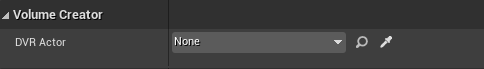
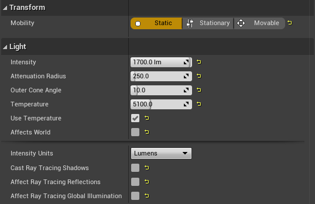
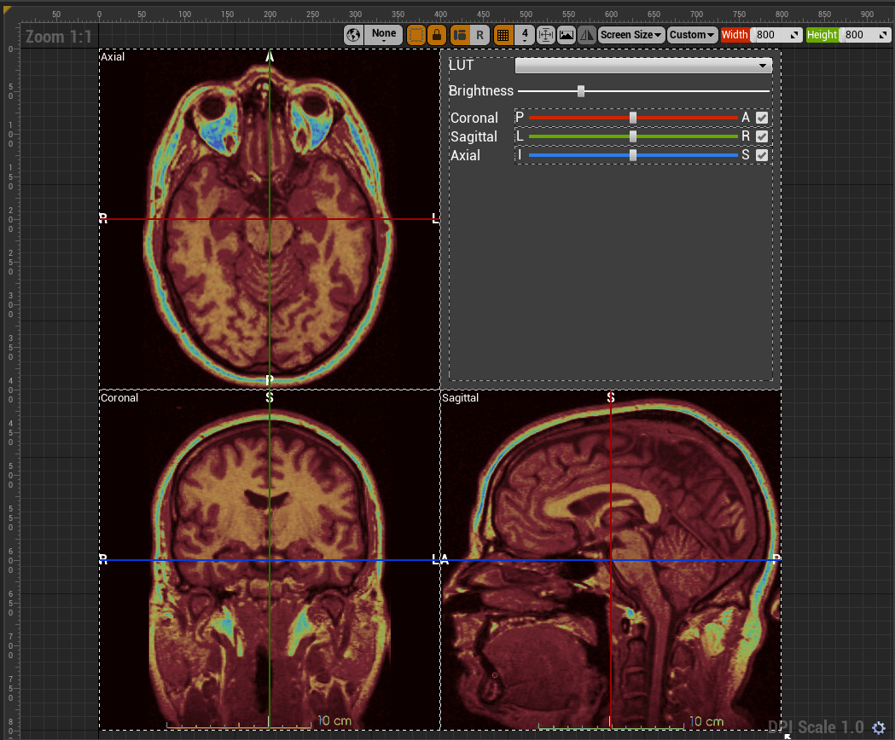

# Volume Creator: An Unreal&reg; Engine Plugin for Medical Data Rendering &ndash; Readme

This document is part of *"Volume Creator: An Unreal&reg; Engine Plugin for Medical Data Rendering &mdash; Documentation"*

* Author: Copyright 2023 Roland Bruggmann aka brugr9
* Profile on UE Marketplace: [https://www.unrealengine.com/marketplace/profile/brugr9](https://www.unrealengine.com/marketplace/profile/brugr9)
* Profile on Epic Developer Community: [https://dev.epicgames.com/community/profile/PQBq/brugr9](https://dev.epicgames.com/community/profile/PQBq/brugr9)

---

<!-- UE Marketplace : Begin 1/2 -->


Adds Blueprint Support for Real-time Rendering from DICOM&reg; based Medical Imaging Data.

## Description

Unreal&reg; Engine plugin "Volume Creator" enables real-time multiplanar and direct volume rendering from the Blueprint Visual Scripting system.

The delivered assets provide importing DICOM&reg; based medical imaging data, applying DICOM Window and rendering by coloring from look-up tables and color-gradient based transferfunctions. With a clipping plane and/or with a region of interest the user may shrink the rendered volume interactively. The plugin allows to create solutions that can be used in VR/AR serious games, e.g., for teaching and training in medical education.

<!-- UE Marketplace : End 1/2 -->

* Index Terms: Medical Imaging, Multiplanar Rendering, Direct Volume Rendering
* Technology: DICOM, Unreal Engine, C++ Code Plugin, HLSL Compute Shader

---

<div style='page-break-after: always'></div>

## Table of Contents

<!-- Start Document Outline -->

* [1. Setup](#1-setup)
  * [1.1. Installation](#11-installation)
  * [1.2. Project Configuration](#12-project-configuration)
* [2. Concept](#2-concept)
* [3. Import](#3-import)
  * [3.1. Import DICOM](#31-import-dicom)
  * [3.2. Import MetaImage](#32-import-metaimage)
* [4. Actors](#4-actors)
  * [4.1. Scalar Volume Actor](#41-scalar-volume-actor)
  * [4.2. Values Of Interest Actor](#42-values-of-interest-actor)
  * [4.3. Multiplanar Rendering Actor](#43-multiplanar-rendering-actor)
  * [4.4. Multiplanar Rendering Monitor Actor](#44-multiplanar-rendering-monitor-actor)
  * [4.5. Direct Volume Rendering Actor](#45-direct-volume-rendering-actor)
  * [4.6. Region Of Interest Actor](#46-region-of-interest-actor)
  * [4.7. Region Of Interest Handles Actor](#47-region-of-interest-handles-actor)
  * [4.8. Clip Plane Actor](#48-clip-plane-actor)
  * [4.9. Orientation Guide Actor](#49-orientation-guide-actor)
  * [4.10. Spot Light Actor](#410-spot-light-actor)
* [5. User Widgets](#5-user-widgets)
  * [5.1. SV User Widget](#51-sv-user-widget)
  * [5.2. VOI User Widget](#52-voi-user-widget)
  * [5.3. MPR User Widget](#53-mpr-user-widget)
  * [5.4. DVR User Widget](#54-dvr-user-widget)
* [6. User Interface Actors](#6-user-interface-actors)
  * [6.1. SV and VOI UI Abstract Actor](#61-sv-and-voi-ui-abstract-actor)
  * [6.2. MPR UI Actor](#62-mpr-ui-actor)
  * [6.3. DVR UI Actor](#63-dvr-ui-actor)
  * [6.4. MPR and DVR UI Actor](#64-mpr-and-dvr-ui-actor)
* [Appendix](#appendix)
  * [Abbreviations and Acronyms](#abbreviations-and-acronyms)
  * [Glossary](#glossary)
    * [Terms of Location and Coordinate Systems](#terms-of-location-and-coordinate-systems)
    * [Asset Naming Convention](#asset-naming-convention)
  * [A. References](#a-references)
    * [A.1. Medical Imaging](#a1-medical-imaging)
    * [A.2. Unreal Engine](#a2-unreal-engine)
  * [B. Readings](#b-readings)
  * [C. Acknowledgements](#c-acknowledgements)
  * [D. Attribution](#d-attribution)
  * [E. Disclaimer](#e-disclaimer)
  * [F. Citation](#f-citation)

<!-- End Document Outline -->

<div style='page-break-after: always'></div>

## 1. Setup

### 1.1. Installation

In the Unreal Editor access the Plugin Editor from the menu 'Edit > Plugins'. In the Plugin Editor, under category 'Rendering' find and enable the plugin. Finally restart the Unreal Editor.


<br>*Fig. 1.1.: Screenshot of Plugin Editor with Plugin "Volume Creator" enabled*

### 1.2. Project Configuration

To allow Volume Texture asset creation follow these steps as from Unreal Engine Documentation article [*Creating Volume Textures*](https://docs.unrealengine.com/4.26/en-US/RenderingAndGraphics/Textures/VolumeTextures/CreatingVolumeTextures/):

> Before you can use Volume Textures in your Unreal Engine 4 (UE4) project, you will need to enable them. In the following How-To, we will take a look at setting up your UE4 project to use Volume Textures.
>
> 1. First, make sure that the Editor is closed, and then locate your project's DefaultEngine.ini file and open it.
> 2. Locate the Script/Engine.RendererSettings section and add the following variable, then save the file when you have added it:
>
> ```r.AllowVolumeTextureAssetCreation=1```
>
> 3. Re-launch the Editor

<div style='page-break-after: always'></div>

## 2. Concept

The plugin provides rendering of image-stack based volumes, commonly known as scalar volumes. The plugin however does not support the rendering of other type of volumes, like vector volumes or tensor volumes. Following the Object Oriented Paradigm OOP entities are implemented as an object or Actor resp.:

<br>*Fig. 2.1.: Plugin Blueprint Actor Classes*

* **Scalar Volume Actor**: Medical images are imported, e.g., from DICOM files and stored as Hounsfield Units encoded Volume Texture. A Scalar Volume Actor holds a reference to the latter and stores also DICOM pixel spacing attribute values.
* **Values Of Interest Actor**: A Values Of Interest Actor consumes the Volume Texture from a Scalar Volume Actor and applies DICOM Window Attributes 'Center' and 'Width'.
* **Multiplanar Rendering Actor**: The DICOM windowed scalar volume may be visualized by multiplanar rendering in a MPR Actor. The MPR Actor as a 3D representation of MPR holds three mutually perpendicular planes, i.e. coronal, sagittal and axial plane. Its dimensions derive from the scalar volume pixel spacing. The planes can be moved in the direction of their corresponding axes interactively in real-time.
  * **MPR Monitor Actor**: The MPR Actor produces planar rendering, which is also consumed by the MPR Monitor, a 2D representation of MPR.
* **Direct Volume Rendering Actor**: The DICOM windowed scalar volume may be visualized by direct volume rendering in a DVR Actor. The DVR Actor extent is shown with a bounding box. Its dimension derives from the scalar volume pixel spacing.
  * **Region Of Interest Actor**: Using a region of interest ROI Actor the DVR geometry can be optionally shrinked in real-time.
    * **ROI Handles Actor**: A ROI geometry can be optionally modified with a ROI Handles Actor interactively in real-time.
  * **Clip Plane Actor**: Using a Clip Plane Actor the DVR geometry can be optionally shrinked interactively in real-time.
  * **Orientation Guide Actor**: The DVR Actor can be optionally attached a rotation synchronized orientation guide.
  * **Spot Light Actor**: The DVR can be optionally illuminated with static spot-lights.

<br>*Fig. 2.2.: Domain Model Diagram &mdash; Blueprint Actor Classes in Reference Viewer with Focus on MPR*

<br>*Fig. 2.3.: Domain Model Diagram &mdash; Blueprint Actor Classes in Reference Viewer with Focus on DVR*

<div style='page-break-after: always'></div>

## 3. Import

CT image data is expected to come in Hounsfield Units HU. DICOM image data is stored as 12 bit data, sometimes you also meet 16 bit. A twelve-digit binary number can represent 4096 values or Hounsfield Units resp. (12 bit, 2<sup>12</sup> = 4096). The imported data is clamped to 4096 values in a range of [-1000, 3096]. Let's assume we have a scalar volume as follows (cp. [DICOM, FAQ]):

* A Stack of 256 images of size 256 x 256 pixel per image = 256<sup>3</sup> pixel or voxel resp.
* 4 channels RGBA with 8 bit per channel (2<sup>8</sup> = 256, range from 0 to 255) TODO: Update channels and bit per channel

The size of Volume<sub>1</sub> becomes 67 MB. If the images are double the size (stack of 512 images with 512 x 512 pixel per image), the size of Volume<sub>2</sub> increases to 0.5 GB. If the images are even double the size (stack of 1024 images with 1024 x 1024 pixel per image), the size of Volume<sub>3</sub> increases to 4 GB.

* *Volume<sub>1</sub> = 256<sup>3</sup> x 4 x 8 bit = 536’870’912 bit = 0.537 Gigabit = 67 MB*
* *Volume<sub>2</sub> = 512<sup>3</sup> x 4 x 8 bit = 4’294’967’296 bit = 4.295 Gigabit = 537 MB*
* *Volume<sub>3</sub> = 1024<sup>3</sup> x 4 x 8 bit = 34’359’738’368 bit = 34.359 Gigabit = 4295 MB*

With processing, e.g., 30 fps (cp. [Lindberg]):

* *ProcessedData<sub>1</sub> = 0.537 Gigabit/frame x 30 frames/s = 16.1 Gigabit/s*
* *ProcessedData<sub>2</sub> = 4.295 Gigabit/frame x 30 frames/s = 128.8 Gigabit/s*
* *ProcessedData<sub>3</sub> = 34.359 Gigabit/frame x 30 frames/s = 1030.8 Gigabit/s*

The created asset name derives from the file name which is imported:

* Underlines (`_`) from a file name are replaced by minus (`-`) in asset names.
* Maximum asset name length: 20 signs

### 3.1. Import DICOM

Workflow:

* Reads from DICOM&reg; files, file name extension `*.dcm`
* Writes image data temporarely to a Houndsfield Units encoded Volume Texture Render Target `RT_HU_Volume`
* Saves image data to a newly created Houndsfield Units encoded Volume Texture asset `T_MyDataName_HU_Volume`
* Writes meta data&mdash;e.g., DICOM Pixel Spacing&mdash;to a newly created Blueprint asset `BP_MyDataName` based on Scalar Volume Actor `BP_SV` and assigns the Volume Texture asset `T_MyDataName_HU_Volume` just created.

### 3.2. Import MetaImage

Workflow:

* Reads from MetaImage&trade;, file name extension `*.mhds`

<div style='page-break-after: always'></div>

## 4. Actors

### 4.1. Scalar Volume Actor

Plugin "Volume Creator" provides with an SV Actor (Blueprint Class: `BP_SV`) to handle a Hounsfield Units encoded Volume Texture and its pixel spacing. The SV Actor is an empty Actor and has no mesh.

<br>*Fig. 4.1.1.: Blueprint Actor BP_SV*

<br>*Fig. 4.1.2.: Blueprint Actor BP_SV &ndash; Details Panel*

Parameter, Category 'Volume Creator' (cp. figure 'Details Panel'):

* Scalar Volume Texture
  * Type: `Volume Texture`
  * Default Value: `T_HU_Volume_Tex`
  * Info: Hounsfield Units encoded Volume Texture
* Origin
  * Type: `Vector`
  * Default Value: `X 0.0, Y 0.0, Z 0.0`
  * Info: Position of the first Voxel in the Anatomical Coordinate System
* Columns
  * Type: `Integer`
  * Default Value: `512`
  * Range: [`1`, `n`]
  * Info: DICOM Columns Attribute: Number of pixel columns in the image; results in Width (UE: Y)
* Columns Spacing
  * Type: `Float`
  * Default Value: `0.3`
  * Range: [`0`, `10`]
  * Info: DICOM Pixel Spacing Attribute: Physical distance in the patient between the center of each pixel - adjacent column spacing (delimiter)
* Rows
  * Type: `Integer`
  * Default Value: `512`
  * Range: [`1`, `n`]
  * Info: DICOM Rows Attribute: Number of pixel rows in the image; results in Height (UE: Z)
* Rows Spacing
  * Type: `Float`
  * Default Value: `0.3`
  * Range: [`0`, `10`]
  * Info: DICOM Pixel Spacing Attribute: Physical distance in the patient between the center of each pixel - adjacent row spacing (delimiter)
* Slices
  * Type: `Integer`
  * Default Value: `256`
  * Range: [`1`, `n`]
  * Info: Number of Slices or Images respectively; results in Depth (UE: X)
* Slices Spacing
  * Type: `Float`
  * Default Value: `0.5`
  * Range: [`0`, `10`]
  * Info: DICOM Spacing Between Slices Attribute: Spacing between slices. The spacing is measured from the center-to-center of each slice

<div style='page-break-after: always'></div>

### 4.2. Values Of Interest Actor

CT image data is expected to come in Hounsfield Units HU in a range of [-1000, 3096] (cp. section Import) representing 4096 gray levels for different materials where air is defined as -1000 HU and water as 0 HU. Consumer computer screens only can visualize 256 gray levels, represented by a value range of [0, 255]. Therefore the 4096 Hounsfield Units are mapped to the 256 screen gray scale levels. In plugin "Volume Creator" this is done by linear interpolation (Lerp).

If the whole range of 4096 Hounsfield data is mapped to 256 gray levels, the contrast becomes quite bad. Therefore, the so called Values Of Interest VOI aka 'DICOM Window' was introduced to downsize the range of Hounsfield data to map. The window is defined by its center and width.

Plugin "Volume Creator" provides with a Values Of Interest VOI Actor (Blueprint Class: `BP_VOI`) to handle a DICOM window. The VOI Actor is an empty Actor and has no mesh. It consumes the Hounsfield Units encoded Volume Texture from a Scalar Volume SV Actor and applies a DICOM window. In the background, the result is hold in a VOI Volume Texture.

<br>*Fig. 4.2.1.: Blueprint Actor BP_VOI*

<br>*Fig. 4.2.2.: Blueprint Actor BP_VOI &ndash; Details Panel*

Parameter, Category 'Volume Creator' (cp. figure 'Details Panel'):

* Scalar Volume Actor
  * Type: Scalar Volume Actor `BP_SV` instance as Object Reference
  * Default Value: `none`
  * Info: Mandatory, Hounsfield Units data source
* Window Center
  * Type: `Float`
  * Default Value: `1048.0`
  * Range: [`-1000.0`, `3096.0`]
  * Info: Window Center in Hounsfield Units (aka level or brightness)
* Window Width
  * Type: `Float`
  * Default Value: `4096.0`
  * Range: [`1.0`, `4096.0`]
  * Info: Window Width in Hounsfield Units (aka range or contrast)
* Window Range
  * Left
    * Type: `Float`
    * Default Value: `-1000.0`
    * Range: [`-1000.0`, `3096.0`]
  * Right
    * Type: `Float`
    * Default Value: `3096.0`
    * Range: [`-1000.0`, `3096.0`]
  * Info: Window Left and Right Border which are calculated, not editable, for information only.
* Window Mask
  * Type: `Boolean`
  * Default Value: `true`
  * Info: With calculating the VOI Volume Texture, values between the window left and right border are linear interpolated (lerped) in a range of [`0`, `255`] by default. Values equal and lesser than the window left border are mapped to `0`, values equal and greater than the window right border are mapped to `255`. To render the lerped values only, a window mask is applied if parameter 'Window Mask' is set to `true`.

If a parameter from above is changed in a VOI Actor instance from the Editor Details Panel, the VOI Volume Texture is not automatically recalculated. Clicking the `Compute Voi Volume Texture` button will trigger this (see figure 4.2.).

The VOI range can also be set by clicking one of the VOI range buttons (see figure 4.2.). The window center and width are calculated from the specified left and right border values (see table 4.2.). Here the VOI Volume Texture is automatically recalculated.

*Table 4.2.: VOI Ranges*<br>
| VOI Range Name | Left Border | Right Border | Window Center | Window Width |
|-------------|--------:|--------:|--------:|-------:|
| Default     | `-1000` |  `3096` |  `1048` | `4096` |
| Air         | `-1000` | `-1000` | `-1000` |    `1` |
| Lung        |  `-600` |  `-400` |  `-500` |  `200` |
| Fat         |  `-100` |   `-60` |   `-80` |   `40` |
| Water       |     `0` |     `0` |     `0` |    `1` |
| Soft Tissue |    `40` |    `80` |    `60` |   `40` |
| Bone        |   `400` |  `1000` |   `700` |  `600` |
| Mediastinum |    `50` |   `500` |   `275` |  `450` |
| PE          |   `100` |   `700` |   `400` |  `600` |

<div style='page-break-after: always'></div>

### 4.3. Multiplanar Rendering Actor

Plugin "Volume Creator" provides with an Multiplanar Rendering MPR Actor (Blueprint Class: `BP_MPR`) to visualize a 3D representation of a DICOM windowed and scalar volume by Coronal, Sagittal and Axial planes arranged perpendicular to one another.

<br>*Fig. 4.3.1.: Blueprint Actor BP_MPR*

<br>*Fig. 4.3.2.: Blueprint Actor BP_MPR &ndash; Details Panel*

Parameter, Category 'Volume Creator' (cp. figure 'Details Panel'):

* Values Of Interest Actor
  * Type: Values Of Interest Actor `BP_VOI` instance as Object Reference
  * Default Value: `none`
  * Info: Mandatory
* Planes Location:
  * Type: `Vector`
  * Default Value: `X 0.0, Y 0.0, Z 0.0`
  * Ranges: [`-50.0`, `50.0`]
  * Info: Anatomical Planes Location (X: COR, Y: SAG, Z: AXE)
* LUT Index
  * Type: `Integer`
  * Default Value: `0`
  * Range: [`0`, `50`]
* Brightness
  * Type: `Float`
  * Default Value: `0.5`
  * Range: [`0`, `10`]
  * Info: Emissive Brightness; Values greater than 1 are allowed as HDR lighting is supported.

<div style='page-break-after: always'></div>

### 4.4. Multiplanar Rendering Monitor Actor

Plugin "Volume Creator" provides with a Multiplanar Rendering MPR Monitor Actor (Blueprint Class: `BP_MprMonitor`) to visualize a 2D representation of Coronal, Sagittal and Axial planes consumed from an MPR Actor instance and arranged side by side.

<br>*Fig. 4.4.1.: Blueprint Actor BP_MprMonitor*

<br>*Fig. 4.4.2.: Blueprint Actor BP_MprMonitor &ndash; Details Panel*

Parameter, Category 'Volume Creator' (cp. figure 'Details Panel'):

* Multiplanar Rendering Actor
  * Type: Multiplanar Rendering Actor `BP_MPR` instance as Object Reference
  * Default Value: `none`
  * Info: Mandatory, Assign an MPR Actor Instance to get the rendered COR/SAG/AXE images from

<div style='page-break-after: always'></div>

### 4.5. Direct Volume Rendering Actor

Plugin "Volume Creator" provides with a Direct Volume Rendering DVR Actor (Blueprint Class: `BP_DVR`) to visualize a 3D representation of a DICOM windowed and direct volume rendered scalar volume. The DVR Actor extent is shown with a bounding box. Its dimension derives from the scalar volume pixel spacing.

<br>*Fig. 4.5.1.: Blueprint Actor BP_DVR*

<br>*Fig. 4.5.2.: Blueprint Actor BP_DVR &ndash; Details Panel*

Parameter, Category 'Volume Creator' (cp. figure 'Details Panel'):

* Values Of Interest Actor
  * Type: VOI Actor `BP_VOI` instance as Object Reference
  * Default Value: `none`
  * Info: Mandatory, used for TF LUT application
* Region Of Interest Actor
  * Type: ROI Actor `BP_ROI` instance as Object Reference
  * Default Value: `none`
  * Optional, used for geometry subtraction if set
* Clip Plane Actor
  * Type: Clip Plane Actor `BP_DvrClipPlane` instance as Object Reference
  * Default Value: `none`
  * Optional, used for geometry subtraction if set
* Distance Power
  * Type: `Float`
  * Default Value: `1.0`
  * Range: [`0.1`, `2.0`]
  * Info: Resampling Distance Power &ndash; The shader algorithm calculates the current distance of the image slices with respect to the angle of entry of the resampling ray. With a value of `1.0` (default) the calculated resampling distance is used. This parameter may be seen as an optimisation method, cp. [Luecke 2005], *Fragmented Line Ray-Casting*:
    > *To lower the number of operations necessary for computing a single frame, [...] the distance between two successive resampling locations, i.e the sampling distance, could be increased, thereby decreasing the number of actual locations used for volume reconstruction.*
    > *However, it is worth mentioning, that incorporating any of these optimization approaches usually tends to result in generated images of less quality compared to an unoptimized ray-casting volume renderer.*
    * With values smaller than `1.0` the resampling distance lowers, a so-called oversampling occurs, which may increase visualisation quality.
    * With values larger than `1.0` the resampling distance grows, a so-called undersampling occurs, which may accelerate rendering.
* Resampling Steps
  * Type: `Integer`
  * Default Value: `256`
  * Range: [`1`, `1024`]
  * Info: Maximum Number of Resampling Steps:
    * A large number means more steps. The resampling ray may advance deeper into the cube. The hereby resulting rendering may increase visualisation quality by the cost of more computing time.
    * A small number may decrease rendering quality but is faster.
* Transfer Function
  * Type: `Curve Linear Color`
  * Default Value: `Curve_Default_TF_Color`
  * Info: The transfer functions are based on color gradients from `Curve Linear Color` assets.
* Alpha Threshold
  * Type: `Float`
  * Default Value: `0.8`
  * Range: [`0.0`, `1.0`]
  * Info: Maximum Opacity Threshold for Early Ray Termination from iteratively added up Alpha Channel
* Phong Shading
  * Ambient: Default Value: `0.1`, Range: [`0.0`, `1.0`]
  * Diffuse: Default Value: `0.9`, Range: [`0.0`, `1.0`]
  * Specular: Default Value: `0.2`, Range: [`0.0`, `1.0`]
  * Specular Power: Default Value: `10`, Range: [`1`, `50`]
* Light Source
  * Type: Array of `BP_DvrSpotLight` Object References
  * Default Value: `none`
  * Optional, used for static lighting if set

<div style='page-break-after: always'></div>

### 4.6. Region Of Interest Actor

Plugin "Volume Creator" provides with a Region Of Interest ROI Actor (Blueprint Class: `BP_ROI`), with which a DVR Actor geometry can be shrinked in real-time. A ROI Actor instance can be assigned as a parameter in a DVR Actor instance. In the Unreal Editor Outline Hierarchy a ROI Actor is ideally subordinated directly to the corresponding DVR Actor for adaptive scaling.

<br>*Fig. 4.6.1.: Blueprint Actor BP_ROI*

Parameter, Category 'Volume Creator':

* none

### 4.7. Region Of Interest Handles Actor

Plugin "Volume Creator" provides with a Region Of Interest ROI Handles Actor (Blueprint Class: `BP_RoiHandles`), with which a ROI Actor geometry can be modified interactively in real-time.

<br>*Fig. 4.7.1.: Blueprint Actor BP_RoiHandles*

<br>*Fig. 4.7.2.: Blueprint Actor BP_RoiHandles &ndash; Details Panel*

Parameter, Category 'Volume Creator' (cp. figure 'Details Panel'):

* Region Of Interest
  * Type: Array of ROI Actor `BP_ROI` instances as Object References
  * Default Value: `none`
  * Info: Mandatory, Region(s) of Interest to Manage

<div style='page-break-after: always'></div>

### 4.8. Clip Plane Actor

Plugin "Volume Creator" provides with a Clip Plane Actor (Blueprint Class: `BP_DvrClipPlane`), with which a DVR Actor geometry can be shrinked in real-time.

<br>*Fig. 4.8.1.: Blueprint Actor BP_DvrClipPlane*

Parameter, Category 'Volume Creator':

* none

### 4.9. Orientation Guide Actor

Plugin "Volume Creator" provides with a Orientation Guide Actor (Blueprint Class: `BP_DvrOrientationGuide`), which can be attached to a DVR Actor and serves as rotation synchronized orientation guide.

<br>*Fig. 4.9.1.: Blueprint Actor BP_DvrOrientationGuide*

<br>*Fig. 4.9.2.: Blueprint Actor BP_DvrOrientationGuide &ndash; Details Panel*

Parameter, Category 'Volume Creator' (cp. figure 'Details Panel'):

* DVR Actor
  * Type: Direct Volume Rendering Actor `BP_DVR` instance as Object Reference
  * Default Value: `none`
  * Info: Mandatory, DVR Actor Instance to synchronize rotation from

<div style='page-break-after: always'></div>

### 4.10. Spot Light Actor

Plugin "Volume Creator" provides with a Spot Light Actor (Blueprint Class: `BP_DvrSpotLight`), which can be optionally attached to a DVR Actor. The Spot Light Actor will serve as static lighting source to illuminate the direct volume rendering. Its `SpotLightComponent` *Light* parameters are simulating an operating theatre light (see figure 4.10.). By default, the lighting is intended only for the DVR. It is up to the developer whether the light should also affect the world and ray tracing.

<br>*Fig. 4.10.1.: Blueprint Actor BP_DvrSpotLight*

<br>*Fig. 4.10.2.: Blueprint Actor BP_DvrSpotLight &ndash; Details Panel*

Parameter (cp. figure 'Details Panel'):

* Transform:
  * Mobility: Static
* Light:
  * Intensity (Brightness): `1700.0` lm
  * Attenuation Radius: `250.0`
  * Outer Cone Angle: `10.0`
  * Temperature: `5100.0` K (cp. [21])
  * User Temperature: `true`
  * Affects World: `false`
  * Intensity Units: `Lumen` (see [UEDoc, Physical Lighting Units])
  * Cast Ray Tracing Shadows: `false`
  * Affect Ray Tracing Reflections: `false`
  * Affect Ray Tracing Global Illumination: `false`

<div style='page-break-after: always'></div>

## 5. User Widgets

The plugin "Volume Creator" elements SV, VOI, MPR and DVR are available as User Widget Blueprint (see figure 5.).

<br>*Fig. 5.: Plugin User Widget Blueprints*

<div style='page-break-after: always'></div>

### 5.1. SV User Widget

Plugin "Volume Creator" provides with a Scalar Volume SV User Widget Blueprint (Blueprint Class: `WBP_SV`).

<br>*Fig. 5.1.: User Widget Blueprint WBP_SV*

Widget Entries:

* Import... (Dialog)
* Open... (Dialog)
* Save
* Save As... (Dialog)

<div style='page-break-after: always'></div>

### 5.2. VOI User Widget

Plugin "Volume Creator" provides with a Values Of Interest VOI User Widget Blueprint (Blueprint Class: `WBP_VOI`).

<br>*Fig. 5.2.: User Widget Blueprint WBP_VOI*

Widget Entries:

* VOI Actor (Select)
* Window Center (Slider)
* Window Width (Slider)
* Window Mask (Check)

<div style='page-break-after: always'></div>

### 5.3. MPR User Widget

Plugin "Volume Creator" provides with a Multiplanar Rendering MPR User Widget Blueprint (Blueprint Class: `WBP_MPR`).

<br>*Fig. 5.3.: User Widget Blueprint WBP_MPR*

Widget Entries:

* MPR Actor (Select)
* LUT (Select)

<div style='page-break-after: always'></div>

### 5.4. DVR User Widget

Plugin "Volume Creator" provides with a Direct Volume Rendering DVR User Widget Blueprint (Blueprint Class: `WBP_DVR`).

<br>*Fig. 5.4.: User Widget Blueprint WBP_DVR*

Widget Entries:

* DVR Actor (Select)
* TF (Select)

<div style='page-break-after: always'></div>

## 6. User Interface Actors

The plugin "Volume Creator" User Widget Blueprints SV, VOI, MPR and DVR are also available as User Interface Blueprint Actor for the use in 3D (see figure 6.).

<br>*Fig. 6.: Plugin User Interface Blueprint Actors*

### 6.1. SV and VOI UI Abstract Actor

Scalar Volume and Values Of Interest Blueprint Actor (Blueprint Class: `BP_SvVoi_UI`), Abstract Class.

<br>*Fig. 6.1.: User Interface Blueprint Actor BP_SvVoi_UI*

Widget Components:

* Widget Component `WidgetSV`, Scalar Volume User Widget `WBP_SV`
* Widget Component `WidgetVOI`, VOI User Widget `WBP_VOI`

<div style='page-break-after: always'></div>

### 6.2. MPR UI Actor

Multiplanar Rendering User Interface Blueprint Actor (Blueprint Class: `BP_MPR_UI`, inherits from `BP_SvVoi_UI`).

<br>*Fig. 6.2.: User Interface Blueprint Actor BP_MPR_UI*

Widget Components:

* Widget Component `WidgetSV`, Scalar Volume User Widget `WBP_SV` (Inherited)
* Widget Component `WidgetVOI`, VOI User Widget `WBP_VOI` (Inherited)
* Widget Component `WidgetMPR`, MPR User Widget `WBP_MPR`

<div style='page-break-after: always'></div>

### 6.3. DVR UI Actor

Direct Volume Rendering User Interface Blueprint Actor (Blueprint Class: `BP_DVR_UI`, inherits from `BP_SvVoi_UI`).

<br>*Fig. 6.3.: User Interface Blueprint Actor BP_DVR_UI*

Widget Components:

* Widget Component `WidgetSV`, Scalar Volume User Widget `WBP_SV` (Inherited)
* Widget Component `WidgetVOI`, VOI User Widget `WBP_VOI` (Inherited)
* Widget Component `WidgetDVR`, DVR User Widget `WBP_DVR`

<div style='page-break-after: always'></div>

### 6.4. MPR and DVR UI Actor

Direct Volume Rendering User Interface Blueprint Actor (Blueprint Class: `BP_MprDvr_UI`, inherits from `BP_MPR_UI`).

<br>*Fig. 6.4.: User Interface Blueprint Actor BP_MprDvr_UI*

Widget Components:

* Widget Component `WidgetSV`, Scalar Volume User Widget `WBP_SV` (Inherited)
* Widget Component `WidgetVOI`, VOI User Widget `WBP_VOI` (Inherited)
* Widget Component `WidgetMPR`, MPR User Widget `WBP_MPR` (Inherited)
* Widget Component `WidgetDVR`, DVR User Widget `WBP_DVR`

<div style='page-break-after: always'></div>

## Appendix

### Abbreviations and Acronyms

* A &mdash; Anterior
* A-R-S &mdash; Anterior&ndash;Right&ndash;Superior
* AXE &mdash; Axial
* BB &mdash; Bounding Box
* COR &mdash; Coronal
* CS &mdash; Compute Shader
* CT &mdash; Computed Tomography (X-ray)
* DICOM &mdash; Digital Imaging and Communications in Medicine
* DVR &mdash; Direct Volume Rendering
* fps &mdash; Frames per Second
* FPV &mdash; First Person View
* HU &mdash; Hounsfield Units
* I &mdash; Inferior
* L &mdash; Left
* LhS &mdash; Left-handed System
* L-A-S &mdash; Left&ndash;Anterior&ndash;Superior
* L-P-S &mdash; Left&ndash;Posterior&ndash;Superior
* LUT &mdash; Look-Up Table
* MIP &mdash; Maximum Intensity Projection
* MPR &mdash; Multiplanar Reconstruction
* MR &mdash; Magnetic Resonance
* OG &mdash; Orientation Guide
* P &mdash; Posterior
* PIE &mdash; Play in Editor
* R &mdash; Right
* R-A-S &mdash; Right&ndash;Anterior&ndash;Superior
* RhS &mdash; Right-handed System
* ROI &mdash; Region of Interest
* RT &mdash; Render Target Texture
* S &mdash; Superior
* SAG &mdash; Sagittal
* SV &mdash; Scalar Volume
* TF &mdash; Transfer Function
* UE &mdash; Unreal Engine
* UI &mdash; User Interface
* US &mdash; Ultrasound Imaging (sonography)
* VOI &mdash; Values of Interest

<!--
* AAA &mdash; Abdominal Aortic Aneurysm
* CRI &mdash; Colour Rendering Index
* CTA &mdash; Computed Tomography Angiography
* dGEMRIC &mdash; delayed gadolinium-enhanced MRI of cartilage
* MRI &mdash; Magnetic Resonance Imaging
* MRT &mdash; Magnetic Resonance Tomography
* PET &mdash; Positron Emission Tomography
* CRS &mdash; Coordinate Reference System
* WCS &mdash; World Coordinate System
-->

<div style='page-break-after: always'></div>

### Glossary

#### Terms of Location and Coordinate Systems

Patient Coordinate System: Anatomical planes and terms of location on a person standing upright (cp. [mbbs]):

* **Axial Plane**: Horizontal plane, separates in **Inferior (I)** towards feet and **Superior (S)** towards head.
* **Sagittal Plane**: The median plane is a longitudinal plane, which separates the body into its **Left (L)** and **Right (R)** halves. A sagittal plane is any plane perpendicular to the median plane.
* **Coronal Plane**: Frontal plane, separates in **Posterior (P)** towards back and **Anterior (A)** towards front.

##### DICOM

DICOM images are using a **Left&ndash;Posterior&ndash;Superior L-P-S** system (cp. [Sharma 2022] and [Adaloglouon 2020], *Anatomical coordinate system*). DICOM images are stored as a matrix of pixels with index coordinates in rows `i`, columns `j`, and slices `k` using a **Right-handed System RhS** (cp. [Adaloglouon 2020, Medical Image coordinate system (Voxel space)]):

* The image stack Origin is located in the first slice, first column, first row
* i: Image width in columns, increases to anatomical **Left L**
* j: Image height in rows, increases to anatomical **Posterior P**
* k: Image stack depth in slices, increases anatomical **Superior S**

##### Unreal Engine

Unreal Engine is using a **Left-handed System LhS** based First Person View FPV (cp. [Mower, Coordinate System]) with terms of location 'Back', 'Front', 'Left', 'Right', 'Bottom' and 'Top'. In plugin "Volume Creator"&mdash;with the use of UE's LhS and terms of location&mdash; the anatomical coordinate system results in a **Anterior&ndash;Right&ndash;Superior A-R-S** system (cp. figure G.1.):

* X: Increases from Back to Front, color code red; anatomical from Posterior P to **Anterior A**
* Y: Increases from Left to Right, color code green; anatomical from Left L to **Right R**
* Z: Increases upwards from Bottom to Top, color code blue; anatomical from Inferior I to **Superior S**

<br>*Fig. G.1.: DVR Orientation Guide Actor with UE Left Handed Location-Gizmo Arrows*

<div style='page-break-after: always'></div>

Anatomical Planes and Terms of Location in plugin "Volume Creator" (cp. figure G.2.):

* **Coronal COR**: Frontal **YZ-Plane** (green/blue arrows) <br>with **Up-Vector X+** (red arrow) from **Posterior P** to **Anterior A**
* **Sagittal SAG**: Longitudinal **XZ-Plane** (red/blue arrows) <br>with **Up-Vector Y+** (green arrow) from **Left L** to **Right R**
* **Axial AXE**: Horizontal **XY-Plane** (red/green arrows) <br>with **Up-Vector Z+** (blue arrow) from **Inferior I** to **Superior S**

<br>*Fig. G.2.: ROI-Handles Actor with UE Left Handed Location-Gizmo Arrows*

#### Asset Naming Convention

The plugins assets naming convention is based on a scheme from [UEDoc, Recommended Asset Naming Conventions] (see also [Allar 2022] and [Amos 2021]):
> *`[AssetTypePrefix]_[AssetName]_[DescriptorSuffix]_[OptionalVariantLetterOrNumber]`*
>
>* *`AssetTypePrefix` identifies the type of Asset [...].*
>* *`AssetName` is the Asset's name.*
>* *`DescriptorSuffix` provides additional context for the Asset, to help identify how it is used. For example, whether a texture is a normal map or an opacity map.*
>* *`OptionalVariantLetterOrNumber` is optionally used to differentiate between multiple versions or variations of an asset.*

* `[AssetTypePrefix]`:
  * Blueprint: `BP`
  * Blueprint Interface: `BPI`
  * Curve: `Curve`
  * Enum(eration): `E`
  * Material: `M`
  * Material Instance: `MI`
  * Material Instance Dynamic: `MID`
  * Struct(ure): `F`
  * Static Mesh: `SM`
  * Texture: `T`
  * Texture Render Target: `RT`
  * Widget Blueprint: `WBP`

<div style='page-break-after: always'></div>

* `[AssetName]` (Domain Specific):
  * Scalar Volume: `SV`
  * Data Type:
    * Hounsfield Units: `HU`
    * Values Of Interest: `VOI`
  * Rendering Type:
    * Multiplanar Rendering: `MPR`
      * Plane: `COR`, `SAG`, `AXE`
      * Location: `P`, `A`, `L`, `R`, `I`, `S`
      * Look-Up Table: `LUT`
    * Direct Volume Rendering: `DVR`
      * Bounding Box: `BB`
      * Orientation Guide: `OG`
      * Region Of Interest: `ROI`
      * Transfer Function: `TF`
  * Acquisition Type:
    * Computer Tomography: `CT`
    * Magnetic Resonance: `MR`
    * Ultrasound: `US`
* `[DescriptorSuffix]`:
  * Texture Array: `Array`
  * Curve Linear Color: `Color`
  * Color Atlas: `ColorAtlas`
  * Compute Shader: `CS`
  * Main Material: `Main`
  * Volume Texture: `Volume`
  * Texture Drawn from 'Material to Texture Render Target': `Tex`
  * User Widget Blueprint Actor: `UI`

<div style='page-break-after: always'></div>

### A. References

#### A.1. Medical Imaging

* Anatomical Terms:
  * [mbbs] mbbsbooks: **Anatomical Terms**. In: mbbsbooks Medical - Category Anatomy. Feb 14, 2023. Online: [https://mbbsbooks.com/anatomical-terms/](https://mbbsbooks.com/anatomical-terms/)
* DICOM:
  * [DICOM] **The DICOM Standard**. Online: [https://www.dicomstandard.org/current](https://www.dicomstandard.org/current)
  * [DICOM, FAQ] **DICOM Standard FAQ**. Online: [https://www.dicomstandard.org/faq](https://www.dicomstandard.org/faq)
  * [DICOM-Browser] Innolitics: **DICOM Standard Browser**. Online: [https://dicom.innolitics.com/ciods/ct-image](https://dicom.innolitics.com/ciods/ct-image)
  * [Sharma 2021] Shivam Sharma: **Introduction to DICOM for Computer Vision Engineers**. In: *RedBrick AI*. Dec 15, 2021. Online: [https://medium.com/redbrick-ai/introduction-to-dicom-for-computer-vision-engineers-78f346bbc1fd](https://medium.com/redbrick-ai/introduction-to-dicom-for-computer-vision-engineers-78f346bbc1fd)
  * [Sharma 2022] Shivam Sharma: **DICOM Coordinate Systems &ndash; 3D DICOM for Computer Vision Engineers**. In: *RedBrick AI*. Dec 22, 2022. Online: [https://medium.com/redbrick-ai/dicom-coordinate-systems-3d-dicom-for-computer-vision-engineers-pt-1-61341d87485f](https://medium.com/redbrick-ai/dicom-coordinate-systems-3d-dicom-for-computer-vision-engineers-pt-1-61341d87485f)
  * [Adaloglouon 2020] Nikolas Adaloglouon: **Understanding Coordinate Systems and DICOM for Deep Learning Medical Image Analysis**. In: *The AI Summer*. July 16, 2020. Online: [https://theaisummer.com/medical-image-coordinates/](https://theaisummer.com/medical-image-coordinates/)
  * [Zaharia 2013] Roni Zaharia: **Chapter 14 - Image Orientation: Getting Oriented using the Image Plane Module**. In: *DICOM Tutorial, DICOM is Easy &ndash; Software Programming for Medical Applications*. June 6, 2013. Online: [http://dicomiseasy.blogspot.com/2013/06/getting-oriented-using-image-plane.html](http://dicomiseasy.blogspot.com/2013/06/getting-oriented-using-image-plane.html)
* Volume Rendering:
  * [Luecke 2005] Peter Lücke: **Volume Rendering Techniques for Medical Imaging**. Diplomarbeit. Technische Universität München, Fakultät für Informatik. April 15, 2005. In collaboration with Siemens Corporate Research Inc., Princeton, USA. Online: [https://campar.in.tum.de/twiki/pub/Students/DaLuecke/Diplomarbeit.pdf](https://campar.in.tum.de/twiki/pub/Students/DaLuecke/Diplomarbeit.pdf)
  <!--* [Piper et al.] Piper S., Finet J., Yarmarkovich A., Aucoin N.: **3D Slicer Module "Volumes"**. License: slicer4. The work is part of the National Alliance for Medical Image Computing (NAMIC), funded by the National Institutes of Health through the NIH Roadmap for Medical Research, Grant U54 EB005149. Online Documentation: [https://slicer.readthedocs.io/en/latest/user_guide/modules/volumes.html](https://slicer.readthedocs.io/en/latest/user_guide/modules/volumes.html)-->
  <!--* [Finet et al.] Finet J., Yarmarkovich A., Liu Y., Freudling A., Kikinis R.: **3D Slicer Module "Volume Rendering"**. License: slicer4. The work is part of the National Alliance for Medical Image Computing (NAMIC), funded by the National Institutes of Health through the NIH Roadmap for Medical Research, Grant U54 EB005149. Online Documentation: [https://slicer.readthedocs.io/en/latest/developer_guide/modules/volumerendering.html](https://slicer.readthedocs.io/en/latest/developer_guide/modules/volumerendering.html); Transfer Function Presets on GitHub: [https://github.com/Slicer/Slicer/blob/main/Modules/Loadable/VolumeRendering/Resources/presets.xml](https://github.com/Slicer/Slicer/blob/main/Modules/Loadable/VolumeRendering/Resources/presets.xml)-->
  * [Lindberg] Kjell Lindberg: **How can a processor handle 10 Gigabit per second or more data rate?**. In: Quora. Nov 2021. URL: [https://www.quora.com/How-can-a-processor-handle-10-Gigabit-per-second-or-more-data-rate](https://www.quora.com/How-can-a-processor-handle-10-Gigabit-per-second-or-more-data-rate)
* Lighting:
  * [21] **Why Colour Matters in Surgical Lighting**. In: Website of Vivo Surgical. Jul 27, 2021. Online: [https://www.vivo-surgical.com/post/why-colour-matters-the-importance-of-colour-temperature](https://www.vivo-surgical.com/post/why-colour-matters-the-importance-of-colour-temperature)
  <!--* [22] **The Different Colors Of Operating Theatre Lights**. In: Website "Forum Theatre". September 15, 2022. Online: [https://forum-theatre.com/the-different-colors-of-operating-theatre-lights/](https://forum-theatre.com/the-different-colors-of-operating-theatre-lights/)-->

#### A.2. Unreal Engine

* [UEDoc] Epic Games: **Unreal Engine Documentation**. URL: [https://docs.unrealengine.com](https://docs.unrealengine.com)
* Coordinate System:
  * [Mower, Scale] Nick Mower: **Scale and Measurement Inside Unreal Engine 4**. In: TechArt-Hub. Online: [https://www.techarthub.com/scale-and-measurement-inside-unreal-engine-4/](https://www.techarthub.com/scale-and-measurement-inside-unreal-engine-4/)
  * [Mower, Coordinate System] Nick Mower: **A Practical Guide to Unreal Engine 4’s Coordinate System**. In: TechArt-Hub. Online: [https://www.techarthub.com/a-practical-guide-to-unreal-engine-4s-coordinate-system/](https://www.techarthub.com/a-practical-guide-to-unreal-engine-4s-coordinate-system/)
* Naming Convention:
  * [UEDoc, Recommended Asset Naming Conventions] Epic Games: **Recommended Asset Naming Conventions**. In: Unreal Engine Documentation. URL: [https://docs.unrealengine.com/5.1/en-US/recommended-asset-naming-conventions-in-unreal-engine-projects/](https://docs.unrealengine.com/5.1/en-US/recommended-asset-naming-conventions-in-unreal-engine-projects/)
  * [Allar 2022] Michael Allar: **Gamemakin UE Style Guide**. March 7, 2022. URL: [https://github.com/Allar/ue5-style-guide](https://github.com/Allar/ue5-style-guide)
  * [Amos 2021] Dylan "Tezenari" Amos: **Asset Naming Conventions**. In: Unreal Directive. October 12, 2021. URL: [https://www.unrealdirective.com/resource/asset-naming-conventions](https://www.unrealdirective.com/resource/asset-naming-conventions)
* Textures:
  * [UEDoc, Guidelines for Optimizing Rendering for Real-Time] Epic Games: **Guidelines for Optimizing Rendering for Real-Time**. In: Unreal Engine Documentation. URL: [https://docs.unrealengine.com/5.1/en-US/guidelines-for-optimizing-rendering-for-real-time-in-unreal-engine/](https://docs.unrealengine.com/5.1/en-US/guidelines-for-optimizing-rendering-for-real-time-in-unreal-engine/)
  * [Mower, Compression] Nick Mower: **Your Guide to Texture Compression in Unreal Engine**. In: TechArt-Hub. Online: [https://www.techarthub.com/your-guide-to-texture-compression-in-unreal-engine/](https://www.techarthub.com/your-guide-to-texture-compression-in-unreal-engine/)
  * [Ivanov 2021] Michael Ivanov: **Unreal Engine and Custom Data Textures**. June 19, 2021. URL: [https://sasmaster.medium.com/unreal-engine-and-custom-data-textures-40857f8b6b81](https://sasmaster.medium.com/unreal-engine-and-custom-data-textures-40857f8b6b81)
* Lighting:
  * [UEDoc, Physical Lighting Units] **Physical Lighting Units**. In: Unreal Engine Documentation. URL: [https://docs.unrealengine.com/4.27/en-US/BuildingWorlds/LightingAndShadows/PhysicalLightUnits/](https://docs.unrealengine.com/4.27/en-US/BuildingWorlds/LightingAndShadows/PhysicalLightUnits/)

### B. Readings

* Ikits M., Kniss J., Lefohn A., Hansen C.: **Volume Rendering Techniques**. In: *GPU Gems: Programming Techniques, Tips, and Tricks for Real-Time Graphics &ndash; Part VI: Beyond Triangles, Chapter 39*. 5th Printing September 2007, Pearson Education, Inc. Online: [https://developer.nvidia.com/gpugems/gpugems/part-vi-beyond-triangles/chapter-39-volume-rendering-techniques](https://developer.nvidia.com/gpugems/gpugems/part-vi-beyond-triangles/chapter-39-volume-rendering-techniques)
* Engel K., Hadwiger M., Kniss J., Rezk Salama C., Weiskopf D. (2006): **Real-Time Volume Graphics**. doi: [10.1145/1103900.1103929](http://dx.doi.org/10.1145/1103900.1103929). Online: [http://www.real-time-volume-graphics.org/](http://www.real-time-volume-graphics.org/)
<!--* [Hadwiger et al. 18] Hadwiger M., Al-Awami A.K., Beyer J., Agos M., Pfister H.P. (2018): **SparseLeap: Efficient Empty Space Skipping for Large-Scale Volume Rendering**. In: *IEEE Transactions on Visualization and Computer Graphics*. Online: [https://vcg.seas.harvard.edu/publications/sparseleap-efficient-empty-space-skipping-for-large-scale-volume-rendering](https://vcg.seas.harvard.edu/publications/sparseleap-efficient-empty-space-skipping-for-large-scale-volume-rendering)-->
<!--* Fedorov A., Beichel R., Kalpathy-Cramer J., Finet J., Fillion-Robin J-C., Pujol S., Bauer C., Jennings D., Fennessy F.M., Sonka M., Buatti J., Aylward S.R., Miller J.V., Pieper S., Kikinis R: **3D Slicer as an Image Computing Platform for the Quantitative Imaging Network**. Online: [https://www.ncbi.nlm.nih.gov/pmc/articles/PMC3466397/pdf/nihms383480.pdf](https://www.ncbi.nlm.nih.gov/pmc/articles/PMC3466397/pdf/nihms383480.pdf). Magnetic Resonance Imaging. 2012 Nov;30(9):1323-41. PMID: 22770690. PMCID: PMC3466397.-->

### C. Acknowledgements

* **Software:** Bruggmann, Roland (2023): **Volume Creator**, Version v1.0.0, UE 4.26. Unreal&reg; Marketplace. URL: [https://www.unrealengine.com/marketplace/en-US/product/volume-creator](https://www.unrealengine.com/marketplace/en-US/product/volume-creator). Copyright 2023 Roland Bruggmann aka brugr9. All Rights Reserved.
* **Data:** van Ginneken, Bram, & Jacobs, Colin. (2019): **LUNA16 Part 1/2 subset0**. Zenodo. [https://doi.org/10.5281/zenodo.3723295](https://doi.org/10.5281/zenodo.3723295), licensed under Creative Commons Attribution 4.0 International ([CC BY 4.0](https://creativecommons.org/licenses/by/4.0/))

<div style='page-break-after: always'></div>

### D. Attribution

* The word mark *Unreal* and its logo are Epic Games, Inc. trademarks or registered trademarks in the US and elsewhere (cp. Branding Guidelines and Trademark Usage, URL: [https://www.unrealengine.com/en-US/branding](https://www.unrealengine.com/en-US/branding))
* The word mark *DICOM&mdash;Digital Imaging and Communication in Medicine* and its logo are trademarks or registered trademarks of the National Electrical Manufacturers Association (NEMA), managed by the Medical Imaging Technology Association (MITA), a division of NEMA
* The word mark *MetaImage* is a trademark or registered trademark of Kitware, Inc.
<!--* The word mark *ITK&mdash;Insight Toolkit* is a trademark or registered trademark of Kitware, Inc.-->
<!--* The word mark *3D Slicer* and its logo are trademarks of Brigham and Women’s Hospital (BWH), used with permission.-->

### E. Disclaimer

This documentation has **not been reviewed or approved** by the Food and Drug Administration FDA or by any other agency. It is the users responsibility to ensure compliance with applicable rules and regulations&mdash;be it in the US or elsewhere.

Read also:

* *"Documentation Disclaimer"* (file DISCLAIMER.md), Online: [https://github.com/brugr9/UEPluginVolumeCreator/blob/main/DISCLAIMER.md](https://github.com/brugr9/UEPluginVolumeCreator/blob/main/DISCLAIMER.md)
* *"Software Disclaimer"* from Plugin folder Docs/DISCLAIMER.pdf

### F. Citation

**Software**: To acknowledge *"Unreal&reg; Engine Plugin: Volume Creator"* software, please cite

> Bruggmann, Roland (2023). *Unreal&reg; Engine Plugin: Volume Creator*, Version [v#.#.#], UE [4.## or 5.#]. Unreal&reg; Marketplace. URL: [https://www.unrealengine.com/marketplace/en-US/product/volume-creator](https://www.unrealengine.com/marketplace/en-US/product/volume-creator). Copyright 2023 Roland Bruggmann aka brugr9. All Rights Reserved.

**Documentation**: To acknowledge this documentation&mdash;be it, e.g., the Readme or the Changelog&mdash;please cite

> Bruggmann, Roland (2023). *Volume Creator: An Unreal&reg; Engine Plugin for Medical Data Rendering &mdash; Documentation*, \[Readme, Changelog\]. GitHub; accessed [Year Month Day]. URL: [https://github.com/brugr9/UEPluginVolumeCreator](https://github.com/brugr9/UEPluginVolumeCreator). Licensed under [Creative Commons Attribution-ShareAlike 4.0 International](http://creativecommons.org/licenses/by-sa/4.0/)

---
<!-- Footer -->

[](https://creativecommons.org/licenses/by-sa/4.0/)

*"Volume Creator: An Unreal&reg; Engine Plugin for Medical Data Rendering &mdash; Documentation"*. URL: [https://github.com/brugr9/UEPluginVolumeCreator](https://github.com/brugr9/UEPluginVolumeCreator). &copy; 2023 by [Roland Bruggmann](https://about.me/rbruggmann), licensed under [Creative Commons Attribution-ShareAlike 4.0 International](http://creativecommons.org/licenses/by-sa/4.0/)
