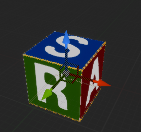

# Volume Creator: An Unreal&reg; Engine Plugin for Medical Data Rendering &ndash; Readme

This document is part of *"Volume Creator: An Unreal&reg; Engine Plugin for Medical Data Rendering &mdash; Documentation"*

* Author: Copyright 2023 Roland Bruggmann aka brugr9
* Profile on UE Marketplace: [https://www.unrealengine.com/marketplace/profile/brugr9](https://www.unrealengine.com/marketplace/profile/brugr9)
* Profile on Epic Developer Community: [https://dev.epicgames.com/community/profile/PQBq/brugr9](https://dev.epicgames.com/community/profile/PQBq/brugr9)

---

<!-- Start Document Outline -->

* [1. Setup](#1-setup)
  * [1.1. Installation](#11-installation)
  * [1.2. Project Configuration](#12-project-configuration)
* [2. Concept](#2-concept)
  * [2.1. Scalar Volume](#21-scalar-volume)
  * [2.2. Region of Interest](#22-region-of-interest)
  * [2.3. Clip Plane](#23-clip-plane)
  * [2.4. Spot-Light](#24-spot-light)
* [3. Blueprint ScalarVolume and Inheriting Actors](#3-blueprint-scalarvolume-and-inheriting-actors)
  * [3.1. Actor BP ScalarVolume H](#31-actor-bp-scalarvolume-h)
    * [3.1.2. Dataset](#312-dataset)
    * [3.1.3. DICOM Window](#313-dicom-window)
    * [3.1.4. Volume Rendering](#314-volume-rendering)
    * [3.1.5. Volume Shading](#315-volume-shading)
  * [3.2. Actor BP ScalarVolume W](#32-actor-bp-scalarvolume-w)
  * [3.3. Actor BP ScalarVolume W L](#33-actor-bp-scalarvolume-w-l)
* [4. Import](#4-import)
  * [4.1. Import DICOM](#41-import-dicom)
  * [4.2. Import MetaImage](#42-import-metaimage)
  * [4.3. Data Background](#43-data-background)
    * [4.3.1. Memory](#431-memory)
    * [4.3.2. Processing](#432-processing)
* [6. Outlook](#6-outlook)
* [Appendix](#appendix)
  * [Acronyms](#acronyms)
  * [Glossary](#glossary)
    * [Coordinate Systems and Terms of Location](#coordinate-systems-and-terms-of-location)
    * [Asset Naming Convention](#asset-naming-convention)
  * [A. References](#a-references)
    * [A.1. Medical Imaging](#a1-medical-imaging)
    * [A.2. Unreal Engine](#a2-unreal-engine)
  * [B. Readings](#b-readings)
  * [C. Acknowledgements](#c-acknowledgements)
  * [D. Attribution](#d-attribution)
  * [E. Disclaimer](#e-disclaimer)
  * [F. Citation](#f-citation)

<!-- End Document Outline -->

<div style='page-break-after: always'></div>

## 1. Setup

### 1.1. Installation

In the Unreal Editor access the Plugin Editor from the menu 'Edit > Plugins'. In the Plugin Editor, under category 'Rendering' find and enable the plugin. Finally restart the Unreal Editor.


<br>*Fig. 1.1.: Screenshot of Plugin Editor with Plugin "Volume Creator" enabled*

### 1.2. Project Configuration

To allow Volume Texture asset creation follow these steps as from Unreal Engine Documentation article [*Creating Volume Textures*](https://docs.unrealengine.com/4.26/en-US/RenderingAndGraphics/Textures/VolumeTextures/CreatingVolumeTextures/):

> Before you can use Volume Textures in your Unreal Engine 4 (UE4) project, you will need to enable them. In the following How-To, we will take a look at setting up your UE4 project to use Volume Textures.
>
> 1. First, make sure that the Editor is closed, and then locate your project's DefaultEngine.ini file and open it.
> 2. Locate the Script/Engine.RendererSettings section and add the following variable, then save the file when you have added it:
>
> ```r.AllowVolumeTextureAssetCreation=1```
>
> 3. Re-launch the Editor

<div style='page-break-after: always'></div>

## 2. Concept

The plugin provides rendering of image-stack based volumes, commonly known as **scalar volumes** (see section 2.1.). The plugin however does not support other type of volumes, like label map volumes, vector volumes or tensor volumes. The volume geometry can be reduced with a **region of interest** (see section 2.2.) and/or with a **clip plane** (see section 2.3.). In addition, the volume can be illuminated with **static spot-lights** (see section 2.4.). The scalar volume datasets are handled in Blueprint actors &mdash; which includes, e.g., pixel spacing and DICOM Window settings (see section 3.).

### 2.1. Scalar Volume

In this plugin, image-stack based scalar volumes are kept in `VolumeTexture` assets (suffix `_Volume`). A `VolumeTexture` may serve as voxel container of three different kind of content. The assets name suffix indicates the intended content type (cp. section *[Asset Naming Convention](#7-asset-naming-convention)*):

* **_H_Volume**: CT image stack data, values in the range of [-1000, 3095] in Hounsfield Units
* **_W_Volume**: DICOM Window applied data, values in the range of [0, 255] Grayscale
* **_L_Volume**: Lightmap from static lighting

Plugin Content:

* Volume Textures (Default Containers): `T_ScalarVolume_H_Volume`, `T_ScalarVolume_W_Volume`, `T_ScalarVolume_L_Volume`
* Volume Render Textures (Shader Textures): `RT_ScalarVolume_W_Volume`, `RT_ScalarVolume_L_Volume`

TODO: Multiplanar Rendering MPR or Direct Volume Rendering DVR

<div style='page-break-after: always'></div>

### 2.2. Region of Interest

The plugin provides with a Blueprint actor named `BP_ROI` with a `StaticMeshComponent` of type `Cube`. The material instance `MI_FramingEdges_ROI` is assigned to the mesh (see figure 2.2.).

Plugin Content:

* Blueprint Actor: `BP_ROI`
* Material Instance: `MI_FramingEdges_ROI`

<br>*Fig. 2.2.: Blueprint Actor BP_ROI*

TODO: ROI-Handles, ROI-Box, ROI-Star

### 2.3. Clip Plane

The plugin provides with a Blueprint actor named `BP_ClipPlane` with a `StaticMeshComponent` of type `Plane`. The material instance `MI_FramingEdges_ClipPlane` is assigned to the mesh (see figure 2.3.).

Plugin Content:

* Blueprint Actor: `BP_ClipPlane`
* Material Instance: `MI_FramingEdges_ClipPlane`

<br>*Fig. 2.3.: Blueprint Actor BP_ClipPlane*

### 2.4. Spot-Light

The plugin provides with a Blueprint SpotLight named `BP_StaticSpotLight` whose transform mobility is set to *static* (see figure 2.4.). Its `SpotLightComponent` *Light* parameters are simulating an operating theatre light:

* Intensity (Brightness): 1700 Lumen (see [UEDoc, Physical Lighting Units])
* Temperature: 5100 K (cp. [21])

Plugin Content:

* Blueprint Actor: `BP_StaticSpotLight`

<br>*Fig. 2.4.: Blueprint SpotLight BP_StaticSpotLight*

## 3. Blueprint ScalarVolume and Inheriting Actors

The scalar volume datasets are handled in actors based on an abstract Blueprint named `BPA_ScalarVolume`, which holds a `StaticMeshComponent` of type `Cube` named `ScalarVolumeMesh` and another `StaticMeshComponent` of type `Cube` named `BoundingBox` (see Class Diagram in figure 3.1.).

Plugin Content:

* Blueprint Actors: `BPA_ScalarVolume`, `BP_ScalarVolume_H`, `BP_ScalarVolume_W`, `BP_ScalarVolume_WL`

*Fig 3.1.: Blueprint Inheritance Diagramm*

  
*Fig 3.2.: Struct Composition Diagramm*


### 3.1. Actor BP ScalarVolume H

#### 3.1.2. Dataset

An image-stack based volume&mdash;commonly known as scalar volume&mdash;is kept as Volume Texture asset in Unreal Engine.

#### 3.1.3. DICOM Window

CT image data is expected to come in Hounsfield Units HU in a range of [-1000, 3095] (cp. section Import) representing 4096 gray levels for different materials where air is defined as -1000 HU and water as 0 HU. Consumer computer screens only can visualize 256 gray levels, represented by a value range of [0, 255]. Therefore the 4096 Hounsfield Units are mapped to the 256 screen gray scale levels. This is done by linear interpolation (Lerp).

If the whole range of 4096 Hounsfield data is mapped to 256 gray levels, the contrast becomes quite bad. Therefore, the so called DICOM Window was introduced to downsize the range of Hounsfield data to map.

To allow to render the lerped values only, a mask may be applied to the volume's Hounsfiled data. Values lesser than the window left border are mapped to 0, greater than the window right border are mapped to 255.

#### 3.1.4. Volume Rendering

Direct Volume Rendering DVR with Materials from Raycasting or Raymarching Shaders, unlit or with (precomputed) static lighting.

##### 3.1.4.1. Region Of Interest

* MeshCube: `BP_ROI` instance as Reference Object, ideally subordinated in Outline Hierarchy (Scene Graph)
* used for geometry subtraction in the shader

##### 3.1.4.2. Clip Plane

* MeshPlane: `BP_ClipPlane` instance as object as Reference Object
* used for geometry subtraction in the shader

##### 3.1.4.3. Distance Power

* Default Value: `1.0`
* Range: [`0.1`, `2.0`]
* Resampling Distance Power:
  * The shader algorithm calculates the current distance of the image slices with respect to the angle of entry of the resampling ray. With a value of `1.0` (default) the calculated resampling distance is used.
  * With values smaller than `1.0` the resampling distance lowers, a so-called oversampling occurs, which may increase visualisation quality.
  * With values larger than `1.0` the resampling distance grows, a so-called undersampling occurs, which may accelerate rendering.

This parameter may be seen as an optimisation method, cp. [Luecke 2005], *Fragmented Line Ray-Casting*:
> *To lower the number of operations necessary for computing a single frame, [...] the distance between two successive resampling locations, i.e the sampling distance, could be increased, thereby decreasing the number of actual locations used for volume reconstruction.*
> *However, it is worth mentioning, that incorporating any of these optimization approaches usually tends to result in generated images of less quality compared to an unoptimized ray-casting volume renderer.*

##### 3.1.4.4. Resampling Steps

* Default Value: `256`
* Range: [`1`, `1024`]
* Maximum Number of Resampling Steps:
  * A large number means more steps. The resampling ray may advance deeper into the cube. The hereby resulting rendering may increase visualisation quality by the cost of more computing time.
  * A small number may decrease rendering quality but is faster.

##### 3.1.4.5. Transfer Function

The transfer functions are based on color gradients from `Curve Linear Color` assets, bundled in a Texture 2D `Curve Atlas` asset as Look-Up Table LUT:

* Curve Linear Color *TF* assets named `Curve_TF-[*]_Color`
* Curve Atlas *TF-LUT* asset named `T_Curve_TF-LUT_ColorAtlas`

The gradients represent values as found in 3D-Slicer&trade; Module "Volume Rendering" (cp. [Finet et al.]).

##### 3.1.4.6. Alpha Max

Maximum Opacity Threshold for Early Ray Termination

* Maximum Value from Iteratively added up Alpha Channel
* Default Value: `0.8`
* Range: [`0.0`, `1.0`]

<div style='page-break-after: always'></div>

#### 3.1.5. Volume Shading

##### 3.1.5.1. Phong

* Ambient: Ambient Reflection Value in [`0.0`, `1.0`], Default `0.1`
* Diffuse: Diffuse Reflection Value in [`0.0`, `1.0`], Default `0.9`
* Specular: Specular Reflection Value in [`0.0`, `1.0`], Default `0.2`
* Specular Power: Specular Reflection Power Value  in [`1`, `50`], Default `10`

##### 3.1.5.2. Lighting

* Spot Lights: Array of `BP_StaticSpotLight` Object Reference
* Half Resolution: Default `true` (checked)
* Lightmap Volume: Texture Render Target Volume Object Reference, Default `RT_ScalarVolume_L_Volume`

<div style='page-break-after: always'></div>

### 3.2. Actor BP ScalarVolume W

<div style='page-break-after: always'></div>

### 3.3. Actor BP ScalarVolume W L

<div style='page-break-after: always'></div>

## 4. Import

CT image data is expected to come in Hounsfield Units HU as values in a range of [-1000, 3095] which are 4096 gray levels for different materials. These 4096 gray levels can be optimally represented with a twelve-digit binary number (12 bit, $2^{12} = 4096$).

Naming Convention: Underlines in file names (`_`) are replaced by minus in asset names (`-`)

### 4.1. Import DICOM

DICOM&reg; *.dcm

The results are stored in a Render Target Volume named `RT_Scalar_Volume`, R-channel.

### 4.2. Import MetaImage

MetaImage&trade; *.mhd

<div style='page-break-after: always'></div>

### 4.3. Data Background

#### 4.3.1. Memory

Scalar volume size $V_1$ (cp. [DICOM, FAQ]):

* A Stack of 256 images of size 256 x 256 pixel per image = 256<sup>3</sup> pixel or voxel resp.
* 4 channels RGBA
* With 8 bit per channel ($2^{8} = 256$, range from 0 to 255)

$ V_1 = 256^3 \times 4 \times 8\ {}bit = 536’870’912\ {}bit = 0.537\ {}Gigabit = 67\ {}MB $

If the images are double the size (stack of 512 images with 512 x 512 pixel per image), the size $V_2$ increases to 0.5 GB:

$ V_2 = 512^3 \times 4 \times 8\ {}bit = 4’294’967’296\ {}bit = 4.295\ {}Gigabit = 537\ {}MB $

If the images are double the size (stack of 1024 images with 1024 x 1024 pixel per image), the size $V_3$ increases to 4 GB:

$ V_3 = 1024^3 \times 4 \times 8\ {}bit = 34’359’738’368\ {}bit = 34.359\ {}Gigabit = 4295\ {}MB $

#### 4.3.2. Processing

With processing, e.g., $30 \text{ fps}$:

$
Processed\ {}Data_1 = \frac{0.537\ {}Gigabit}{frame} \times \frac{30\ {}frames}{s} = 16.1\ {} Gigabit\ {}per\ {}second
$

$
Processed\ {}Data_2 = \frac{4.295\ {}Gigabit}{frame} \times \frac{30\ {}frames}{s} = 128.8\ {} Gigabit\ {}per\ {}second
$

$
Processed\ {}Data_3 = \frac{34.359\ {}Gigabit}{frame} \times \frac{30\ {}frames}{s} = 1030.8\ {} Gigabit\ {}per\ {}second
$

<!-- 
https://www.quora.com/How-can-a-processor-handle-10-Gigabit-per-second-or-more-data-rate
-->

<div style='page-break-after: always'></div>

## 6. Outlook

Not yet implmeneted features:

* Indirect Volume Rendering
* Unsupported volume type (terminology cp. [Piper et al., Overview]):
  * *Labelmap Volume* &ndash; where the voxels store a discrete value, such as an index or a label; e.g., used for segmentation.
  * *Vector Volume* &ndash; where the voxels store multiple scalar values, e.g., LPS or RAS coordinates as components of a displacement field.
  * *Tensor Volume* &ndash; where the voxels store a tensor, e.g., used for MRI diffusion tensor imaging DTI.

<div style='page-break-after: always'></div>

## Appendix

### Acronyms

* ARS &mdash; Anterior&ndash;Right&ndash;Superior
* BB &mdash; Bounding Box
* CS &mdash; Compute Shader
* CT &mdash; Computed Tomography (X-ray)
* CTA &mdash; Computed Tomography Angiography
* DICOM &mdash; Digital Imaging and Communications in Medicine
* DVR &mdash; Direct Volume Rendering
* FPS &mdash; Frames per Second
* FPV &mdash; First Person View
* HU &mdash; Hounsfield Unit
* LhS &mdash; Left-handed System
* LPS &mdash; Left&ndash;Posterior&ndash;Superior
* LUT &mdash; Look-Up Table
* MIP &mdash; Maximum Intensity Projection
* MPR &mdash; Multiplanar Reconstruction
* MR &mdash; Magnetic Resonance
* MRI &mdash; Magnetic Resonance Imaging
* MRT &mdash; Magnetic Resonance Tomography
* RAS &mdash; Right&ndash;Anterior&ndash;Superior
* RhS &mdash; Right-handed System
* ROI &mdash; Region of Interest
* TF &mdash; Transfer Function

<!--* AAA &mdash; Abdominal Aortic Aneurysm-->
<!--* CRI &mdash; Colour Rendering Index-->
<!--* IVR &mdash; Indirect Volume Rendering-->
<!--* PET &mdash; Positron Emission Tomography-->
<!--* VOI &mdash; Volume of Interest-->

<div style='page-break-after: always'></div>

### Glossary

#### Coordinate Systems and Terms of Location

Anatomical Planes and Terms of Location (cp. [Sharma 2022]) on a person standing upright:

* **Coronal Plane**: Frontal plane, divides in back as **Posterior (P)** and front as **Anterior (A)**
* **Saggital Plane**: Longitudinal (median) plane, divides in **Left (L)** and **Right (R)**
* **Axial Plane**: Horizontal plane, divides in **Inferior (I)** towards feet and **Superior (S)** towards head

##### DICOM

DICOM images are using a Left&ndash;Posterior&ndash;Superior **LPS** System (cp. [Adaloglouon 2020], *Anatomical coordinate system*):
> *"[Left&ndash;Posterior&ndash;Superior] LPS is used by DICOM images and by the ITK toolkit, while 3D Slicer and other medical software use [Right&ndash;Anterior&ndash;Superior] RAS"*

* **L**: X increases from R to L
* **P**: Y increases from A to P
* **S**: Z increases from I to S

DICOM images are using a Right-handed System **RhS** of matrix or index coordinates as rows of columns of pixel values in a stack of slices (cp. [Adaloglouon 2020], *Medical Image coordinate system (Voxel space)*):

* i: Image width in columns, increases to the right
* j: Image height in rows, increases downwards
* k: Image stack depth in slices, increases backwards

##### Unreal Engine

Unreal Engine is using a Left-handed System **LhS** based First Person View FPV (cp. [Mower, Coordinate System]):

* X increases from **Back** to **Front**, color code red
* Y increases from **Left** to **Right**, color code green
* Z increases upwards from **Bottom** to **Top**, color code blue

##### This Plugin

The anatomical coordinate system in this plugin&mdash;with UE's use of an LhS&mdash;results in an Anterior&ndash;Right&ndash;Superior **ARS** anatomical coordinate system (cp. figure G.1.):

* **A**: X increases from Back to Front, color code red; anatomical from **Posterior (P)** to **Anterior (A)**
* **R**: Y increases from Left to Right, color code green; anatomical from  **Left (L)** to **Right (R)**
* **S**: Z increases upwards from Bottom to Top, color code blue; anatomical from **Inferior (I)** to **Superior (S)**

<br>*Fig. G.1.: Orientation Guide with Left Handed UE-Location-Gizmo*

Anatomical Planes and Terms of Location in this plugin (cp. figure G.2.):

* **Coronal**: Frontal **YZ-Plane**, divides in Back / Posterior (P) and Front / Anterior (A)
* **Saggital**: Longitudinal **XZ-Plane**, divides in Left (L) and Right (R)
* **Axial**: Horizontal **XY-Plane**, divides in Bottom / Inferior (I) and Top / Superior (S)

<br>*Fig. G.2.: ROI-Handles with Left Handed UE-Location-Gizmo*

<div style='page-break-after: always'></div>

#### Asset Naming Convention

The plugins assets naming is based on a scheme from [UEDoc, Recommended Asset Naming Conventions] (see also [Allar 2022]):
> *`[AssetTypePrefix]_[AssetName]_[Descriptor]_[OptionalVariantLetterOrNumber]`*
>
>* *`AssetTypePrefix` identifies the type of Asset [...].*
>* *`AssetName` is the Asset's name.*
>* *`Descriptor` provides additional context for the Asset, to help identify how it is used. For example, whether a texture is a normal map or an opacity map.*
>* *`OptionalVariantLetterOrNumber` is optionally used to differentiate between multiple versions or variations of an asset.*

* In the `AssetName`, dashes "`-`" are used, no underlines "`_`".
* In the `Descriptor`, single letter suffixes are combined without additional underlines "`_`".

##### Blueprints

* `AssetTypePrefix`:
  * Blueprint: `BP_`
  * Blueprint Interface: `BPI_`
* `AssetName`:
  * `ScalarVolume`
* `Descriptor`:
  * Volume Type Suffix:
    * Hounsfield Units: `_H`
    * DICOM Window: `_W`
    * Lightmap: `_L`

Examples:

* Blueprint, Scalar Volume, Abstract Class: **`BP_ScalarVolume`**
* Blueprint Interface
  * Scalar Volume, DICOM Window: **`BPI_ScalarVolume_W`**
  * Scalar Volume, Lightmap: **`BPI_ScalarVolume_L`**
* Blueprint, Scalar Volume
  * From Hounsfield Units Volume Texture: **`BP_ScalarVolume_H`**
  * From DICOM Window Volume Texture: **`BP_ScalarVolume_W`**
  * From DICOM Window and Lightmap Volume Textures: **`BP_ScalarVolume_WL`**

##### Data

###### Structures

* `AssetTypePrefix`
  * Struct: `F_`
* `AssetName`:
  * Templates: `Default`
* `Descriptor`:
  * Volume Type Suffix:
    * Hounsfield Units: `_H`
    * DICOM Window: `_W`
    * Lightmap: `_L`
  * Data Asset Suffix: `_Data`

Examples:

* Data Asset: **`F_Default_H_Data`**
* Data Asset: **`F_Default_W_Data`**
* Data Asset: **`F_Default_WL_Data`**

###### Volumes

* `AssetTypePrefix`
  * Texture: `T_`
* `AssetName`:
  * Templates: `Default`
* `Descriptor`:
  * Data Asset Suffix: `_Data`
  * Volume Type Suffix:
    * Hounsfield Units: `_H`
    * DICOM Window: `_W`
    * Lightmap: `_L`
  * Volume Texture Suffix: `_Volume`

Examples:

* Volume Texture
  * Hounsfield Units: **`T_ScalarVolume_H_Volume`**
  * DICOM Window: **`T_ScalarVolume_W_Volume`**
  * Lightmap: **`T_ScalarVolume_L_Volume`**

##### Material Library

###### Material

* `AssetTypePrefix`
  * Material: `M_`
  * Material Instance: `MI_`
* `AssetName`:
  * Rendering Type Prefix: `MPR-`, `DVR-`
  * Volume Rendering Method: `Raycasting`, `Raymarching`
* `Descriptor`:
  * Compute Shader Suffix: `_CS`
  * Volume Type Suffix:
    * DICOM Window: `_W`
    * Lightmap: `_L`

Examples:

* MPR: **`M_MPR_Master`**, **`MI_MPR-Coronal`**, **`MI_MPR-Sagittal`**, **`MI_MPR-Axial`**
* Scalar Volume:
  * Compute Shader:
    * Compute DICOM Window: **`M_ScalarVolume_CSW`**
    * Compute Lightmap: **`M_ScalarVolume_CSL`**
  * DVR Raycasting:
    * DICOM Window as Parameter: **`M_DVR-Raycasting_W`**
    * DICOM Window and Lightmap as Parameter: **`M_DVR-Raycasting_WL`**
  * DVR Raymarching:
    * DICOM Window as Parameter: **`M_DVR-Raymarching_W`**
    * DICOM Window and Lightmap as Parameter: **`M_DVR-Raymarching_WL`**

###### Texture Render Target

* `AssetTypePrefix`
  * Texture Render Target: `RT_`
* `AssetName`:
  * Rendering Type Prefix: `MPR`
  * Volume Type: `ScalarVolume`
* `Descriptor`:
  * Volume Type Suffix:
    * DICOM Window: `_W`
    * Lightmap: `_L`
  * Volume Texture Suffix: `_Volume`

Examples:

* Texture Render Target 2D:
  * MPR, Coronal: **`RT_MPR-Coronal`**
  * MPR, Sagittal: **`RT_MPR-Sagittal`**
  * MPR, Axial: **`RT_MPR-Axial`**
* Texture Render Target Volume:
  * DICOM Window: **`RT_ScalarVolume_W_Volume`**
  * Lightmap: **`RT_ScalarVolume_L_Volume`**

###### Look-Up Table

* `AssetTypePrefix`:
  * Texture: `T_`
* `AssetName`:
  * Look-Up Table: `LUT-`
* `Descriptor`:
  * Texture Array Suffix: `_Array`
  
Examples:

* Texture 2D, LUT: **`T_LUT-DiscreteBlue`**
* Texture 2D Array, LUT: **`T_LUT_Array`**

###### Transfer Function

* `AssetTypePrefix`
  * Curve: `Curve_`
  * Texture: `T_`
* `AssetName`:
  * Transfer Function Prefix: `TF-`
  * Acquisition Type Prefix:
    * Computer Tomography: `CT-`
    * Computer Tomography: `MR-`
* `Descriptor`:
  * Curve Linear Color Suffix: `_Color`
  * Color Atlas Suffix: `_ColorAtlas`

Examples:

* Curve Linear Color, Transfer Function, CT, MIP: **`Curve_TF-CT-MIP_Color`**
* Texture 2D Color Atlas, Transfer Function: **`T_Curve_TF_ColorAtlas`**

<div style='page-break-after: always'></div>

### A. References

#### A.1. Medical Imaging

* DICOM:
  * [DICOM] **The DICOM Standard**. Online: [https://www.dicomstandard.org/current](https://www.dicomstandard.org/current)
  * [DICOM, FAQ] **DICOM Standard FAQ**. Online: [https://www.dicomstandard.org/faq](https://www.dicomstandard.org/faq)
  * [DICOM-Browser] Innolitics: **DICOM Standard Browser**. Online: [https://dicom.innolitics.com/ciods/ct-image](https://dicom.innolitics.com/ciods/ct-image)
  * [Sharma 2021] Shivam Sharma: **Introduction to DICOM for Computer Vision Engineers**. In: *RedBrick AI*. Dec 15, 2021. Online: [https://medium.com/redbrick-ai/introduction-to-dicom-for-computer-vision-engineers-78f346bbc1fd](https://medium.com/redbrick-ai/introduction-to-dicom-for-computer-vision-engineers-78f346bbc1fd)
  * [Sharma 2022] Shivam Sharma: **DICOM Coordinate Systems &ndash; 3D DICOM for Computer Vision Engineers**. In: *RedBrick AI*. Dec 22, 2022. Online: [https://medium.com/redbrick-ai/dicom-coordinate-systems-3d-dicom-for-computer-vision-engineers-pt-1-61341d87485f](https://medium.com/redbrick-ai/dicom-coordinate-systems-3d-dicom-for-computer-vision-engineers-pt-1-61341d87485f)
  * [Adaloglouon 2020] Nikolas Adaloglouon: **Understanding Coordinate Systems and DICOM for Deep Learning Medical Image Analysis**. In: *The AI Summer*. July 16, 2020. Online: [https://theaisummer.com/medical-image-coordinates/](https://theaisummer.com/medical-image-coordinates/)
  * [Zaharia 2013] Roni Zaharia: **Chapter 14 - Image Orientation: Getting Oriented using the Image Plane Module**. In: *DICOM Tutorial, DICOM is Easy &ndash; Software Programming for Medical Applications*. June 6, 2013. Online: [http://dicomiseasy.blogspot.com/2013/06/getting-oriented-using-image-plane.html](http://dicomiseasy.blogspot.com/2013/06/getting-oriented-using-image-plane.html)
* Volume Rendering:
  * [Engel et al. 06] Klaus Engel, Markus Hadwiger, Joe Kniss, Christof Rezk Salama, Daniel Weiskopf (2006): **Real-Time Volume Graphics**. doi: [10.1145/1103900.1103929](http://dx.doi.org/10.1145/1103900.1103929). Online: [http://www.real-time-volume-graphics.org/](http://www.real-time-volume-graphics.org/)
  * [Hadwiger et al. 18] Markus Hadwiger, Ali K. Al-Awami, Johanna Beyer, Marcos Agos, Hanspeter Pfister (2018): **SparseLeap: Efficient Empty Space Skipping for Large-Scale Volume Rendering**. In: *IEEE Transactions on Visualization and Computer Graphics*. Online: [https://vcg.seas.harvard.edu/publications/sparseleap-efficient-empty-space-skipping-for-large-scale-volume-rendering](https://vcg.seas.harvard.edu/publications/sparseleap-efficient-empty-space-skipping-for-large-scale-volume-rendering)
  * [Luecke 2005] Peter Lücke: **Volume Rendering Techniques for Medical Imaging**. Diplomarbeit. Technische Universität München, Fakultät für Informatik. April 15, 2005. In collaboration with Siemens Corporate Research Inc., Princeton, USA. Online: [https://campar.in.tum.de/twiki/pub/Students/DaLuecke/Diplomarbeit.pdf](https://campar.in.tum.de/twiki/pub/Students/DaLuecke/Diplomarbeit.pdf)
  * [Piper et al.] Steve Piper (Isomics), Julien Finet (Kitware), Alex Yarmarkovich (Isomics), Nicole Aucoin (SPL, BWH): **3D Slicer Module "Volumes"**. License: slicer4. The work is part of the National Alliance for Medical Image Computing (NAMIC), funded by the National Institutes of Health through the NIH Roadmap for Medical Research, Grant U54 EB005149. Online Documentation: [https://slicer.readthedocs.io/en/latest/user_guide/modules/volumes.html](https://slicer.readthedocs.io/en/latest/user_guide/modules/volumes.html)
  * [Finet et al.] Julien Finet (Kitware), Alex Yarmarkovich (Isomics), Yanling Liu (SAIC-Frederick, NCI-Frederick), Andreas Freudling (SPL, BWH), Ron Kikinis (SPL, BWH): **3D Slicer Module "Volume Rendering"**. License: slicer4. The work is part of the National Alliance for Medical Image Computing (NAMIC), funded by the National Institutes of Health through the NIH Roadmap for Medical Research, Grant U54 EB005149. Online Documentation: [https://slicer.readthedocs.io/en/latest/developer_guide/modules/volumerendering.html](https://slicer.readthedocs.io/en/latest/developer_guide/modules/volumerendering.html); Transfer Function Presets on GitHub: [https://github.com/Slicer/Slicer/blob/main/Modules/Loadable/VolumeRendering/Resources/presets.xml](https://github.com/Slicer/Slicer/blob/main/Modules/Loadable/VolumeRendering/Resources/presets.xml)
* Lighting:
  * [21] **Why Colour Matters in Surgical Lighting**. In: Website of Vivo Surgical. Jul 27, 2021. Online: [https://www.vivo-surgical.com/post/why-colour-matters-the-importance-of-colour-temperature](https://www.vivo-surgical.com/post/why-colour-matters-the-importance-of-colour-temperature)
  <!--* [22] **The Different Colors Of Operating Theatre Lights**. In: Website "Forum Theatre". September 15, 2022. Online: [https://forum-theatre.com/the-different-colors-of-operating-theatre-lights/](https://forum-theatre.com/the-different-colors-of-operating-theatre-lights/)-->

#### A.2. Unreal Engine

* [UEDoc] Epic Games: **Unreal Engine Documentation**. URL: [https://docs.unrealengine.com](https://docs.unrealengine.com)
* Coordinate System:
  * [Mower, Scale] Nick Mower: **Scale and Measurement Inside Unreal Engine 4**. In: TechArt-Hub. Online: [https://www.techarthub.com/scale-and-measurement-inside-unreal-engine-4/](https://www.techarthub.com/scale-and-measurement-inside-unreal-engine-4/)
  * [Mower, Coordinate System] Nick Mower: **A Practical Guide to Unreal Engine 4’s Coordinate System**. In: TechArt-Hub. Online: [https://www.techarthub.com/a-practical-guide-to-unreal-engine-4s-coordinate-system/](https://www.techarthub.com/a-practical-guide-to-unreal-engine-4s-coordinate-system/)
* Naming Convention:
  * [UEDoc, Recommended Asset Naming Conventions] Epic Games: **Recommended Asset Naming Conventions**. URL: [https://docs.unrealengine.com/5.1/en-US/recommended-asset-naming-conventions-in-unreal-engine-projects/](https://docs.unrealengine.com/5.1/en-US/recommended-asset-naming-conventions-in-unreal-engine-projects/)
  * [Allar 2022] Michael Allar: **Gamemakin UE Style Guide**. Mar 7, 2022. URL: [https://github.com/Allar/ue5-style-guide](https://github.com/Allar/ue5-style-guide)
* Textures:
  * [UEDoc, Guidelines for Optimizing Rendering for Real-Time] Epic Games: **Guidelines for Optimizing Rendering for Real-Time**. URL: [https://docs.unrealengine.com/5.1/en-US/guidelines-for-optimizing-rendering-for-real-time-in-unreal-engine/](https://docs.unrealengine.com/5.1/en-US/guidelines-for-optimizing-rendering-for-real-time-in-unreal-engine/)
  * [Mower, Compression] Nick Mower: **Your Guide to Texture Compression in Unreal Engine**. In: TechArt-Hub. Online: [https://www.techarthub.com/your-guide-to-texture-compression-in-unreal-engine/](https://www.techarthub.com/your-guide-to-texture-compression-in-unreal-engine/)
  * [Ivanov 2021] Michael Ivanov: **Unreal Engine and Custom Data Textures**. Jun 19, 2021 URL: [https://sasmaster.medium.com/unreal-engine-and-custom-data-textures-40857f8b6b81](https://sasmaster.medium.com/unreal-engine-and-custom-data-textures-40857f8b6b81)
* Lighting:
  * [UEDoc, Physical Lighting Units] **Physical Lighting Units**. URL: [https://docs.unrealengine.com/4.27/en-US/BuildingWorlds/LightingAndShadows/PhysicalLightUnits/](https://docs.unrealengine.com/4.27/en-US/BuildingWorlds/LightingAndShadows/PhysicalLightUnits/)

### B. Readings

* [Ikits et al. 2007] Milan Ikits, Joe Kniss, Aaron Lefohn, Charles Hansen: **Volume Rendering Techniques**. In: *GPU Gems: Programming Techniques, Tips, and Tricks for Real-Time Graphics &ndash; Part VI: Beyond Triangles, Chapter 39*. 5th Printing September 2007, Pearson Education, Inc. Online: [https://developer.nvidia.com/gpugems/gpugems/part-vi-beyond-triangles/chapter-39-volume-rendering-techniques](https://developer.nvidia.com/gpugems/gpugems/part-vi-beyond-triangles/chapter-39-volume-rendering-techniques)
<!-- * Fedorov A., Beichel R., Kalpathy-Cramer J., Finet J., Fillion-Robin J-C., Pujol S., Bauer C., Jennings D., Fennessy F.M., Sonka M., Buatti J., Aylward S.R., Miller J.V., Pieper S., Kikinis R: **3D Slicer as an Image Computing Platform for the Quantitative Imaging Network**. Online: [https://www.ncbi.nlm.nih.gov/pmc/articles/PMC3466397/pdf/nihms383480.pdf](https://www.ncbi.nlm.nih.gov/pmc/articles/PMC3466397/pdf/nihms383480.pdf). Magnetic Resonance Imaging. 2012 Nov;30(9):1323-41. PMID: 22770690. PMCID: PMC3466397. -->

### C. Acknowledgements

* **Software:** Bruggmann, Roland (2023): **Volume Creator**, Version v1.0.0, UE 4.26&ndash;5.1. Unreal&reg; Marketplace. URL: [https://www.unrealengine.com/marketplace/en-US/product/volume-creator](https://www.unrealengine.com/marketplace/en-US/product/volume-creator). Copyright 2023 Roland Bruggmann aka brugr9. All Rights Reserved.

<div style='page-break-after: always'></div>

### D. Attribution

* The word mark *Unreal* and its logo are Epic Games, Inc. trademarks or registered trademarks in the US and elsewhere (cp. Branding Guidelines and Trademark Usage, URL: [https://www.unrealengine.com/en-US/branding](https://www.unrealengine.com/en-US/branding))
* The word mark *DICOM&mdash;Digital Imaging and Communication in Medicine* and its logo are trademarks or registered trademarks of the National Electrical Manufacturers Association (NEMA), managed by the Medical Imaging Technology Association (MITA), a division of NEMA
* The word mark *MetaImage* is a trademark or registered trademark of Kitware, Inc.
* The word mark *ITK&mdash;Insight Toolkit* is a trademark or registered trademark of Kitware, Inc.
* The word mark *3D Slicer* and the logo are trademarks of Brigham and Women’s Hospital (BWH), used with permission.

### E. Disclaimer

This documentation has **not been reviewed or approved** by the Food and Drug Administration FDA or by any other agency. It is the users responsibility to ensure compliance with applicable rules and regulations&mdash;be it in the US or elsewhere.

Read also:

* *"Documentation Disclaimer"* (file DISCLAIMER.md), Online: [https://github.com/brugr9/UEPluginVolumeCreator/blob/main/DISCLAIMER.md](https://github.com/brugr9/UEPluginVolumeCreator/blob/main/DISCLAIMER.md)
* *"Software Disclaimer"* from Plugin folder Docs/DISCLAIMER.pdf

### F. Citation

**Software**: To acknowledge *"Unreal&reg; Engine Plugin: Volume Creator"* software, please cite

> Bruggmann, Roland (2023). *Unreal&reg; Engine Plugin: Volume Creator*, Version [v#.#.#], UE [4.## or 5.#]. Unreal&reg; Marketplace. URL: [https://www.unrealengine.com/marketplace/en-US/product/volume-creator](https://www.unrealengine.com/marketplace/en-US/product/volume-creator). Copyright 2023 Roland Bruggmann aka brugr9. All Rights Reserved.

**Documentation**: To acknowledge this documentation&mdash;be it, e.g., the Readme or the Changelog&mdash;please cite

> Bruggmann, Roland (2023). *Volume Creator: An Unreal&reg; Engine Plugin for Medical Data Rendering &mdash; Documentation*, \[Readme, Changelog\]. GitHub; accessed [Year Month Day]. URL: [https://github.com/brugr9/UEPluginVolumeCreator](https://github.com/brugr9/UEPluginVolumeCreator). Licensed under [Creative Commons Attribution-ShareAlike 4.0 International](http://creativecommons.org/licenses/by-sa/4.0/)

---
<!-- Footer -->

[](https://creativecommons.org/licenses/by-sa/4.0/)

*"Volume Creator: An Unreal&reg; Engine Plugin for Medical Data Rendering &mdash; Documentation"*. URL: [https://github.com/brugr9/UEPluginVolumeCreator](https://github.com/brugr9/UEPluginVolumeCreator). &copy; 2023 by [Roland Bruggmann](https://about.me/rbruggmann), licensed under [Creative Commons Attribution-ShareAlike 4.0 International](http://creativecommons.org/licenses/by-sa/4.0/)
