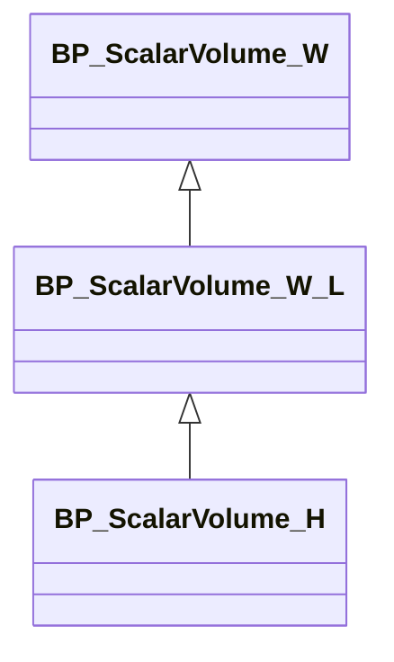

# Volume Creator: An Unreal&reg; Engine Plugin for Medical Data Rendering &ndash; Readme

This document is part of *"Volume Creator: An Unreal&reg; Engine Plugin for Medical Data Rendering &mdash; Documentation"*

* Author: Copyright 2023 Roland Bruggmann aka brugr9
* Profile on UE Marketplace: [https://www.unrealengine.com/marketplace/profile/brugr9](https://www.unrealengine.com/marketplace/profile/brugr9)
* Profile on Epic Developer Community: [https://dev.epicgames.com/community/profile/PQBq/brugr9](https://dev.epicgames.com/community/profile/PQBq/brugr9)

---

<!-- Start Document Outline -->

* [1. Setup](#1-setup)
  * [1.1. Installation](#11-installation)
  * [1.2. Project Configuration](#12-project-configuration)
* [2. Concept](#2-concept)
  * [2.1. Scalar Volumes](#21-scalar-volumes)
  * [2.2. Region of Interest](#22-region-of-interest)
  * [2.3. Clip Plane](#23-clip-plane)
  * [2.4. Static Spot-Light](#24-static-spot-light)
* [3. Blueprint BP_ScalarVolume_H](#3-blueprint-bp_scalarvolume_h)
  * [3.2. Dataset](#32-dataset)
  * [3.3. DICOM Window](#33-dicom-window)
    * [3.3.1. DICOM Window Function](#331-dicom-window-function)
    * [3.3.2. DICOM Window Mask](#332-dicom-window-mask)
  * [3.4. Volume Rendering](#34-volume-rendering)
    * [3.4.1. Region Of Interest](#341-region-of-interest)
    * [3.4.2. Clip Plane](#342-clip-plane)
    * [3.4.3. Distance Power](#343-distance-power)
    * [3.4.4. Resampling Steps](#344-resampling-steps)
    * [3.4.4. Transfer Function](#344-transfer-function)
    * [3.4.5. Alpha Max](#345-alpha-max)
  * [3.5. Volume Shading](#35-volume-shading)
    * [3.5.1. Phong](#351-phong)
    * [3.5.2. Lighting](#352-lighting)
* [4. Blueprint BP_ScalarVolume_W](#4-blueprint-bp_scalarvolume_w)
* [5. Blueprint BP_ScalarVolume_W_L](#5-blueprint-bp_scalarvolume_w_l)
* [6. Import](#6-import)
  * [6.1. Import DICOM](#61-import-dicom)
  * [6.2. Import MetaImage](#62-import-metaimage)
  * [6.3. Import Grayscale Images](#63-import-grayscale-images)
  * [6.2. Data Background](#62-data-background)
    * [6.2.1. Memory](#621-memory)
    * [6.2.2. Processing](#622-processing)
* [7. Asset Naming Convention](#7-asset-naming-convention)
  * [7.1. Blueprints](#71-blueprints)
  * [7.2. Datasets](#72-datasets)
    * [7.2.1. Structures](#721-structures)
    * [7.2.2. Volumes](#722-volumes)
  * [7.3. Material Library](#73-material-library)
    * [7.3.1. Scalar Volume](#731-scalar-volume)
    * [7.3.2. Transfer Function](#732-transfer-function)
* [8. Demo](#8-demo)
* [Appendix](#appendix)
  * [Acronyms](#acronyms)
  * [Glossary](#glossary)
    * [Anatomical Coordinate System](#anatomical-coordinate-system)
    * [Cartesian Coordinate Systems](#cartesian-coordinate-systems)
  * [A. References](#a-references)
    * [A.1. Medical Image Processing](#a1-medical-image-processing)
    * [A.2. Unreal Engine](#a2-unreal-engine)
  * [B. Readings](#b-readings)
  * [C. Acknowledgements](#c-acknowledgements)
  * [D. Attribution](#d-attribution)
  * [E. Disclaimer](#e-disclaimer)
  * [F. Citation](#f-citation)

<!-- End Document Outline -->

<div style='page-break-after: always'></div>

## 1. Setup

### 1.1. Installation

In the Unreal Editor access the Plugin Editor from the menu 'Edit > Plugins'. In the Plugin Editor, under category 'Rendering' find and enable the plugin. Finally restart the Unreal Editor.


<br>*Fig. 1.1.: Screenshot of Plugin Editor with Plugin "Volume Creator" enabled*

### 1.2. Project Configuration

To allow Volume Texture asset creation follow these steps as from Unreal Engine Documentation article [*Creating Volume Textures*](https://docs.unrealengine.com/4.26/en-US/RenderingAndGraphics/Textures/VolumeTextures/CreatingVolumeTextures/):

> Before you can use Volume Textures in your Unreal Engine 4 (UE4) project, you will need to enable them. In the following How-To, we will take a look at setting up your UE4 project to use Volume Textures.
>
> 1. First, make sure that the Editor is closed, and then locate your project's DefaultEngine.ini file and open it.
> 2. Locate the Script/Engine.RendererSettings section and add the following variable, then save the file when you have added it:
>
> ```r.AllowVolumeTextureAssetCreation=1```
>
> 3. Re-launch the Editor

<div style='page-break-after: always'></div>

## 2. Concept

### 2.1. Scalar Volumes

The following workflow is discussed as a basic concept. We use an actor with an actor component Static Mesh 'Cube'. The cube is assiged a volume rendering material with parameters as follows:

* **Hounsfield Volume**: Voxels from image stack in Hounsfield Units represented as `Volume Texture` asset
* **Window Volume**: DICOM Windowed `Volume Render Texture` or `Volume Texture` asset
* **Lightmap Volume**: Static lighting `Volume Render Texture` or `Volume Texture` asset



Unsupported:

* **Labelmap Volume** &ndash; where the voxels store a discrete value, such as an index or a label; e.g., used for segmentation.
* **Vector Volume** &ndash; where the voxels store multiple scalar values, e.g., LPS or RAS coordinates as components of a displacement field.
* **Tensor Volume** &ndash; where the voxels store a tensor, e.g., used for MRI diffusion tensor imaging DTI.

(Terminology: cp. [Piper et al., Overview])

<div style='page-break-after: always'></div>

### 2.2. Region of Interest

Blueprint `BP_RegionOfInterest`

### 2.3. Clip Plane

Blueprint `BP_ClipPlane`

### 2.4. Static Spot-Light

Blueprint `BP_StaticSpotLight`

## 3. Blueprint BP_ScalarVolume_H

### 3.2. Dataset

An image-stack based volume&mdash;commonly known as scalar volume&mdash;is kept as Volume Texture asset in Unreal Engine.

### 3.3. DICOM Window

CT image data is expected to come in Hounsfield Units $HU$ in a range of $[-1024,3071]$ representing $4096$ gray levels for different materials where air is defined as $-1000 HU$ and water as $0 HU$. But computer screens only can visualize $256$ gray levels, represented by a value range of $[0, 255]$. Therefore the $4096$ Hounsfield Units have to be mapped to the $256$ screen gray scale levels. This is done by linear interpolation (Lerp).

If the whole range of $4096$ Hounsfield data is mapped to $256$ gray levels, the contrast becomes quite bad. Therefore, the so called DICOM Window was introduced to downsize the range of Hounsfield data to map.

#### 3.3.1. DICOM Window Function

A DICOM Window is defined in $HU$ by its center $W_c$&mdash;aka level, and width $W_w$&mdash;aka contrast. The DICOM window center $W_c$ and width $W_w$ define the window right border $W_r$ and left border $W_l$:

* $W_r = W_c + \frac{W_w}{2}$
* $W_l = W_c - \frac{W_w}{2}$
* $W_l <= W_r$

The DICOM Window function $w$ is applied to the volume's Hounsfiled data $v$ as a linear mapping $w(v)$ into the range of $[0,255]$ as follows:

$
w(v) := \begin{cases}
255 & \text{if } v > W_r\\
0 & \text{if } v < W_l\\
0 + \frac{(v-w_l)(255-0)}{w_r-w_l} =
\frac{(v-w_l) \times 255}{w_r-w_l}
& \text{else}
\end{cases}
$

by means of a gray level becomes:

* $255$ if $v$ is greater than the window right border $W_r$
* $0$ if $v$ is lesser than the window left border $W_l$
* linear Interpolated (lerp) in the range of $[0,255]$ else

Example:

With, e.g., a DICOM Window center $W_c = 1023 HU$ and width $W_w = 4096 HU$ the whole range of $[-1024,3071] HU$ is taken to account for mapping. With a DICOM Window center $W_c = 200 HU$ and width $W_w = 600 HU$ only the range of $[-100,500] HU$ is mapped (see figure 2.1. and see figure 2.3.).

<br>*Fig. 3.1.: Graph of DICOM Window function with $W_c = 200$ and $W_w = 600$ ($W_r = 500$ and $W_l = -100$)*

For Blueprint Actor `BP_ScalarVolume` Detail Panel, DICOM Window, see figure 2.2. The result is stored in a Volume-Render-Texture instance named `RT_Scalar_Volume` (8-bit R-channel).

<br>*Fig. 3.2.: BP_ScalarVolume Detail Panel, DICOM Window*


<br>*Fig. 3.3.: DICOM Window Rendering Result Comparison*

<div style='page-break-after: always'></div>

#### 3.3.2. DICOM Window Mask

To allow to render the lerped values only, a mask $m$ is applied to the volume's Hounsfiled data $v$. Values $v$ greater than the window right border $W_r$ and lesser than the window left border $W_l$ are mapped as follows:

$
m(v) := \begin{cases}
0 & \text{if } v > W_r \text{ or } v < W_l\\
1 & \text{else}
\end{cases}
$

by means of the mask becomes:

* $false$ or $0$ if $v$ is greater than the right window border $W_r$
* $false$ or $0$ if $v$ is lesser than the left window border $W_l$
* $true$ or $1$ else

<br>*Fig. 3.4.: Graph of mask for DICOM Window with $W_c = 200$ and $W_w = 600$ ($W_r = 500$ and $W_l = -100$)*

For Blueprint Actor `BP_ScalarVolume` Detail Panel, DICOM Window, Checkbox Mask see figure 2.5. The result is stored in the Volume-Render-Texture instance `RT_Scalar_Volume` (8-bit G-channel).

<br>*Fig. 3.5.: BP_ScalarVolume Detail Panel, DICOM Window, Checkbox Mask*


<br>*Fig. 3.3.: DICOM Window Mask Rendering Result Comparison*

<div style='page-break-after: always'></div>

### 3.4. Volume Rendering

Direct Volume Rendering DVR with Materials from Raycasting or Raymarching Shaders, unlit or with (precomputed) static lighting.

#### 3.4.1. Region Of Interest

* MeshCube: `BP_RegionOfInterest` instance as Reference Object, ideally subordinated in Outline Hierarchy (Scene Graph)
* used for geometry subtraction in the shader

#### 3.4.2. Clip Plane

* MeshPlane: `BP_ClipPlane` instance as object as Reference Object
* used for geometry subtraction in the shader

#### 3.4.3. Distance Power

* Default Value: `1.0`
* Range: [`0.1`, `2.0`]
* Resampling Distance Power:
  * The shader algorithm calculates the current distance of the image slices with respect to the angle of entry of the resampling ray. With a value of `1.0` (default) the calculated resampling distance is used.
  * With values smaller than `1.0` the resampling distance lowers, a so-called oversampling occurs, which may increase visualisation quality.
  * With values larger than `1.0` the resampling distance grows, a so-called undersampling occurs, which may accelerate rendering.

This parameter may be seen as an optimisation method, cp. [Luecke 2005], *Fragmented Line Ray-Casting*:
> *To lower the number of operations necessary for computing a single frame, [...] the distance between two successive resampling locations, i.e the sampling distance, could be increased, thereby decreasing the number of actual locations used for volume reconstruction.*
> *However, it is worth mentioning, that incorporating any of these optimization approaches usually tends to result in generated images of less quality compared to an unoptimized ray-casting volume renderer.*

#### 3.4.4. Resampling Steps

* Default Value: `256`
* Range: [`1`, `1024`]
* Maximum Number of Resampling Steps:
  * A large number means more steps. The resampling ray may advance deeper into the cube. The hereby resulting rendering may increase visualisation quality by the cost of more computing time.
  * A small number may decrease rendering quality but is faster.

#### 3.4.4. Transfer Function

The transfer functions are based on color gradients from `Curve Linear Color` assets, bundled in a Texture 2D `Curve Atlas` asset as Look-Up Table LUT:

* Curve Linear Color *TF* assets named `Curve_TF-[*]_Color`
* Curve Atlas *TF-LUT* asset named `T_Curve_TF-LUT_ColorAtlas`

The gradients represent values as found in 3D-Slicer&trade; Module "Volume Rendering" (cp. [Finet et al.]).

#### 3.4.5. Alpha Max

Maximum Opacity Threshold for Early Ray Termination

* Maximum Value from Iteratively added up Alpha Channel
* Default Value: `0.8`
* Range: [`0.0`, `1.0`]

<div style='page-break-after: always'></div>

### 3.5. Volume Shading

#### 3.5.1. Phong

* Ambient: Ambient Reflection Value in [`0.0`, `1.0`], Default `0.1`
* Diffuse: Diffuse Reflection Value in [`0.0`, `1.0`], Default `0.9`
* Specular: Specular Reflection Value in [`0.0`, `1.0`], Default `0.2`
* Specular Power: Specular Reflection Power Value  in [`1`, `50`], Default `10`

#### 3.5.2. Lighting

* Spot Lights: Array of `BP_StaticSpotLight` Object Reference
* Half Resolution: Default `true` (checked)
* Lightmap Volume: Volume Render Target Object Reference, Default `RT_ScalarVolume_L_Volume`

<div style='page-break-after: always'></div>

## 4. Blueprint BP_ScalarVolume_W

<div style='page-break-after: always'></div>

## 5. Blueprint BP_ScalarVolume_W_L

<div style='page-break-after: always'></div>

## 6. Import

CT image data is expected to come in Hounsfield Units $HU$ as values in a range of $[-1024,3071]$ which are $4096$ gray levels for different materials. These $4096$ gray levels can be optimally represented with a twelve-digit binary number ($2^{12} = 4096$).

Naming Convention: Underlines in file names (`_`) are replaced by minus in asset names (`-`)

### 6.1. Import DICOM

DICOM&reg; *.dcm

The results are stored in a Volume Render Texture named `RT_Scalar_Volume`, R-channel.

### 6.2. Import MetaImage

MetaImage&trade; *.mhd

### 6.3. Import Grayscale Images

TODO:

<div style='page-break-after: always'></div>

### 6.2. Data Background

#### 6.2.1. Memory

Scalar volume size $V_1$ (cp. [DICOM-FAQ]):

* A Stack of 256 images of size 256 x 256 pixel per image = 256<sup>3</sup> pixel or voxel resp.
* 4 channels RGBA
* With 8 bit per channel ($2^{8} = 256$, range from 0 to 255)

$ V_1 = 256^3 \times 4 \times 8\ {}bit = 536’870’912\ {}bit = 0.537\ {}Gigabit = 67\ {}MB $

If the images are double the size (stack of 512 images with 512 x 512 pixel per image), the size $V_2$ increases to 0.5 GB:

$ V_2 = 512^3 \times 4 \times 8\ {}bit = 4’294’967’296\ {}bit = 4.295\ {}Gigabit = 537\ {}MB $

If the images are double the size (stack of 1024 images with 1024 x 1024 pixel per image), the size $V_3$ increases to 4 GB:

$ V_3 = 1024^3 \times 4 \times 8\ {}bit = 34’359’738’368\ {}bit = 34.359\ {}Gigabit = 4295\ {}MB $

#### 6.2.2. Processing

With processing, e.g., $30 \text{ fps}$:

$
Processed\ {}Data_1 = \frac{0.537\ {}Gigabit}{frame} \times \frac{30\ {}frames}{s} = 16.1\ {} Gigabit\ {}per\ {}second
$

$
Processed\ {}Data_2 = \frac{4.295\ {}Gigabit}{frame} \times \frac{30\ {}frames}{s} = 128.8\ {} Gigabit\ {}per\ {}second
$

$
Processed\ {}Data_3 = \frac{34.359\ {}Gigabit}{frame} \times \frac{30\ {}frames}{s} = 1030.8\ {} Gigabit\ {}per\ {}second
$

<!-- 
https://www.quora.com/How-can-a-processor-handle-10-Gigabit-per-second-or-more-data-rate
-->

<div style='page-break-after: always'></div>

## 7. Asset Naming Convention

Citation from [UEDoc, Recommended Asset Naming Conventions] (see also [Allar22]):
> *`[AssetTypePrefix]_[AssetName]_[Descriptor]_[OptionalVariantLetterOrNumber]`*
>
>* *`AssetTypePrefix` identifies the type of Asset [...].*
>* *`AssetName` is the Asset's name.*
>* *`Descriptor` provides additional context for the Asset, to help identify how it is used. For example, whether a texture is a normal map or an opacity map.*
>* *`OptionalVariantLetterOrNumber` is optionally used to differentiate between multiple versions or variations of an asset.*

### 7.1. Blueprints

* `AssetTypePrefix`:
  * Blueprint: `BP_`
* `AssetName`:
  * `ScalarVolume`
* `Descriptor`:
  * Scalar Volume Type Suffix:
    * Hounsfield Units: `_H`
    * DICOM Window: `_W`
    * Lightmap: `_L`

Examples:

* Blueprint, Scalar Volume, from Hounsfield Units Volume Texture: **`BP_ScalarVolume_H`**
* Blueprint, Scalar Volume, from DICOM Window Volume Texture: **`BP_ScalarVolume_W`**
* Blueprint, Scalar Volume, from DICOM Window and Lightmap Volume Textures: **`BP_ScalarVolume_W_L`**

### 7.2. Datasets

#### 7.2.1. Structures

* `AssetTypePrefix`
  * Texture: `F`
* `AssetName`:
  * Templates: `Default`
* `Descriptor`:
  * Volume Type Suffix:
    * Hounsfield Units: `_H`
    * DICOM Window: `_W`
    * Lightmap: `_L`
  * Data Asset Suffix: `_Data`

Examples:

* Data Asset: **`FDefault_Data`**

#### 7.2.2. Volumes

* `AssetTypePrefix`
  * Texture: `T_`
* `AssetName`:
  * Templates: `Default`
* `Descriptor`:
  * Data Asset Suffix: `_Data`
  * Volume Type Suffix:
    * Hounsfield Units: `_H`
    * DICOM Window: `_W`
    * Lightmap: `_L`
  * Volume Texture Suffix: `_Volume`

Examples:

* Volume Texture, Hounsfield Units: **`T_Default_H_Volume`**
* Volume Texture, DICOM Window: **`T_Default_W_Volume`**
* Volume Texture, Lightmap: **`T_Default_L_Volume`**

### 7.3. Material Library

#### 7.3.1. Scalar Volume

##### 7.3.1.1. Material

* `AssetTypePrefix`
  * Material: `M_`
* `AssetName`:
  * Volume Rendering Type Prefix: `DVR-`, `IVR-`
  * Volume Rendering Method: `Raycasting`, `Raymarching`
* `Descriptor`:
  * DICOM Window Suffix: `_W`
  * Lightmap Suffix: `_L`
  * Compute Shader Suffix: `_C`

Examples:

* Material, DVR Raycasting, DICOM Window as Parameter: **`M_DVR-Raycasting_W`**
* Material, DVR Raycasting, DICOM Window and Lightmap as Parameter: **`M_DVR-Raycasting_W_L`**
* Material, DVR Raymarching, DICOM Window as Parameter: **`M_DVR-Raymarching_W`**
* Material, DVR Raymarching, DICOM Window and Lightmap as Parameter: **`M_DVR-Raymarching_W_L`**
* Material, IVR Raycasting, DICOM Window as Parameter: **`M_IVR-Raycasting_W`**
* Material, IVR Raycasting, DICOM Window and Lightmap as Parameter: **`M_IVR-Raycasting_W_L`**
* Material, Scalar Volume, DICOM Window Compute Shader: **`M_ScalarVolume_W_C`**
* Material, Scalar Volume, Lightmap Compute Shader: **`M_ScalarVolume_L_C`**

##### 7.3.1.2. Render Texture

* `AssetTypePrefix`
  * Render Texture: `RT_`
* `AssetName`:
  * Volume Type: `ScalarVolume`
* `Descriptor`:
  * Data Type Suffix:
    * DICOM Window: `_W`
    * Lightmap: `_L`
  * Volume Texture Suffix: `_Volume`

Examples:

* Render Texture Volume, DVR, DICOM Window: **`RT_ScalarVolume_W_Volume`**
* Render Texture Volume, DVR, Lightmap: **`RT_ScalarVolume_L_Volume`**

#### 7.3.2. Transfer Function

##### 7.3.2.1. Gradients

* `AssetTypePrefix`
  * Curve: `Curve_`
* `AssetName`:
  * Transfer Function Prefix: `TF-`
  * Acquisition Type Prefix:
    * Computer Tomography: `CT-`
    * Magnetic Resonance: `MR-`
* `Descriptor`:
  * Curve Linear Color Suffix: `_Color`

Examples:

* Curve Linear Color, Transfer Function, Computer Tomography: **`Curve_TF-CT-AAA2_Color`**
* Curve Linear Color, Transfer Function, Magnetic Resonance: **`Curve_TF-MR-Angio_Color`**

##### 7.3.2.2. Look-Up Table

* `AssetTypePrefix`:
  * Texture: `T_`
  * Curve: `Curve_`
* `AssetName`:
  * Transfer Function Prefix: `TF-`
  * Look-Up Table: `LUT`
* `Descriptor`:
  * Color Atlas Suffix: `_ColorAtlas`

Examples:

* Texture 2D Color Atlas, Transfer Function LUT: **`T_Curve_TF-LUT_ColorAtlas`**

<div style='page-break-after: always'></div>

## 8. Demo

The plugin folder 'Demo' provides with two Blueprints ... `BP_Demo-DVR-TF-Gradient` as well as with two maps `Map_Demo-VolumeCreator`.

Screenshot of Content Browser with VolumeCreator Content, Folder 'Demo':


`Map_DVR-Demo`


With the level `Map_DVR-Demo` opened, from the Level Editor, click the Play button to Play-in-Editor PIE:


<div style='page-break-after: always'></div>

## Appendix

### Acronyms

* CT &mdash; Computed Tomography (X-ray)
* CTA &mdash; Computed Tomography Angiography
* DICOM &mdash; Digital Imaging and Communications in Medicine
* DVR &mdash; Direct Volume Rendering
* FPS &mdash; Frames per Second
* FPV &mdash; First Person View
* HU &mdash; Hounsfield Unit
* LhS &mdash; Left-handed System
* LPS &mdash; Left&ndash;Posterior&ndash;Superior
* LUT &mdash; Look-Up Table
* MIP &mdash; Maximum Intensity Projection
* MR &mdash; Magnetic Resonance
* MRI &mdash; Magnetic Resonance Imaging
* MRT &mdash; Magnetic Resonance Tomography
* PET &mdash; Positron Emission Tomography
* RAS &mdash; Right&ndash;Anterior&ndash;Superior
* RhS &mdash; Right-handed System
* ROI &mdash; Region of Interest
* TF &mdash; Transfer Function

<!-- * BMD &mdash; Bone Mineral Density -->
<!-- * DXA &mdash; Dual-energy X-ray Absorptiometry -->
<!-- * FOV &mdash; Field of View -->
<!-- * IVR &mdash; Indirect Volume Rendering -->
<!-- * QCT &mdash; Quantitative Computed Tomography -->
<!-- * SNR &mdash; Signal-to-Noise Ratio -->

<div style='page-break-after: always'></div>

### Glossary

#### Anatomical Coordinate System

Anatomical Planes and Terms of Location (cp. [ Sharma 2022]):

* **Saggital**: Longitudinal (median) plane, divides in *Right (R)* and *Left (L)*
* **Coronal**: Frontal plane, divides in front as *Anterior (A)* and behind as *Posterior (P)*
* **Axial**: Horizontal plane, divides in *Inferior (I)* towards *Feet (F)* and *Superior (S)* towards *Head (H)*

DICOM images are using a Left&ndash;Posterior&ndash;Superior **LPS** System (cp. [Adaloglouon 2020], *Anatomical coordinate system*):
> *"[Left&ndash;Posterior&ndash;Superior] LPS is used by DICOM images and by the ITK toolkit, while 3D Slicer and other medical software use [Right&ndash;Anterior&ndash;Superior] RAS"*

* **L**: Direction R-L in which X increases
* **P**: Direction A-P in which Y increases
* **S**: Direction I-S or F-H in which Z increases

#### Cartesian Coordinate Systems

DICOM images are using a Right-handed System **RhS** of matrix or index coordinates as rows of columns of voxel values in a stack of slices (cp. [Adaloglouon 2020], *Medical Image coordinate system (Voxel space)*):

* X or i: Image width in columns, increases to the right
* Y or j: Image height in rows, increases downwards
* Z or k: Image stack depth in slices, increases backwards

Unreal Engine is using a Left-handed System **LhS** based First Person View FPV (cp. [Mower-Coord]):

* X increases to the front
* Y increases to the right
* Z increases upwards

<div style='page-break-after: always'></div>

### A. References

#### A.1. Medical Image Processing

* DICOM:
  * [DICOM] **The DICOM Standard**. Online: [https://www.dicomstandard.org/current](https://www.dicomstandard.org/current)
  * [DICOM-FAQ] **DICOM Standard FAQ**. Online: [https://www.dicomstandard.org/faq](https://www.dicomstandard.org/faq)
  * [DICOM-Browser] Innolitics: **DICOM Standard Browser**. Online: [https://dicom.innolitics.com/ciods/ct-image](https://dicom.innolitics.com/ciods/ct-image)
  * [ Sharma 2021] Shivam Sharma: **Introduction to DICOM for Computer Vision Engineers**. In: *RedBrick AI*. Dec 15, 2021. Online: [https://medium.com/redbrick-ai/introduction-to-dicom-for-computer-vision-engineers-78f346bbc1fd](https://medium.com/redbrick-ai/introduction-to-dicom-for-computer-vision-engineers-78f346bbc1fd)
  * [ Sharma 2022] Shivam Sharma: **DICOM Coordinate Systems &ndash; 3D DICOM for Computer Vision Engineers**. In: *RedBrick AI*. Dec 22, 2022. Online: [https://medium.com/redbrick-ai/dicom-coordinate-systems-3d-dicom-for-computer-vision-engineers-pt-1-61341d87485f](https://medium.com/redbrick-ai/dicom-coordinate-systems-3d-dicom-for-computer-vision-engineers-pt-1-61341d87485f)
  * [Adaloglouon 2020] Nikolas Adaloglouon: **Understanding Coordinate Systems and DICOM for Deep Learning Medical Image Analysis**. In: *The AI Summer*. July 16, 2020. Online: [https://theaisummer.com/medical-image-coordinates/](https://theaisummer.com/medical-image-coordinates/)
  * [Zaharia 2013] Roni Zaharia: **Chapter 14 - Image Orientation: Getting Oriented using the Image Plane Module**. In: *DICOM Tutorial, DICOM is Easy &ndash; Software Programming for Medical Applications*. June 6, 2013. Online: [http://dicomiseasy.blogspot.com/2013/06/getting-oriented-using-image-plane.html](http://dicomiseasy.blogspot.com/2013/06/getting-oriented-using-image-plane.html)
* Volume Rendering:
  * [Engel et al. 06] Klaus Engel, Markus Hadwiger, Joe Kniss, Christof Rezk Salama, Daniel Weiskopf (2006): **Real-Time Volume Graphics**. doi: [10.1145/1103900.1103929](http://dx.doi.org/10.1145/1103900.1103929). Online: [http://www.real-time-volume-graphics.org/](http://www.real-time-volume-graphics.org/)
  * [Hadwiger et al. 18] Markus Hadwiger, Ali K. Al-Awami, Johanna Beyer, Marcos Agos, Hanspeter Pfister (2018): **SparseLeap: Efficient Empty Space Skipping for Large-Scale Volume Rendering**. In: *IEEE Transactions on Visualization and Computer Graphics*. Online: [https://vcg.seas.harvard.edu/publications/sparseleap-efficient-empty-space-skipping-for-large-scale-volume-rendering](https://vcg.seas.harvard.edu/publications/sparseleap-efficient-empty-space-skipping-for-large-scale-volume-rendering)
  * [Luecke 2005] Peter Lücke: **Volume Rendering Techniques for Medical Imaging**. Diplomarbeit. Technische Universität München, Fakultät für Informatik. April 15, 2005. In collaboration with Siemens Corporate Research Inc., Princeton, USA. Online: [https://campar.in.tum.de/twiki/pub/Students/DaLuecke/Diplomarbeit.pdf](https://campar.in.tum.de/twiki/pub/Students/DaLuecke/Diplomarbeit.pdf)
  * [Piper et al.] Steve Piper (Isomics), Julien Finet (Kitware), Alex Yarmarkovich (Isomics), Nicole Aucoin (SPL, BWH): **3D Slicer Module "Volumes"**. License: slicer4. The work is part of the National Alliance for Medical Image Computing (NAMIC), funded by the National Institutes of Health through the NIH Roadmap for Medical Research, Grant U54 EB005149. Online Documentation: [https://slicer.readthedocs.io/en/latest/user_guide/modules/volumes.html](https://slicer.readthedocs.io/en/latest/user_guide/modules/volumes.html)
  * [Finet et al.] Julien Finet (Kitware), Alex Yarmarkovich (Isomics), Yanling Liu (SAIC-Frederick, NCI-Frederick), Andreas Freudling (SPL, BWH), Ron Kikinis (SPL, BWH): **3D Slicer Module "Volume Rendering"**. License: slicer4. The work is part of the National Alliance for Medical Image Computing (NAMIC), funded by the National Institutes of Health through the NIH Roadmap for Medical Research, Grant U54 EB005149. Online Documentation: [https://slicer.readthedocs.io/en/latest/developer_guide/modules/volumerendering.html](https://slicer.readthedocs.io/en/latest/developer_guide/modules/volumerendering.html); Transfer Function Presets on GitHub: [https://github.com/Slicer/Slicer/blob/main/Modules/Loadable/VolumeRendering/Resources/presets.xml](https://github.com/Slicer/Slicer/blob/main/Modules/Loadable/VolumeRendering/Resources/presets.xml)

#### A.2. Unreal Engine

* [UEDoc] Epic Games: **Unreal Engine Documentation**. URL: [https://docs.unrealengine.com](https://docs.unrealengine.com)
* Coordinate System:
  * [Mower-Coord] Nick Mower: **A Practical Guide to Unreal Engine 4’s Coordinate System**. Online: [https://www.techarthub.com/a-practical-guide-to-unreal-engine-4s-coordinate-system/](https://www.techarthub.com/a-practical-guide-to-unreal-engine-4s-coordinate-system/)
* Naming Convention:
  * [UEDoc, Recommended Asset Naming Conventions] Epic Games: **Recommended Asset Naming Conventions**. URL: [https://docs.unrealengine.com/5.1/en-US/recommended-asset-naming-conventions-in-unreal-engine-projects/](https://docs.unrealengine.com/5.1/en-US/recommended-asset-naming-conventions-in-unreal-engine-projects/)
  * [Allar22] Michael Allar: **Gamemakin UE Style Guide**. Mar 7, 2022. URL: [https://github.com/Allar/ue5-style-guide](https://github.com/Allar/ue5-style-guide)
* Textures:
  * [UEDoc, Guidelines for Optimizing Rendering for Real-Time] Epic Games: **Guidelines for Optimizing Rendering for Real-Time**. URL: [https://docs.unrealengine.com/5.1/en-US/guidelines-for-optimizing-rendering-for-real-time-in-unreal-engine/](https://docs.unrealengine.com/5.1/en-US/guidelines-for-optimizing-rendering-for-real-time-in-unreal-engine/)
  * [Mower-Comp] Nick Mower: **Your Guide to Texture Compression in Unreal Engine**. URL: [https://www.techarthub.com/your-guide-to-texture-compression-in-unreal-engine/](https://www.techarthub.com/your-guide-to-texture-compression-in-unreal-engine/)
  * [Ivanov 2021] Michael Ivanov: **Unreal Engine and Custom Data Textures**. Jun 19, 2021 URL: [https://sasmaster.medium.com/unreal-engine-and-custom-data-textures-40857f8b6b81](https://sasmaster.medium.com/unreal-engine-and-custom-data-textures-40857f8b6b81)

### B. Readings

* Milan Ikits, Joe Kniss, Aaron Lefohn, Charles Hansen: **Volume Rendering Techniques**. In: *GPU Gems: Programming Techniques, Tips, and Tricks for Real-Time Graphics &ndash; Part VI: Beyond Triangles, Chapter 39*. 5th Printing September 2007, Pearson Education, Inc. Online: [https://developer.nvidia.com/gpugems/gpugems/part-vi-beyond-triangles/chapter-39-volume-rendering-techniques](https://developer.nvidia.com/gpugems/gpugems/part-vi-beyond-triangles/chapter-39-volume-rendering-techniques)
<!-- * Fedorov A., Beichel R., Kalpathy-Cramer J., Finet J., Fillion-Robin J-C., Pujol S., Bauer C., Jennings D., Fennessy F.M., Sonka M., Buatti J., Aylward S.R., Miller J.V., Pieper S., Kikinis R: **3D Slicer as an Image Computing Platform for the Quantitative Imaging Network**. Online: [https://www.ncbi.nlm.nih.gov/pmc/articles/PMC3466397/pdf/nihms383480.pdf](https://www.ncbi.nlm.nih.gov/pmc/articles/PMC3466397/pdf/nihms383480.pdf). Magnetic Resonance Imaging. 2012 Nov;30(9):1323-41. PMID: 22770690. PMCID: PMC3466397. -->

### C. Acknowledgements

* **Software:** Bruggmann, Roland (2023): **Volume Creator**, Version v1.0.0, UE 4.26&ndash;5.1. Unreal&reg; Marketplace. URL: [https://www.unrealengine.com/marketplace/en-US/product/volume-creator](https://www.unrealengine.com/marketplace/en-US/product/volume-creator). Copyright 2023 Roland Bruggmann aka brugr9. All Rights Reserved.
* **Data:** van Ginneken, Bram, & Jacobs, Colin. (2019): **LUNA16 Part 1/2 subset0**. Zenodo. [https://doi.org/10.5281/zenodo.3723295](https://doi.org/10.5281/zenodo.3723295), licensed under Creative Commons Attribution 4.0 International ([CC BY 4.0](https://creativecommons.org/licenses/by/4.0/))

<div style='page-break-after: always'></div>

### D. Attribution

* The word mark *Unreal* and its logo are Epic Games, Inc. trademarks or registered trademarks in the US and elsewhere (cp. Branding Guidelines and Trademark Usage, URL: [https://www.unrealengine.com/en-US/branding](https://www.unrealengine.com/en-US/branding))
* The word mark *DICOM&mdash;Digital Imaging and Communication in Medicine* and its logo are trademarks or registered trademarks of the National Electrical Manufacturers Association (NEMA), managed by the Medical Imaging Technology Association (MITA), a division of NEMA
* The word mark *MetaImage* is a trademark or registered trademark of Kitware, Inc.
* The word mark *ITK&mdash;Insight Toolkit* is a trademark or registered trademark of Kitware, Inc.
* The word mark *3D Slicer* and the logo are trademarks of Brigham and Women’s Hospital (BWH), used with permission.

### E. Disclaimer

This documentation has **not been reviewed or approved** by the Food and Drug Administration FDA or by any other agency. It is the users responsibility to ensure compliance with applicable rules and regulations&mdash;be it in the US or elsewhere.

Read also:

* *"Documentation Disclaimer"* (file DISCLAIMER.md), Online: [https://github.com/brugr9/UEPluginVolumeCreator/blob/main/DISCLAIMER.md](https://github.com/brugr9/UEPluginVolumeCreator/blob/main/DISCLAIMER.md)
* *"Software Disclaimer"* from Plugin folder Docs/DISCLAIMER.pdf

### F. Citation

**Software**: To acknowledge *"Unreal&reg; Engine Plugin: Volume Creator"* software, please cite

> Bruggmann, Roland (2023). *Unreal&reg; Engine Plugin: Volume Creator*, Version [v#.#.#], UE [4.## or 5.#]. Unreal&reg; Marketplace. URL: [https://www.unrealengine.com/marketplace/en-US/product/volume-creator](https://www.unrealengine.com/marketplace/en-US/product/volume-creator). Copyright 2023 Roland Bruggmann aka brugr9. All Rights Reserved.

**Documentation**: To acknowledge this documentation&mdash;be it, e.g., the Readme or the Changelog&mdash;please cite

> Bruggmann, Roland (2023). *Volume Creator: An Unreal&reg; Engine Plugin for Medical Data Rendering &mdash; Documentation*, \[Readme, Changelog\]. GitHub; accessed [Year Month Day]. URL: [https://github.com/brugr9/UEPluginVolumeCreator](https://github.com/brugr9/UEPluginVolumeCreator). Licensed under [Creative Commons Attribution-ShareAlike 4.0 International](http://creativecommons.org/licenses/by-sa/4.0/)

---
<!-- Footer -->

[](https://creativecommons.org/licenses/by-sa/4.0/)

*"Volume Creator: An Unreal&reg; Engine Plugin for Medical Data Rendering &mdash; Documentation"*. URL: [https://github.com/brugr9/UEPluginVolumeCreator](https://github.com/brugr9/UEPluginVolumeCreator). &copy; 2023 by [Roland Bruggmann](https://about.me/rbruggmann), licensed under [Creative Commons Attribution-ShareAlike 4.0 International](http://creativecommons.org/licenses/by-sa/4.0/)
