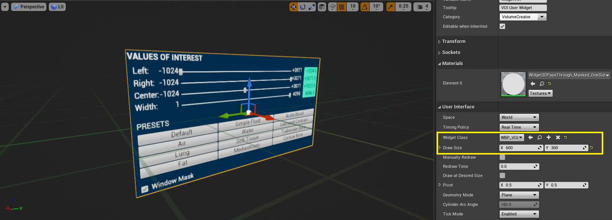
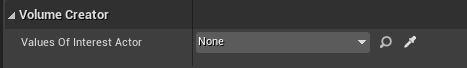
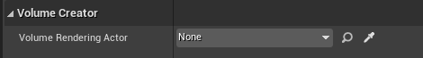

# Volume Creator: An Unreal&reg; Engine Plugin for Medical Data Rendering &ndash; Readme

This document is part of *"Volume Creator: An Unreal&reg; Engine Plugin for Medical Data Rendering &mdash; Documentation"*

* Author: Copyright 2023 Roland Bruggmann aka brugr9
* Profile on UE Marketplace: [https://www.unrealengine.com/marketplace/profile/brugr9](https://www.unrealengine.com/marketplace/profile/brugr9)
* Profile on Epic Developer Community: [https://dev.epicgames.com/community/profile/PQBq/brugr9](https://dev.epicgames.com/community/profile/PQBq/brugr9)

---

**Warning**

Plugin not yet deployed &ndash; Documentation not yet complete

<!-- UE Marketplace : Begin 1/2 -->


Adds Blueprint Support for Real-time Rendering from Medical Imaging Data.

## Description

Unreal&reg; Engine plugin "Volume Creator" enables real-time multiplanar and direct volume rendering from the Blueprint visual scripting system.

The delivered assets provide importing DICOM&reg; or MetaImage&trade; based medical imaging data, applying values of interest&mdash;aka DICOM Window&mdash;and coloring from look-up tables and color-gradient based transferfunctions. With a clipping plane or a region of interest the user may crop the rendered volume interactively. The plugin acts as a framework which allows game developers to create VR/AR serious games, e.g., for teaching and training in medical education.

<!-- UE Marketplace : End 1/2 -->

* Index Terms: Medical Imaging, Multiplanar Rendering, Direct Volume Rendering
* Technology: Unreal Engine, Blueprint Visual Scripting, Code Plugin, C++, HLSL, DICOM

<div style='page-break-after: always'></div>

## Table of Contents

<!-- Start Document Outline -->

* [1. Setup](#1-setup)
  * [1.1. Plugin Installation](#11-plugin-installation)
  * [1.2. Project Configuration](#12-project-configuration)
* [2. Concept](#2-concept)
  * [2.1. Objects](#21-objects)
  * [2.2. Domain Model](#22-domain-model)
* [3. Medical Imaging Data Import](#3-medical-imaging-data-import)
  * [3.1. Import Actor](#31-import-actor)
    * [3.1.1. Import DICOM](#311-import-dicom)
    * [3.2.2. Import MetaImage](#312-import-metaimage)
  * [3.2. Import User Widget](#32-import-user-widget)
  * [3.2. Import User Widget Actor](#33-import-user-widget-actor)
  * [3.4. Content File Name](#34-content-file-name)
  * [3.5. File Size](#35-file-size)
  * [3.6. Size in Memory](#36-size-in-memory)
  * [3.7. Data Processing](#37-data-processing)
* [4. Rendering](#4-rendering)
  * [4.1. Scalar Volume SV](#41-scalar-volume-sv)
    * [4.1.1. SV Actor](#411-sv-actor)
    * [4.1.2. SV User Widget](#412-sv-user-widget)
    * [4.1.3. SV User Widget Actor](#413-sv-user-widget-actor)
  * [4.2. Values Of Interest VOI](#42-values-of-interest-voi)
    * [4.2.1. VOI Actor](#421-voi-actor)
    * [4.2.2. VOI User Widget](#422-voi-user-widget)
    * [4.2.3. VOI User Widget Actor](#423-voi-user-widget-actor)
  * [4.3. Multiplanar Rendering MPR](#43-multiplanar-rendering-mpr)
    * [4.3.1. MPR Actor](#431-mpr-actor)
    * [4.3.2. MPR User Widget](#432-mpr-user-widget)
    * [4.3.3. MPR User Widget Actor](#433-mpr-user-widget-actor)
  * [4.4. Direct Volume Rendering DVR](#44-direct-volume-rendering-dvr)
    * [4.4.1. DVR Actor](#441-dvr-actor)
    * [4.4.2. DVR User Widget](#442-dvr-user-widget)
    * [4.4.3. DVR User Widget Actor](#443-dvr-user-widget-actor)
    * [4.4.3. Region Of Interest ROI](#443-region-of-interest-roi)
      * [4.4.3.1. ROI Actor](#4431-roi-actor)
      * [4.4.3.2. ROI Handles Actor](#4432-roi-handles-actor)
    * [4.4.4. Clip Plane Actor](#444-clip-plane-actor)
    * [4.4.5. Light Source Actor](#445-light-source-actor)
    * [4.4.6. Orientation Guide Actor](#446-orientation-guide-actor)

<div style='page-break-after: always'></div>

* [Appendix](#appendix)
  * [Abbreviations and Acronyms](#abbreviations-and-acronyms)
  * [Glossary](#glossary)
    * [Terms of Location and Coordinate Systems](#terms-of-location-and-coordinate-systems)
    * [Asset Naming Convention](#asset-naming-convention)
  * [A. References](#a-references)
    * [A.1. Medical Imaging](#a1-medical-imaging)
    * [A.2. Unreal Engine](#a2-unreal-engine)
  * [B. Readings](#b-readings)
  * [C. Acknowledgements](#c-acknowledgements)
  * [D. Attribution](#d-attribution)
  * [E. Disclaimer](#e-disclaimer)
  * [F. Citation](#f-citation)

<!-- End Document Outline -->

<div style='page-break-after: always'></div>

## 1. Setup

### 1.1. Plugin Installation

In the Unreal Editor access the Plugin Editor from the menu 'Edit > Plugins'. In the Plugin Editor, under category 'Rendering' find and enable the plugin. Finally restart the Unreal Editor.


<br>*Fig. 1.1.: Screenshot of Plugin Editor with Plugin "Volume Creator" enabled*

### 1.2. Project Configuration

To allow Volume Texture asset creation follow these steps as from Unreal Engine Documentation article [*Creating Volume Textures*](https://docs.unrealengine.com/4.26/en-US/RenderingAndGraphics/Textures/VolumeTextures/CreatingVolumeTextures/):

> Before you can use Volume Textures in your Unreal Engine 4 (UE4) project, you will need to enable them. In the following How-To, we will take a look at setting up your UE4 project to use Volume Textures.
>
> 1. First, make sure that the Editor is closed, and then locate your project's DefaultEngine.ini file and open it.
> 2. Locate the Script/Engine.RendererSettings section and add the following variable, then save the file when you have added it:
>
> ```r.AllowVolumeTextureAssetCreation=1```
>
> 3. Re-launch the Editor

<div style='page-break-after: always'></div>

## 2. Concept

### 2.1. Objects

The plugin provides the rendering of image-stack based volumes, commonly known as scalar volumes. However, the plugin does not support rendering of either vector or tensor volumes. Following the object oriented paradigm the domain specific entities are implemented as Blueprint Actors (see figure 2.1.1.):

* Scalar Volume SV
* Values of Interest VOI
* Multiplanar Rendering MPR
* Direct Volume Rendering DVR
  * Region of Interest ROI
    * Region of Interest ROI Handles
  * Clip Plane
  * Light Source
  * Orientation Guide

<br>*Fig. 2.1.1.: Content Browser, VolumeCreator Content, Folder Classes &ndash; Blueprint Actors*

To access and change parameters of the Blueprint Actors in runtime, the plugin provides with User Widgets (see figure 2.1.2.) as well as with User Widget Actors for the use in augmented and/or virtual reality (see figure 2.1.3.).

<br>*Fig. 2.1.2.: Content Browser, VolumeCreator Content, Folder Basic &ndash; User Widget Blueprints*

<br>*Fig. 2.1.3.: Content Browser, VolumeCreator Content, Folder Classes &ndash; User Widget Actor Blueprints*

<div style='page-break-after: always'></div>

### 2.2. Domain Model

Domain Model Description:

<!--
* **Medical Imaging Data Import**:
  * **Import Actor**: Medical Medical imaging data is imported from DICOM or MetaImage files and stored as Hounsfield Units encoded Volume Texture.
  * **Import User Widget and Import User Widget Actor**: To access and change parameters of an Import Actor in runtime, the plugin provides with an Import User Widget and an Import User Widget Actor.
  -->
* **Scalar Volume SV**:
  * **SV Actor**: A Scalar Volume Actor holds a reference to the latter and stores also DICOM pixel spacing attribute values.
  * **SV User Widget and SV User Widget Actor**: To access and change parameters of an SV Actor in runtime, the plugin provides with an SV User Widget and an SV User Widget Actor.
* **Values Of Interest VOI**
  * **VOI Actor**: A Values Of Interest VOI Actor consumes the Volume Texture from a Scalar Volume Actor and applies DICOM Window Attributes 'Center' and 'Width'.
  * **VOI User Widget and VOI User Widget Actor**: To access and change parameters of a VOI Actor in runtime, the plugin provides with a VOI User Widget and a VOI User Widget Actor.
* **Multiplanar Rendering MPR**
  * **MPR Actor**: The Values Of Interest may be visualized by multiplanar rendering in an MPR Actor. The MPR Actor&mdash;as a 3D representation of MPR&mdash;holds three mutually perpendicular planes, i.e. coronal, sagittal and axial plane.
  * **MPR User Widget and MPR User Widget Actor**: The MPR Actor produces planar rendering, which is also consumed by an MPR User Widget and an MPR User Widget Actor, which are 2D representations of MPR. The anatomical planes can be moved in the direction of their corresponding axes interactively in real-time.
* **Volume Rendering**
  * **Direct Volume Rendering DVR**
    * **DVR Actor**: The Values Of Interest may be visualized by direct volume rendering in a DVR Actor. The DVR Actor extent is shown with a bounding box. Its dimension derives from the scalar volume pixel spacing.
    * **DVR User Widget and DVR User Widget Actor**: To access and change parameters of a DVR Actor in runtime, the plugin provides with a DVR User Widget and a DVR User Widget Actor.
  * **Region Of Interest ROI**
    * **ROI Actor**: The volume rendering actor geometry can optionally be cropped in real-time using a region of interest ROI Actor.
    * **ROI Handles Actor**: A ROI geometry can optionally be modified with a ROI Handles Actor interactively in real-time.
  * **Clip Plane Actor**: The volume rendering actor geometry can optionally be cropped in real-time using a Clip Plane Actor.
  * **Light Source Actor**: The volume rendering actor can optionally be illuminated with static light sources from Light Source Actors.
  * **Orientation Guide Actor**: The volume rendering actor can optionally be attached a rotation synchronized orientation guide.

<div style='page-break-after: always'></div>

<br>*Fig. 2.2.1.: Domain Model Diagram &ndash; Multiplanar Rendering MPR*

<br>*Fig. 2.2.2.: Domain Model Diagram &ndash; Direct Volume Rendering DVR*

<div style='page-break-after: always'></div>

## 3. Medical Imaging Data Import

### 3.1. Import Actor

Workflow: Read from DICOM&reg; or MetaImage&trade; files and

* Write the scalar volume image data temporarely to a Houndsfield Units encoded Volume Texture Render Target `RT_SV_Volume`
* Save the Volume Texture Render Target persistently as Volume Texture asset `T_MyDataName_SV_Volume`
* Create a Blueprint asset `BP_MyDataName` deriving from Scalar Volume Actor `BP_SV` and
  * Assign the just created Volume Texture asset `T_MyDataName_SV_Volume`
  * Set meta data, e.g., DICOM Pixel Spacing

See also section "Content File Name" below.

#### 3.1.1. Import DICOM

* Reads from DICOM files, file name extension `*.dcm`

TODO:

#### 3.1.2. Import MetaImage

* Reads from MetaImage files, file name extension `*.mhds`

TODO:

<div style='page-break-after: always'></div>

### 3.2. Import User Widget

TODO:

<div style='page-break-after: always'></div>

### 3.3. Import User Widget Actor

TODO:

<div style='page-break-after: always'></div>

### 3.4. Content File Name

The created content file name derives from the file which is imported (cp. appendix section [Asset Naming Convention](#asset-naming-convention)) but with rules from the Project Settings (see figure 3.4.1.):

* `AssetTypePrefix`: `T_`
* `AssetName`:
  * The same as the imported file name
  * Underlines (`_`) are replaced with a string as given by the 'Project Settings', which is minus (`-`) by default
  * Maximum length as given by the 'Project Settings', which is `20` by default
* `DescriptorSuffix`: `_Volume`

Example: With importing imaging data from a file named `My_0123456789_ImageFile.dcm` and using the plugin default settings the `AssetName` becomes `My-0123456789-ImageF`. In addition, the `AssetTypePrefix` `T_` and the `DescriptorSuffix` `_Volume` are added, resulting in a content file named `T_My-0123456789-ImageF_Volume`.

When setting the `AssetName Maximum Length`, note that an assets pathname may be limited by the operating system, e.g. to 260 characters.

<br>*Fig. 3.4.1.: Screenshot of Project Settings > Plugin > Volume Creator*

<div style='page-break-after: always'></div>

### 3.5. File Size

CT image data is expected to come in Hounsfield Units HU, where the use of 4096 values in a range of [-1000, 3095] is documented (cp. [DICOM, FAQ]). A twelve-digit binary number can represent these 4096 values or Hounsfield Units resp. (12 bit, 2<sup>12</sup> = 4096). DICOM images therefore are stored as 12 bit data. Sometimes one also meet 16 bit data, that's why we also use 16 bit. Let's assume we have a scalar volume as follows:

* A Stack of 512 images of size 512 x 512 pixel per image = 512<sup>3</sup> pixel or voxel resp.
* A single grayscale 16 bit channel: Grayscale G16 (1 channel, 16 bit); G: Hounsfield Units [-1000, 3076]
* *ScalarVolume<sub>1</sub> `T_SV_Volume` = 512<sup>3</sup> px x 1 x 16 bit/voxel = 134'217'728 voxel x 16 bit/voxel = 2’147’483’648 bit = 268’435’456 Byte = 256 MB*

The size of ScalarVolume<sub>1</sub> becomes 256 MB. If the images are double the size (stack of 1024 images with 1024 x 1024 pixel per image), the size of ScalarVolume<sub>2</sub> increases to 2 GB:

* *ScalarVolume<sub>2</sub> `T_SV_Volume` = 1024<sup>3</sup> px x 1 x 16 bit/voxel = 1’073’741’824 voxel x 16 bit/voxel = 17’179’869’184 bit = 2’147’483’648 Byte = 2 GB*

### 3.6. Size in Memory

The delivered assets make use of Render Targets. The Volume Render Targets size is inherited from the imported data, e.g., from ScalarVolume<sub>1</sub> `T_SV_Volume` from above:

* **VOI** &ndash; `RT_VOI_Volume`: Linear RG8 (2 channels, 8 bit); R: VOI [0, 255], G: Window-Mask [0, 1]; Dimension inherited from `T_SV_Volume`
<br>*Example: 512<sup>3</sup> px x 2 x 8 bit/voxel = 134'217'728 voxel x 16 bit/voxel = 2’147’483’648 bit = 268’435’456 Byte = 256 MB*
* **DVR** &ndash; `RT_Lightmap_Volume`: Linear Color RGBA8 (4 channels, 8 bit); RGBA: Color [0, 255]; Dimension inherited from `RT_VOI_Volume` but half Resolution
<br>*Example: 256<sup>3</sup> px x 4 x 8 bit/voxel = 16’777’216 voxel x 32 bit/voxel = 536’870’912 bit = 67’108’864 Byte = 64 MB*
* **MPR** &ndash; `RT_VOI_COR` / `RT_VOI_SAG` / `RT_VOI_AXE`: Linear R8 (single channel, 8 bit); R: VOI [0, 255]; The MPR Render Targets do not inherit, they are always the same size
<br>*Example: 1024<sup>2</sup> px x 1 x 8 bit/voxel = 1’048’576 voxel x 8 bit/voxel = 8’388’608 bit = 1’048’576 Byte = 1 MB each; Sum: 3 MB*

*Example, size in Memory: <br>`T_SV_Volume` + `RT_VOI_Volume` + `RT_Lightmap_Volume` + `RT_VOI_COR` + `RT_VOI_SAG` + `RT_VOI_AXE` = 256 MB + 256 MB + 64 MB + 1 MB + 1 MB + 1 MB = 579 MB*

### 3.7. Data Processing

For a use case of DVR, the Render Texture Volumes `RT_VOI_Volume` and `RT_Lightmap_Volume` are accessed every tick. With rendering, e.g., 30 fps this results in an access rate of 80.52 Gigabit/s:

* *2’147’483’648 bit + 536’870’912 bit = 2’684’354’560 bit = 2.684 Gigabit*
* *ProcessedData = 2.684 Gigabit/frame x 30 frames/s = 80.52 Gigabit/s*

<div style='page-break-after: always'></div>

## 4. Rendering

### 4.1. Scalar Volume SV

#### 4.1.1. SV Actor

Plugin "Volume Creator" provides with an SV Actor (Blueprint Class: `BP_SV`) to handle a Hounsfield Units encoded Volume Texture and its pixel spacing. The SV Actor is an empty Actor and has no mesh.

<br>*Fig. 4.1.1.1.: Blueprint Actor BP_SV &ndash; Details Panel*

Parameter, Category 'Volume Creator' (see figure 'Details Panel'):

* Scalar Volume Texture
  * Type: `Volume Texture`
  * Default Value: `T_SV_Volume`
  * Info: Scalar Volume, Hounsfield Units encoded Volume Texture
* Origin
  * Type: `Vector`
  * Default Value: `X 0.0, Y 0.0, Z 0.0`
  * Info: Position of the first Voxel in the Anatomical Coordinate System
* Columns
  * Type: `Integer`
  * Default Value: `512`
  * Range: [`1`, `n`]
  * Info: DICOM Columns Attribute: Number of pixel columns in the image; results in Width (UE: Y)
* Columns Spacing
  * Type: `Float`
  * Default Value: `0.3`
  * Range: [`0`, `10`]
  * Info: DICOM Pixel Spacing Attribute: Physical distance in the patient between the center of each pixel - adjacent column spacing (delimiter)
* Rows
  * Type: `Integer`
  * Default Value: `512`
  * Range: [`1`, `n`]
  * Info: DICOM Rows Attribute: Number of pixel rows in the image; results in Height (UE: Z)
* Rows Spacing
  * Type: `Float`
  * Default Value: `0.3`
  * Range: [`0`, `10`]
  * Info: DICOM Pixel Spacing Attribute: Physical distance in the patient between the center of each pixel - adjacent row spacing (delimiter)
* Slices
  * Type: `Integer`
  * Default Value: `256`
  * Range: [`1`, `n`]
  * Info: Number of Slices or Images respectively; results in Depth (UE: X)
* Slices Spacing
  * Type: `Float`
  * Default Value: `0.5`
  * Range: [`0`, `10`]
  * Info: DICOM Spacing Between Slices Attribute: Spacing between slices. The spacing is measured from the center-to-center of each slice

<br>*Fig. 4.1.1.2.: Level Blueprint, SpawnActor SV Actor*

Spawn Parameter from Category 'Volume Creator':

* Scalar Volume Texture
  * Type: `Volume Texture`
  * Default Value: `T_SV_Volume`
  * Info: Scalar Volume, Hounsfield Units encoded Volume Texture

<div style='page-break-after: always'></div>

#### 4.1.2. SV User Widget

TODO:

Plugin "Volume Creator" provides with an SV User Widget (Blueprint Class: `WBP_SV`).

<br>*Fig. 4.1.2.1.: User Widget Blueprint WBP_SV*

Widget Input:

* Import... (Dialog)
* Open... (Dialog)
* Save
* Save As... (Dialog)

<br>*Fig. 4.1.2.2.: Level Blueprint, Create SV User Widget*

Create Parameter:

* Scalar Volume Actor:
  * Type: Scalar Volume Actor `BP_SV` instance as Object Reference
  * Default Value: `none`
  * Info: Mandatory, assign an SV Actor Instance to manage

<div style='page-break-after: always'></div>

#### 4.1.3. SV User Widget Actor

TODO:

Plugin "Volume Creator" provides with an "SV User Widget Actor" (Blueprint Class: `BP_SV_UI`). The Actor holds a User Widget Component with an "SV User Widget" assigned (Blueprint Class: `WBP_SV`).

<br>*Fig. 4.1.3.1.: Blueprint Actor BP_SV_UI &ndash; Viewport &ndash; Viewport*

<br>*Fig. 4.1.3.2.: Blueprint Actor BP_SV_UI &ndash; Details Panel*

Parameter, Category 'Volume Creator' (see figure 'Details Panel'):

* Scalar Volume Actor:
  * Type: Scalar Volume Actor `BP_SV` instance as Object Reference
  * Default Value: `none`
  * Info: Mandatory, assign an SV Actor Instance to manage

<br>*Fig. 4.1.3.3: Level Blueprint, SpawnActor SV User Widget Actor*

Spawn Parameter from Category 'Volume Creator':

* Scalar Volume Actor:
  * Type: Scalar Volume Actor `BP_SV` instance as Object Reference
  * Default Value: `none`
  * Info: Mandatory, assign an SV Actor Instance to manage

<div style='page-break-after: always'></div>

### 4.2. Values Of Interest VOI

#### 4.2.1. VOI Actor

CT image data is expected to come in Hounsfield Units HU in a range of [-1000, 3095] (cp. section Import) representing 4096 gray levels for different materials where air is defined as -1000 HU and water as 0 HU. Consumer computer screens only can visualize 256 gray levels, represented by a value range of [0, 255]. Therefore the 4096 Hounsfield Units are mapped to the 256 screen gray scale levels. In plugin "Volume Creator" this is done by linear interpolation (Lerp).

If the whole range of 4096 Hounsfield data is mapped to 256 gray levels, the contrast becomes quite bad. Therefore, the so called Values Of Interest VOI aka 'DICOM Window' was introduced to downsize the range of Hounsfield data to map. The window is defined by its center and width.

Plugin "Volume Creator" provides with a Values Of Interest VOI Actor (Blueprint Class: `BP_VOI`) to handle a DICOM Window. The VOI Actor is an empty Actor and has no mesh. It consumes the Hounsfield Units encoded Volume Texture from a Scalar Volume SV Actor and applies a DICOM Window. In the background, the result is hold in a VOI Volume Texture.

<br>*Fig. 4.2.1.1.: Blueprint Actor BP_VOI &ndash; Details Panel*

Parameter, Category 'Volume Creator' (see figure 'Details Panel'):

* Scalar Volume Actor
  * Type: Scalar Volume Actor `BP_SV` instance as Object Reference
  * Default Value: `none`
  * Info: Mandatory, Hounsfield Units data source
* Window Center
  * Type: `Float`
  * Default Value: `1048.0`
  * Range: [`-1000.0`, `3095.0`]
  * Info: Window Center in Hounsfield Units (aka level or brightness)
* Window Width
  * Type: `Float`
  * Default Value: `4096.0`
  * Range: [`1.0`, `4096.0`]
  * Info: Window Width in Hounsfield Units (aka range or contrast)
* Window Border
  * Left
    * Type: `Float`
    * Default Value: `-1000.0`
    * Range: [`-1000.0`, `3095.0`]
    * Info: Window Left (lower) Border Value; which is calculated (not editable, for information only).
  * Right
    * Type: `Float`
    * Default Value: `3095.0`
    * Range: [`-1000.0`, `3095.0`]
    * Info: Window Right (upper) Border Value; which is calculated (not editable, for information only).
* Window Mask
  * Type: `Boolean`
  * Default Value: `true`
  * Info: With calculating the VOI Volume Texture, values between the window left and right border are linear interpolated (lerped) in a range of [`0`, `255`] by default. Values equal and lesser than the window left border are mapped to `0`, values equal and greater than the window right border are mapped to `255`. To render the lerped values only, a window mask is applied if parameter 'Window Mask' is set to `true`.

If a parameter from above is changed in a VOI Actor instance from the Editor Details Panel, the VOI Volume Texture is not automatically recalculated. Clicking the `Compute Voi Volume Texture` button will trigger this (see figure 4.2.1.2.).

The VOI range can also be set by clicking one of the VOI range buttons (see figure 4.2.1.2.). The window center and width are calculated from the specified left and right border values (see table 4.2.1.1.). Here the VOI Volume Texture is automatically recalculated.

*Table 4.2.1.1.: VOI Ranges*<br>
| VOI Range Name | Left Border | Right Border | Window Center | Window Width |
|-------------|--------:|--------:|--------:|-------:|
| Default     | `-1000` |  `3095` |  `1048` | `4096` |
| Air         | `-1000` | `-1000` | `-1000` |    `1` |
| Water       |     `0` |     `0` |     `0` |    `1` |
| Bone        |   `400` |  `1000` |   `700` |  `600` |
| Soft Tissue |    `40` |    `80` |    `60` |   `40` |
| Fat         |  `-100` |   `-60` |   `-80` |   `40` |
| Lung        |  `-600` |  `-400` |  `-500` |  `200` |
| Mediastinum |    `50` |   `500` |   `275` |  `450` |
| PE          |   `100` |   `700` |   `400` |  `600` |

<br>*Fig. 4.2.1.2.: Level Blueprint, SpawnActor VOI Actor*

Spawn Parameter from Category 'Volume Creator':

* Scalar Volume Actor
  * Type: Scalar Volume Actor `BP_SV` instance as Object Reference
  * Default Value: `none`
  * Info: Mandatory, Hounsfield Units data source

<div style='page-break-after: always'></div>

#### 4.2.2. VOI User Widget

Plugin "Volume Creator" provides with an VOI User Widget (Blueprint Class: `WBP_VOI`).

<br>*Fig. 4.2.2.1.: User Widget Blueprint WBP_VOI*

Widget Input:

* Window Center (Slider)
* Window Width (Slider)
* Window Mask (Check Box)
* Presets VOI Ranges (Buttons, cp. Table 4.2.1.1.)

<br>*Fig. 4.2.2.2.: Level Blueprint, Create VOI User Widget*

Create Parameter:

* Values Of Interest Actor:
  * Type: Values Of Interest Actor `BP_VOI` instance as Object Reference
  * Default Value: `none`
  * Info: Mandatory, assign an VOI Actor Instance to manage

<div style='page-break-after: always'></div>

#### 4.2.3. VOI User Widget Actor

Plugin "Volume Creator" provides with a VOI User Widget Actor (Blueprint Class: `BP_VOI_UI`). The Actor holds a User Widget Component with a VOI User Widget assigned (Blueprint Class: `WBP_VOI`).

<br>*Fig. 4.2.3.1.: Blueprint Actor BP_VOI_UI &ndash; Viewport*

<br>*Fig. 4.2.3.2.: Blueprint Actor BP_VOI_UI &ndash; Details Panel*

Parameter, Category 'Volume Creator' (see figure 'Details Panel'):

* Values Of Interest Actor:
  * Type: Values Of Interest Actor `BP_VOI` instance as Object Reference
  * Default Value: `none`
  * Info: Mandatory, assign a VOI Actor Instance to manage

<br>*Fig. 4.2.3.3: Level Blueprint, SpawnActor VOI User Widget Actor*

Spawn Parameter from Category 'Volume Creator':

* Values Of Interest Actor:
  * Type: Values Of Interest Actor `BP_VOI` instance as Object Reference
  * Default Value: `none`
  * Info: Mandatory, assign a VOI Actor Instance to manage

<div style='page-break-after: always'></div>

### 4.3. Multiplanar Rendering MPR

#### 4.3.1. MPR Actor

Plugin "Volume Creator" provides with an Multiplanar Rendering MPR Actor (Blueprint Class: `BP_MPR`) to visualize a 3D representation of a scalar volume by Coronal, Sagittal and Axial planes arranged perpendicular to one another.

<br>*Fig. 4.3.1.1.: Blueprint Actor BP_MPR &ndash; Viewport*

<br>*Fig. 4.3.1.2.: Blueprint Actor BP_MPR &ndash; Details Panel*

Parameter, Category 'Volume Creator' (see figure 'Details Panel'):

* Values Of Interest Actor:
  * Type: VOI Actor `BP_VOI` instance as Object Reference
  * Default Value: `none`
  * Info: Mandatory, data to which the transfer function LUT is applied
* LUT Index:
  * Type: `Integer`
  * Default Value: `0`
  * Range: [`0`, `50`]
  * Info: Select Look-Up Table by Index
* Brightness:
  * Type: `Float`
  * Default Value: `0.5`
  * Range: [`0.0`, `2.0`]
  * Info: Emissive Brightness; Values greater than 1 are allowed as HDR lighting is supported.
* Planes Location:
  * Type: `Vector`
  * Default Value: `X 0.0, Y 0.0, Z 0.0`
  * Ranges: [`-50.0`, `50.0`]
  * Info: Anatomical Planes Location (X: Coronal, Y: Sagittal, Z: Axial)<br>Use this Values instead of Component Location Values (Serialized for Saved Games).
* Coronal Plane Visibility:
  * Type: `bool`
  * Default Value: `true`
  * Info: Use this Value instead of Component Visibility Value (Serialized for Saved Games).
* Sagittal Plane Visibility:
  * Type: `bool`
  * Default Value: `true`
  * Info: Use this Value instead of Component Visibility Value (Serialized for Saved Games).
* Axial Plane Visibility:
  * Type: `bool`
  * Default Value: `true`
  * Info: Use this Value instead of Component Visibility Value (Serialized for Saved Games).

*Table 4.3.1.1.: Look-Up Tables LUT*<br>
| Index | Name | Colors | Index | Name | Colors | Index | Name | Colors |
|------:|:-----|:-------|------:|:-----|:-------|------:|:-----|:-------|
| 0 | dGEMRIC3T |  | 17 | DiscreteOcean |  | 34 | PETHeat |  |
| 1 | dGEMRIC15T |  | 18 | DiscreteRainbow |  | 35 | PETMIP |  |
| 2 | DiscreteBlue |  | 19 | DiscreteRandom |  | 36 | PETRainbow |  |
| 3 | DiscreteCool1 |  | 20 | DiscreteRandomIntegers |  | 37 | ShadeCoolShade1 |  |
| 4 | DiscreteCool2 |  | 21 | DiscreteRed |  | 38 | ShadeCoolShade2 |  |
| 5 | DiscreteCool3 |  | 22 | DiscreteReverseRainbow |  | 39 | ShadeCoolShade3 |  |
| 6 | DiscreteCyan |  | 23 | DiscreteWarm1 |  | 40 | ShadeWarmShade1 |  |
| 7 | DiscreteDesert |  | 24 | DiscreteWarm2 |  | 41 | ShadeWarmShade2 |  |
| 8 | DiscretefMRI |  | 25 | DiscreteWarm3 |  | 42 | ShadeWarmShade3 |  |
| 9 | DiscretefMRIPA |  | 26 | DiscreteYellow |  | 43 | TintCoolTint1 |  |
| 10 | DiscreteFullRainbow |  | 27 | BlueRed |  | 44 | TintCoolTint2 |  |
| 11 | DiscreteGreen |  | 28 | GreenRed |  | 45 | TintCoolTint3 |  |
| 12 | DiscreteGrey |  | 29 | Heat |  | 46 | TintWarmTint1 |  |
| 13 | DiscreteInvertedGrey |  | 30 | RedBlue |  | 47 | TintWarmTint2 |  |
| 14 | DiscreteIron |  | 31 | RedGreen |  | 48 | TintWarmTint3 |  |
| 15 | Discretelabels |  | 32 | LabelsNonSemantic |  |
| 16 | DiscreteMagenta |  | 33 | LabelsPelvis |  |

<br>*Fig. 4.3.1.3.: Level Blueprint, SpawnActor MPR Actor*

Spawn Parameter from Category 'Volume Creator':

* Values Of Interest Actor:
  * Type: Values Of Interest Actor `BP_VOI` instance as Object Reference
  * Default Value: `none`
  * Info: Mandatory, data to which the transfer function LUT is applied

<div style='page-break-after: always'></div>

#### 4.3.2. MPR User Widget

Plugin "Volume Creator" provides with an MPR User Widget (Blueprint Class: `WBP_MPR`) to visualize a 2D representation of the anatomical coronal, sagittal and axial planes which are consumed from an MPR Actor instance and arranged side by side.

<br>*Fig. 4.3.2.1.: User Widget Blueprint WBP_MPR*

Widget Input:

* LUT (Select)
* Brightness (Slider)
* Coronal Plane:
  * Location Posterior/Anterior  P&ndash;A (Slider)
  * Visibility (Check Box)
* Sagittal Plane:
  * Location Left/Right L&ndash;R (Slider)
  * Visibility (Check Box)
* Axial Plane:
  * Location Inferior/Superior I&ndash;S (Slider)
  * Visibility (Check Box)

<br>*Fig. 4.3.2.2.: Level Blueprint, Create MPR User Widget*

Create Parameter:

* Multiplanar Rendering Actor:
  * Type: Multiplanar Rendering Actor `BP_MPR` instance as Object Reference
  * Default Value: `none`
  * Info: Mandatory, assign an MPR Actor Instance to manage

<div style='page-break-after: always'></div>

#### 4.3.3. MPR User Widget Actor

Plugin "Volume Creator" provides with an MPR User Widget Actor (Blueprint Class: `BP_MPR_UI`). The Actor holds a User Widget Component with an MPR User Widget assigned (Blueprint Class: `WBP_MPR`).

<br>*Fig. 4.3.3.1.: Blueprint Actor BP_MPR_UI &ndash; Viewport*

<br>*Fig. 4.3.3.2.: Blueprint Actor BP_MPR_UI &ndash; Details Panel*

Parameter, Category 'Volume Creator' (see figure 'Details Panel'):

* Multiplanar Rendering Actor:
  * Type: Multiplanar Rendering Actor `BP_MPR` instance as Object Reference
  * Default Value: `none`
  * Info: Mandatory, assign an MPR Actor Instance to manage

<br>*Fig. 4.3.3.3: Level Blueprint, SpawnActor MPR User Widget Actor*

Spawn Parameter from Category 'Volume Creator':

* Multiplanar Rendering Actor:
  * Type: Multiplanar Rendering Actor `BP_MPR` instance as Object Reference
  * Default Value: `none`
  * Info: Mandatory, assign an MPR Actor Instance to manage

<div style='page-break-after: always'></div>

### 4.4. Direct Volume Rendering DVR

#### 4.4.1. DVR Actor

Plugin "Volume Creator" provides with a Direct Volume Rendering DVR Actor (Blueprint Class: `BP_DVR`) to visualize a 3D representation of a scalar volume. The DVR Actor extent is shown with a bounding box. Its dimension derives from the scalar volume pixel spacing.

<br>*Fig. 4.4.1.1.: Blueprint Actor BP_DVR  &ndash; Viewport*

<br>*Fig. 4.4.1.2.: Blueprint Actor BP_DVR &ndash; Details Panel*

<div style='page-break-after: always'></div>

Parameter, Category 'Volume Creator' (see figure 'Details Panel'):

* Data:
  * Values Of Interest Actor:
    * Type: Values Of Interest Actor `BP_VOI` instance as Object Reference
    * Default Value: `none`
    * Info: Mandatory, data to which the transfer function Curve is applied
* Geometry:
  * Region Of Interest Actor:
    * Type: Region Of Interest Actor `BP_ROI` instance as Object Reference
    * Default Value: `none`
    * Info: Optional, used for geometry subtraction if set
  * Clip Plane Actor:
    * Type: Clip Plane Actor `BP_ClipPlane` instance as Object Reference
    * Default Value: `none`
    * Info: Optional, used for geometry subtraction if set
* DVR:
  * Distance Power
    * Type: `Float`
    * Default Value: `1.0`
    * Range: [`0.1`, `2.0`]
    * Info: Resampling Distance Power &ndash; The shader algorithm calculates the current distance of the image slices with respect to the angle of entry of the resampling ray. With a value of `1.0` (default) the calculated resampling distance is used. This parameter may be seen as an optimisation method, cp. [Luecke 2005], "Fragmented Line Ray-Casting").
      * With values smaller than `1.0` the resampling distance lowers, a so-called oversampling occurs, which may increase visualisation quality.
      * With values larger than `1.0` the resampling distance grows, a so-called undersampling occurs, which may accelerate rendering.
  * Resampling Steps:
    * Type: `Integer`
    * Default Value: `256`
    * Range: [`1`, `1024`]
    * Info: Maximum Number of Resampling Steps:
      * A large number means more steps. The resampling ray may advance deeper into the cube. The hereby resulting rendering may increase visualisation quality by the cost of more computing time.
      * A small number may decrease rendering quality but is faster.
  * Transfer Function:
    * Type: `Curve Linear Color`
    * Default Value: `Curve_Default_TF_Color`
    * Info: The transfer functions are based on color gradients from `Curve Linear Color` assets.
  * Alpha Threshold:
    * Type: `Float`
    * Default Value: `0.8`
    * Range: [`0.0`, `1.0`]
    * Info: Maximum Opacity Threshold for Early Ray Termination from iteratively added up Alpha Channel
* Lighting:
  * Light Source:
    * Type: Array of `BP_LightSource` Object References
    * Default Value: `none`
    * Optional, used for static lighting if set
  * Ambient:
    * Type: `Float`
    * Default Value: `0.1`
    * Range: [`0.0`, `1.0`]
    * Info: Phong Shading Parameter
  * Diffuse:
    * Type: `Float`
    * Default Value: `0.9`
    * Range: [`0.0`, `1.0`]
    * Info: Phong Shading Parameter
  * Specular:
    * Type: `Float`
    * Default Value: `0.2`
    * Range: [`0.0`, `1.0`]
    * Info: Phong Shading Parameter
  * Specular Power:
    * Type: `Integer`
    * Default Value: `10`
    * Range: [`1`, `50`]
    * Info: Phong Shading Parameter

TODO: Curves Images

*Table 4.4.1.1.: Transfer Functions TF*<br>
| Index | Name | Colors | Index | Name | Colors | Index | Name | Colors |
|------:|:-----|:-------|------:|:-----|:-------|------:|:-----|:-------|
| 0 | Default |  | 9 | CT-Chest-Vessels |  | 19 | CT-Pulmonary-Arteries |  |
| 1 | CT-AAA |  | 10 | CT-Coronary-Arteries |  | 20 | CT-Soft-Tissue |  |
| 2 | CT-AAA2 |  | 11 | CT-Coronary-Arteries2 |  | 21 | CT-Air |  |
| 3 | CT-Bone |  | 12 | CT-Coronary-Arteries3 |  | 22 | CT-XRay |  |
| 4 | CT-Bones |  | 13 | CT-Cropped-Volume-Bone |  | 23 | MR-Default |  |
| 5 | CT-Cardiac |  | 14 | CT-Fat |  | 24 | MR-Angio |  |
| 6 | CT-Cardiac2 |  | 15 | CT-Liver-Vasculature |  | 25 | MR-T2-Brain |  |
| 7 | CT-Cardiac3 |  | 16 | CT-Lung |  | 26 | MR-MIP |  |
| 8 | CT-Chest-Contrast-Enhanced |  | 17 | CT-MIP |  | 27 | US-Fetal |  |
| 9 | CT-Chest-Vessels |  | 18 | CT-Muscle |  |

<br>*Fig. 4.4.1.3.: Level Blueprint, SpawnActor DVR Actor*

Spawn Parameter from Category 'Volume Creator':

* Values Of Interest Actor:
  * Type: Values Of Interest Actor `BP_VOI` instance as Object Reference
  * Default Value: `none`
  * Info: Mandatory, data to which the transfer function Curve is applied

<div style='page-break-after: always'></div>

#### 4.4.2. DVR User Widget

Plugin "Volume Creator" provides with a DVR User Widget (Blueprint Class: `WBP_DVR`).

<br>*Fig. 4.4.2.1.: User Widget Blueprint WBP_DVR*

Widget Input:

* DVR:
  * Distance Power (Slider)
  * Resampling Steps (Slider)
  * Transfer Function (Select)
  * Alpha Threshold (Slider)
* Lighting:
  * Ambient (Slider)
  * Diffuse (Slider)
  * Specular (Slider)
  * Specular Power (Slider)

<br>*Fig. 4.4.2.2.: Level Blueprint, Create DVR User Widget*

Create Parameter:

* Direct Volume Rendering Actor:
  * Type: Direct Volume Rendering Actor `BP_DVR` instance as Object Reference
  * Default Value: `none`
  * Info: Mandatory, assign a DVR Actor Instance to manage

<div style='page-break-after: always'></div>

#### 4.4.3. DVR User Widget Actor

Plugin "Volume Creator" provides with a DVR User Widget Actor (Blueprint Class: `BP_DVR_UI`). The Actor holds a User Widget Component with a DVR User Widget assigned (Blueprint Class: `WBP_DVR`).

<br>*Fig. 4.4.3.1.: Blueprint Actor BP_DVR_UI &ndash; Viewport*

<br>*Fig. 4.4.3.2.: Blueprint Actor BP_DVR_UI &ndash; Details Panel*

Parameter, Category 'Volume Creator' (see figure 'Details Panel'):

* Direct Volume Rendering Actor:
  * Type: Direct Volume Rendering Actor `BP_DVR` instance as Object Reference
  * Default Value: `none`
  * Info: Mandatory, assign a DVR Actor Instance to manage

<br>*Fig. 4.4.3.3: Level Blueprint, SpawnActor DVR User Widget Actor*

Spawn Parameter from Category 'Volume Creator':

* Direct Volume Rendering Actor:
  * Type: Direct Volume Rendering Actor `BP_DVR` instance as Object Reference
  * Default Value: `none`
  * Info: Mandatory, assign a DVR Actor Instance to manage

<div style='page-break-after: always'></div>

#### 4.4.3. Region Of Interest ROI

##### 4.4.3.1. ROI Actor

Plugin "Volume Creator" provides with a Region Of Interest ROI Actor (Blueprint Class: `BP_ROI`), with which a volume rendering actor geometry can be cropped in real-time. An ROI Actor instance can be assigned as to a DVR Actor instance by specifying it there as a parameter. In the Unreal Editor Outline Hierarchy a ROI Actor is ideally subordinated directly to the corresponding DVR Actor for adaptive scaling.

<br>*Fig. 4.4.3.1.1.: Blueprint Actor BP_ROI &ndash; Viewport*

Parameter, Category 'Volume Creator':

* none

<br>*Fig. 4.4.3.1.2.: Level Blueprint, SpawnActor ROI Actor*

Spawn Parameter from Category 'Volume Creator':

* none

<div style='page-break-after: always'></div>

##### 4.4.3.2. ROI Handles Actor

Plugin "Volume Creator" provides with a Region Of Interest ROI Handles Actor (Blueprint Class: `BP_RoiHandles`), with which a ROI Actor geometry can be modified interactively in real-time.

<br>*Fig. 4.4.3.2.1.: Blueprint Actor BP_RoiHandles &ndash; Viewport*

<br>*Fig. 4.4.3.2.2.: Blueprint Actor BP_RoiHandles &ndash; Details Panel*

Parameter, Category 'Volume Creator' (see figure 'Details Panel'):

* Region Of Interest:
  * Type: Array of ROI Actor `BP_ROI` instances as Object References
  * Default Value: `none`
  * Info: Mandatory, Region(s) of Interest to manage

<br>*Fig. 4.4.3.2.3.: Level Blueprint, SpawnActor ROI Handles Actor*

Spawn Parameter from Category 'Volume Creator':

* Region Of Interest:
  * Type: Array of ROI Actor `BP_ROI` instances as Object References
  * Default Value: `none`
  * Info: Mandatory, Region(s) of Interest to manage

<div style='page-break-after: always'></div>

#### 4.4.4. Clip Plane Actor

Plugin "Volume Creator" provides with a Clip Plane Actor (Blueprint Class: `BP_ClipPlane`), with which a volume rendering actor geometry can be cropped in real-time.

<br>*Fig. 4.4.4.1.: Blueprint Actor BP_ClipPlane &ndash; Viewport*

Parameter, Category 'Volume Creator':

* none

<br>*Fig. 4.4.4.2.: Level Blueprint, SpawnActor Clip Plane Actor*

Spawn Parameter from Category 'Volume Creator':

* none

<div style='page-break-after: always'></div>

#### 4.4.5. Light Source Actor

Plugin "Volume Creator" provides with a Light Source Actor (Blueprint Class: `BP_LightSource`), which can optionally be attached to a volume rendering actor. The Light Source Actor will serve as static lighting source to illuminate the volume rendering. Its `SpotLightComponent` parameters are simulating an operating theatre light (see figure 4.4.5.2.). By default, the lighting is intended only for the DVR. It is up to the game developer whether the light should also affect the world and ray tracing.

<br>*Fig. 4.4.5.1.: Blueprint Actor BP_LightSource &ndash; Viewport*

<br>*Fig. 4.4.5.2.: Blueprint Actor BP_LightSource &ndash; Details Panel*

Parameter (see figure 'Details Panel'):

* Category 'Transform':
  * Mobility: Static
* Category 'Light':
  * Intensity (Brightness): `1700.0` lm
  * Attenuation Radius: `250.0`
  * Outer Cone Angle: `10.0`
  * Temperature: `5100.0` K (cp. [21])
  * User Temperature: `true`
  * Affects World: `false`
  * Intensity Units: `Lumen` (see [UEDoc, Physical Lighting Units])
  * Cast Ray Tracing Shadows: `false`
  * Affect Ray Tracing Reflections: `false`
  * Affect Ray Tracing Global Illumination: `false`
* Category 'Volume Creator':
  * none

<br>*Fig. 4.4.5.3.: Level Blueprint, SpawnActor Light Source Actor*

Spawn Parameter from Category 'Volume Creator':

* none

<div style='page-break-after: always'></div>

#### 4.4.6. Orientation Guide Actor

Plugin "Volume Creator" provides with a Orientation Guide Actor (Blueprint Class: `BP_OrientationGuide`), which can be attached to a volume rendering actor and serves as rotation synchronized orientation guide.

<br>*Fig. 4.4.6.1.: Blueprint Actor BP_OrientationGuide &ndash; Viewport*

<br>*Fig. 4.4.6.2.: Blueprint Actor BP_OrientationGuide &ndash; Details Panel*

Parameter, Category 'Volume Creator' (see figure 'Details Panel'):

* Volume Rendering Actor:
  * Type: Direct Volume Rendering Actor `BP_DVR` instance as Object Reference
  * Default Value: `none`
  * Info: Mandatory, DVR Actor Instance to synchronize rotation from

<br>*Fig. 4.4.6.3.: Level Blueprint, SpawnActor Orientation Guide Actor*

Spawn Parameter from Category 'Volume Creator':

* Volume Rendering Actor:
  * Type: Direct Volume Rendering Actor `BP_DVR` instance as Object Reference
  * Default Value: `none`
  * Info: Mandatory, DVR Actor Instance to synchronize rotation from

<div style='page-break-after: always'></div>

## Appendix

### Abbreviations and Acronyms

* A &mdash; Anterior
* A&ndash;R&ndash;S &mdash; Anterior&ndash;Right&ndash;Superior
* AXE &mdash; Axial
* BB &mdash; Bounding Box
* COR &mdash; Coronal
* CS &mdash; Compute Shader
* CT &mdash; Computed Tomography (X-ray)
* DICOM &mdash; Digital Imaging and Communications in Medicine
* DVR &mdash; Direct Volume Rendering
* fps &mdash; Frames per Second
* FPV &mdash; First Person View
* HU &mdash; Hounsfield Units
* I &mdash; Inferior
* L &mdash; Left
* LhS &mdash; Left-handed System
* L&ndash;A&ndash;S &mdash; Left&ndash;Anterior&ndash;Superior
* L&ndash;P&ndash;S &mdash; Left&ndash;Posterior&ndash;Superior
* LUT &mdash; Look-Up Table
* MinIP &mdash; Minimum Intensity Projection
* MIP &mdash; Maximum Intensity Projection
* MPR &mdash; Multiplanar Rendering or Reconstruction resp.
* MR &mdash; Magnetic Resonance
* OG &mdash; Orientation Guide
* P &mdash; Posterior
* PIE &mdash; Play in Editor
* PS &mdash; Pixel Shader
* R &mdash; Right
* R&ndash;A&ndash;S &mdash; Right&ndash;Anterior&ndash;Superior
* RhS &mdash; Right-handed System
* ROI &mdash; Region of Interest
* RT &mdash; Render Target Texture
* S &mdash; Superior
* SAG &mdash; Sagittal
* SV &mdash; Scalar Volume
* TF &mdash; Transfer Function
* UE &mdash; Unreal Engine
* UI &mdash; User Interface
* US &mdash; Ultrasound Imaging (sonography)
* VOI &mdash; Values of Interest

<!--
* AAA &mdash; Abdominal Aortic Aneurysm
* CRI &mdash; Color Rendering Index
* CRS &mdash; Coordinate Reference System
* CTA &mdash; Computed Tomography Angiography
* dGEMRIC &mdash; delayed Gadolinium-Enhanced MRI of Cartilage
* IES &mdash; Illuminating Engineering Society, Lighting Profile File Extension
* MRI &mdash; Magnetic Resonance Imaging
* MRT &mdash; Magnetic Resonance Tomography
* MRT &mdash; Multiple Render Targets (rendering technique)
* PET &mdash; Positron Emission Tomography
* SV &mdash; Scalar Volume (not to be confused with the HLSL abbreviation for System Value; cp. Online: *[HLSL Semantics](https://learn.microsoft.com/en-gb/windows/win32/direct3dhlsl/dx-graphics-hlsl-semantics)*).
* WCS &mdash; World Coordinate System
-->

<div style='page-break-after: always'></div>

### Glossary

#### Terms of Location and Coordinate Systems

Patient Coordinate System: Anatomical planes and terms of location on a person standing upright (cp. [mbbs]):

* **Coronal Plane**: Frontal plane, separates in **Posterior (P)** towards back and **Anterior (A)** towards front.
* **Sagittal Plane**: The median plane is a longitudinal plane, which separates the body into its **Left (L)** and **Right (R)** halves. A sagittal plane is any plane perpendicular to the median plane.
* **Axial Plane**: Horizontal plane, separates in **Inferior (I)** towards feet and **Superior (S)** towards head.

##### *DICOM Images*

DICOM images are using a **Left&ndash;Posterior&ndash;Superior L&ndash;P&ndash;S** system (cp. [Sharma 2022] and [Adaloglouon 2020], *Anatomical coordinate system*). DICOM images are stored as a matrix of pixels with index coordinates in rows `i`, columns `j`, and slices `k` using a **Right-handed System RhS** (cp. [Adaloglouon 2020, Medical Image coordinate system (Voxel space)]):

* The image stack Origin is located in the first slice, first column, first row
* i: Image width in columns, increases to anatomical **Left L**
* j: Image height in rows, increases to anatomical **Posterior P**
* k: Image stack depth in slices, increases anatomical **Superior S**

##### *Unreal Engine*

Unreal Engine is using a **Left-handed System LhS** based First Person View FPV (cp. [Mower, Coordinate System]) with terms of location 'Back', 'Front', 'Left', 'Right', 'Bottom' and 'Top'. In plugin "Volume Creator"&mdash;with the use of UE's LhS and terms of location&mdash; the anatomical coordinate system results in an **Anterior&ndash;Right&ndash;Superior A&ndash;R&ndash;S** system (see figure G.1.):

* X: Increases from Back to Front, color code **Red**; anatomical from Posterior P to **Anterior A**
* Y: Increases from Left to Right, color code **Green**; anatomical from Left L to **Right R**
* Z: Increases upwards from Bottom to Top, color code **Blue**; anatomical from Inferior I to **Superior S**

<br>*Fig. G.1.: Orientation Guide Actor with UE Left handed Location-Gizmo Arrows*

Anatomical Planes and Terms of Location in plugin "Volume Creator" (see figure G.2.):

* **Coronal COR**: Frontal **YZ-Plane** (green/blue arrows) with **Up-Vector X+** (red arrow) from **Posterior P** to **Anterior A**
* **Sagittal SAG**: Longitudinal **XZ-Plane** (red/blue arrows) with **Up-Vector Y+** (green arrow) from **Left L** to **Right R**
* **Axial AXE**: Horizontal **XY-Plane** (red/green arrows) with **Up-Vector Z+** (blue arrow) from **Inferior I** to **Superior S**

<br>*Fig. G.2.: ROI-Handles Actor with UE Left handed Location-Gizmo Arrows*

<div style='page-break-after: always'></div>

#### Asset Naming Convention

The plugins assets naming convention is based on a scheme from [UEDoc, Recommended Asset Naming Conventions] (see also [Allar 2022] and [Amos 2021]):
> *`[AssetTypePrefix]_[AssetName]_[DescriptorSuffix]_[OptionalVariantLetterOrNumber]`*
>
>* *`AssetTypePrefix` identifies the type of Asset [...].*
>* *`AssetName` is the Asset's name.*
>* *`DescriptorSuffix` provides additional context for the Asset, to help identify how it is used. For example, whether a texture is a normal map or an opacity map.*
>* *`OptionalVariantLetterOrNumber` is optionally used to differentiate between multiple versions or variations of an asset.*

* `[AssetTypePrefix]`:
  * Blueprint: `BP`
  * Blueprint Interface: `BPI`
  * Curve: `Curve`
  * Enum(eration): `E`
  * Material: `M`
  * Material Instance: `MI`
  * Material Instance Dynamic: `MID`
  * Struct(ure): `F`
  * Static Mesh: `SM`
  * Texture: `T`
  * Texture Render Target: `RT`
  * Widget Blueprint: `WBP`
* `[AssetName]` (Domain Specific):
  * Data Type:
    * Scalar Volume: `SV`
    * Values Of Interest: `VOI`
  * Rendering Type:
    * Multiplanar Rendering: `MPR`
      * Plane: `COR`, `SAG`, `AXE`
      * Location: `P`, `A`, `L`, `R`, `I`, `S`
      * Look-Up Table: `LUT`
    * Volume Rendering:
      * Bounding Box: `BB`
      * Direct Volume Rendering: `DVR`
      * Orientation Guide: `OG`
      * Region Of Interest: `ROI`
      * Transfer Function: `TF`
  * Acquisition Type:
    * Computer Tomography: `CT`
    * Magnetic Resonance: `MR`
    * Ultrasound: `US`
* `[DescriptorSuffix]`:
  * Texture Array: `Array`
  * Curve Linear Color: `Color`
  * Color Atlas: `ColorAtlas`
  * Main Material: `Main`
  * User Widget Actor: `UI`
  * Volume Texture: `Volume`

<div style='page-break-after: always'></div>

### A. References

#### A.1. Medical Imaging

* Anatomical Terms:
  * [mbbs] mbbsbooks: **Anatomical Terms**. In: mbbsbooks Medical - Category Anatomy. Feb 14, 2023. Online: *[https://mbbsbooks.com/anatomical-terms/](https://mbbsbooks.com/anatomical-terms/)*
* DICOM:
  * [DICOM] **The DICOM Standard**. Online: *[https://www.dicomstandard.org/current](https://www.dicomstandard.org/current)*
  * [DICOM, FAQ] **DICOM Standard FAQ**. Online: *[https://www.dicomstandard.org/faq](https://www.dicomstandard.org/faq)*
  * [DICOM-Browser] Innolitics: **DICOM Standard Browser**. Online: *[https://dicom.innolitics.com/ciods/ct-image](https://dicom.innolitics.com/ciods/ct-image)*
  * [Sharma 2021] Shivam Sharma: **Introduction to DICOM for Computer Vision Engineers**. In: *RedBrick AI*. Dec 15, 2021. Online: *[https://medium.com/redbrick-ai/introduction-to-dicom-for-computer-vision-engineers-78f346bbc1fd](https://medium.com/redbrick-ai/introduction-to-dicom-for-computer-vision-engineers-78f346bbc1fd)*
  * [Sharma 2022] Shivam Sharma: **DICOM Coordinate Systems &ndash; 3D DICOM for Computer Vision Engineers**. In: *RedBrick AI*. Dec 22, 2022. Online: *[https://medium.com/redbrick-ai/dicom-coordinate-systems-3d-dicom-for-computer-vision-engineers-pt-1-61341d87485f](https://medium.com/redbrick-ai/dicom-coordinate-systems-3d-dicom-for-computer-vision-engineers-pt-1-61341d87485f)*
  * [Adaloglouon 2020] Nikolas Adaloglouon: **Understanding Coordinate Systems and DICOM for Deep Learning Medical Image Analysis**. In: *The AI Summer*. July 16, 2020. Online: *[https://theaisummer.com/medical-image-coordinates/](https://theaisummer.com/medical-image-coordinates/)*
  * [Zaharia 2013] Roni Zaharia: **Chapter 14 - Image Orientation: Getting Oriented using the Image Plane Module**. In: *DICOM Tutorial, DICOM is Easy &ndash; Software Programming for Medical Applications*. June 6, 2013. Online: *[http://dicomiseasy.blogspot.com/2013/06/getting-oriented-using-image-plane.html](http://dicomiseasy.blogspot.com/2013/06/getting-oriented-using-image-plane.html)*
* Volume Rendering:
  * [Luecke 2005] Peter Lücke: **Volume Rendering Techniques for Medical Imaging**. Diplomarbeit. Technische Universität München, Fakultät für Informatik. April 15, 2005. In collaboration with Siemens Corporate Research Inc., Princeton, USA. Online: *[https://campar.in.tum.de/twiki/pub/Students/DaLuecke/Diplomarbeit.pdf](https://campar.in.tum.de/twiki/pub/Students/DaLuecke/Diplomarbeit.pdf)*
  <!--* [Piper et al.] Piper S., Finet J., Yarmarkovich A., Aucoin N.: **3D Slicer Module "Volumes"**. License: slicer4. The work is part of the National Alliance for Medical Image Computing (NAMIC), funded by the National Institutes of Health through the NIH Roadmap for Medical Research, Grant U54 EB005149. Online Documentation:* [https://slicer.readthedocs.io/en/latest/user_guide/modules/volumes.html](https://slicer.readthedocs.io/en/latest/user_guide/modules/volumes.html)*-->
  <!--* [Finet et al.] Finet J., Yarmarkovich A., Liu Y., Freudling A., Kikinis R.: **3D Slicer Module "Volume Rendering"**. License: slicer4. The work is part of the National Alliance for Medical Image Computing (NAMIC), funded by the National Institutes of Health through the NIH Roadmap for Medical Research, Grant U54 EB005149. Online Documentation: *[https://slicer.readthedocs.io/en/latest/developer_guide/modules/volumerendering.html](https://slicer.readthedocs.io/en/latest/developer_guide/modules/volumerendering.html)*; Transfer Function Presets on GitHub: *[https://github.com/Slicer/Slicer/blob/main/Modules/Loadable/VolumeRendering/Resources/presets.xml](https://github.com/Slicer/Slicer/blob/main/Modules/Loadable/VolumeRendering/Resources/presets.xml)*-->
  * [Radiopaedia] : **Radiopaedia**. Online: *[https://radiopaedia.org/](https://radiopaedia.org/)*
* Lighting:
  * [21] **Why Colour Matters in Surgical Lighting**. In: Website of Vivo Surgical. Jul 27, 2021. Online: *[https://www.vivo-surgical.com/post/why-colour-matters-the-importance-of-colour-temperature](https://www.vivo-surgical.com/post/why-colour-matters-the-importance-of-colour-temperature)*
  <!--* [22] **The Different Colors Of Operating Theatre Lights**. In: Website "Forum Theatre". September 15, 2022. Online: *[https://forum-theatre.com/the-different-colors-of-operating-theatre-lights/](https://forum-theatre.com/the-different-colors-of-operating-theatre-lights/)*-->

#### A.2. Unreal Engine

* [UEDoc] Epic Games: **Unreal Engine Documentation**. Online: *[https://docs.unrealengine.com](https://docs.unrealengine.com)*
* Coordinate System:
  * [Mower, Scale] Nick Mower: **Scale and Measurement Inside Unreal Engine 4**. In: TechArt-Hub. Online: [https://www.techarthub.com/scale-and-measurement-inside-unreal-engine-4/](https://www.techarthub.com/scale-and-measurement-inside-unreal-engine-4/)
  * [Mower, Coordinate System] Nick Mower: **A Practical Guide to Unreal Engine 4’s Coordinate System**. In: TechArt-Hub. Online: [https://www.techarthub.com/a-practical-guide-to-unreal-engine-4s-coordinate-system/](https://www.techarthub.com/a-practical-guide-to-unreal-engine-4s-coordinate-system/)
* Naming Convention:
  * [UEDoc, Recommended Asset Naming Conventions] Epic Games: **Recommended Asset Naming Conventions**. In: Unreal Engine Documentation. Online: [https://docs.unrealengine.com/5.1/en-US/recommended-asset-naming-conventions-in-unreal-engine-projects/](https://docs.unrealengine.com/5.1/en-US/recommended-asset-naming-conventions-in-unreal-engine-projects/)
  * [Allar 2022] Michael Allar: **Gamemakin UE Style Guide**. March 7, 2022. Online: [https://github.com/Allar/ue5-style-guide](https://github.com/Allar/ue5-style-guide)
  * [Amos 2021] Dylan "Tezenari" Amos: **Asset Naming Conventions**. In: Unreal Directive. October 12, 2021. Online: [https://www.unrealdirective.com/resource/asset-naming-conventions](https://www.unrealdirective.com/resource/asset-naming-conventions)
* Textures:
  * [UEDoc, Guidelines for Optimizing Rendering for Real-Time] Epic Games: **Guidelines for Optimizing Rendering for Real-Time**. In: Unreal Engine Documentation. Online: [https://docs.unrealengine.com/5.1/en-US/guidelines-for-optimizing-rendering-for-real-time-in-unreal-engine/](https://docs.unrealengine.com/5.1/en-US/guidelines-for-optimizing-rendering-for-real-time-in-unreal-engine/)
  * [Mower, Compression] Nick Mower: **Your Guide to Texture Compression in Unreal Engine**. In: TechArt-Hub. Online: [https://www.techarthub.com/your-guide-to-texture-compression-in-unreal-engine/](https://www.techarthub.com/your-guide-to-texture-compression-in-unreal-engine/)
  * [Ivanov 2021] Michael Ivanov: **Unreal Engine and Custom Data Textures**. June 19, 2021. Online: [https://sasmaster.medium.com/unreal-engine-and-custom-data-textures-40857f8b6b81](https://sasmaster.medium.com/unreal-engine-and-custom-data-textures-40857f8b6b81)
* Lighting:
  * [UEDoc, Physical Lighting Units] **Physical Lighting Units**. In: Unreal Engine Documentation. Online: [https://docs.unrealengine.com/4.27/en-US/BuildingWorlds/LightingAndShadows/PhysicalLightUnits/](https://docs.unrealengine.com/4.27/en-US/BuildingWorlds/LightingAndShadows/PhysicalLightUnits/)

<div style='page-break-after: always'></div>

### B. Readings

* Ikits M., Kniss J., Lefohn A., Hansen C.: **Volume Rendering Techniques**. In: *GPU Gems: Programming Techniques, Tips, and Tricks for Real-Time Graphics &ndash; Part VI: Beyond Triangles, Chapter 39*. 5th Printing September 2007, Pearson Education, Inc. Online: [https://developer.nvidia.com/gpugems/gpugems/part-vi-beyond-triangles/chapter-39-volume-rendering-techniques](https://developer.nvidia.com/gpugems/gpugems/part-vi-beyond-triangles/chapter-39-volume-rendering-techniques)
* Engel K., Hadwiger M., Kniss J., Rezk Salama C., Weiskopf D. (2006): **Real-Time Volume Graphics**. doi: [10.1145/1103900.1103929](http://dx.doi.org/10.1145/1103900.1103929). Online: [http://www.real-time-volume-graphics.org/](http://www.real-time-volume-graphics.org/)
<!--* [Hadwiger et al. 18] Hadwiger M., Al-Awami A.K., Beyer J., Agos M., Pfister H.P. (2018): **SparseLeap: Efficient Empty Space Skipping for Large-Scale Volume Rendering**. In: *IEEE Transactions on Visualization and Computer Graphics*. Online: [https://vcg.seas.harvard.edu/publications/sparseleap-efficient-empty-space-skipping-for-large-scale-volume-rendering](https://vcg.seas.harvard.edu/publications/sparseleap-efficient-empty-space-skipping-for-large-scale-volume-rendering)-->
<!--* Fedorov A., Beichel R., Kalpathy-Cramer J., Finet J., Fillion-Robin J-C., Pujol S., Bauer C., Jennings D., Fennessy F.M., Sonka M., Buatti J., Aylward S.R., Miller J.V., Pieper S., Kikinis R: **3D Slicer as an Image Computing Platform for the Quantitative Imaging Network**. Online: [https://www.ncbi.nlm.nih.gov/pmc/articles/PMC3466397/pdf/nihms383480.pdf](https://www.ncbi.nlm.nih.gov/pmc/articles/PMC3466397/pdf/nihms383480.pdf). Magnetic Resonance Imaging. 2012 Nov;30(9):1323-41. PMID: 22770690. PMCID: PMC3466397.-->

### C. Acknowledgements

* **Software:** Bruggmann, Roland (2023): **Volume Creator**, Version v1.0.0, UE 4.26&ndash;5.1, Unreal&reg; Marketplace. Copyright 2023 Roland Bruggmann aka brugr9. All Rights Reserved. TODO: URL <!--URL: [https://www.unrealengine.com/marketplace/en-US/product/volume-creator](https://www.unrealengine.com/marketplace/en-US/product/volume-creator)-->
<!-- * **Data:** van Ginneken, Bram, & Jacobs, Colin. (2019): **LUNA16 Part 1/2 subset0**. Zenodo. [https://doi.org/10.5281/zenodo.3723295](https://doi.org/10.5281/zenodo.3723295), licensed under Creative Commons Attribution 4.0 International ([CC BY 4.0](https://creativecommons.org/licenses/by/4.0/)) -->

### D. Attribution

* The word mark *Unreal* and its logo are Epic Games, Inc. trademarks or registered trademarks in the US and elsewhere (cp. Branding Guidelines and Trademark Usage, Online: [https://www.unrealengine.com/en-US/branding](https://www.unrealengine.com/en-US/branding))
* The word mark *DICOM&mdash;Digital Imaging and Communication in Medicine* and its logo are trademarks or registered trademarks of the National Electrical Manufacturers Association (NEMA), managed by the Medical Imaging Technology Association (MITA), a division of NEMA
* The word mark *MetaImage* is a trademark or registered trademark of Kitware, Inc.
<!--* The word mark *ITK&mdash;Insight Toolkit* is a trademark or registered trademark of Kitware, Inc.-->
<!--* The word mark *3D Slicer* and its logo are trademarks of Brigham and Women’s Hospital (BWH), used with permission.-->

### E. Disclaimer

This documentation has **not been reviewed or approved** by the Food and Drug Administration FDA or by any other agency. It is the users responsibility to ensure compliance with applicable rules and regulations&mdash;be it in the US or elsewhere.

Read also:

* *"Documentation Disclaimer"* (file DISCLAIMER.md), Online: [https://github.com/brugr9/UEPluginVolumeCreator/blob/main/DISCLAIMER.md](https://github.com/brugr9/UEPluginVolumeCreator/blob/main/DISCLAIMER.md)
* *"Software Disclaimer"* from Plugin folder Docs/DISCLAIMER.pdf

### F. Citation

**Software**: To acknowledge *"Unreal&reg; Engine Plugin: Volume Creator"* software, please cite

> Bruggmann, Roland (2023). *Unreal&reg; Engine Plugin: Volume Creator*, Version [v#.#.#], UE [4.## or 5.#]. Unreal&reg; Marketplace. URL: [https://www.unrealengine.com/marketplace/en-US/product/volume-creator](https://www.unrealengine.com/marketplace/en-US/product/volume-creator). Copyright 2023 Roland Bruggmann aka brugr9. All Rights Reserved.

**Documentation**: To acknowledge this documentation&mdash;be it, e.g., the Readme or the Changelog&mdash;please cite

> Bruggmann, Roland (2023). *Volume Creator: An Unreal&reg; Engine Plugin for Medical Data Rendering &mdash; Documentation*, \[Readme, Changelog\]. GitHub; accessed [Year Month Day]. URL: [https://github.com/brugr9/UEPluginVolumeCreator](https://github.com/brugr9/UEPluginVolumeCreator). Licensed under [Creative Commons Attribution-ShareAlike 4.0 International](http://creativecommons.org/licenses/by-sa/4.0/)

---
<!-- Footer -->

[](https://creativecommons.org/licenses/by-sa/4.0/)

*"Volume Creator: An Unreal&reg; Engine Plugin for Medical Data Rendering &mdash; Documentation"*. URL: [https://github.com/brugr9/UEPluginVolumeCreator](https://github.com/brugr9/UEPluginVolumeCreator). &copy; 2023 by Roland Bruggmann, licensed under Creative Commons Attribution-ShareAlike 4.0 International
